# Diagramme de Cas d'Usage UML - FoxShelter

## Vue d'ensemble

Ce diagramme présente les différents cas d'usage du système FoxShelter, les acteurs impliqués et leurs interactions.

## Diagramme de Cas d'Usage

```mermaid
graph TB
    %% Acteurs
    subgraph Acteurs
        V[Vétérinaire]
        E[Employé]
        B[Bénévole]
        A[Administrateur]
        D[Donateur]
        Ad[Adoptant]
    end
    
    %% Système FoxShelter
    subgraph "Système FoxShelter"
        %% Gestion des renards
        subgraph "Gestion des Renards"
            UC1[Enregistrer nouveau renard]
            UC2[Consulter fiche renard]
            UC3[Modifier informations renard]
            UC4[Marquer renard comme adopté]
            UC5[Rechercher renards]
            UC6[Générer statistiques renards]
        end
        
        %% Gestion des soins
        subgraph "Gestion des Soins Vétérinaires"
            UC7[Programmer soin vétérinaire]
            UC8[Effectuer soin vétérinaire]
            UC9[Consulter historique soins]
            UC10[Modifier état de santé]
            UC11[Générer rapport médical]
            UC12[Planifier suivi médical]
        end
        
        %% Gestion alimentaire
        subgraph "Gestion Alimentaire"
            UC13[Créer régime alimentaire]
            UC14[Assigner régime à renard]
            UC15[Modifier régime alimentaire]
            UC16[Calculer coûts alimentaires]
            UC17[Planifier repas]
        end
        
        %% Gestion du personnel
        subgraph "Gestion du Personnel"
            UC18[Enregistrer employé]
            UC19[Enregistrer bénévole]
            UC20[Consulter planning personnel]
            UC21[Modifier informations personnel]
            UC22[Gérer qualifications]
        end
        
        %% Gestion des dons
        subgraph "Gestion des Dons"
            UC23[Enregistrer don]
            UC24[Générer reçu fiscal]
            UC25[Suivre dons récurrents]
            UC26[Remercier donateurs]
            UC27[Générer rapport financier]
        end
        
        %% Gestion des adoptions
        subgraph "Gestion des Adoptions"
            UC28[Consulter renards adoptables]
            UC29[Demander adoption]
            UC30[Évaluer demande adoption]
            UC31[Finaliser adoption]
            UC32[Suivre post-adoption]
        end
        
        %% Administration
        subgraph "Administration"
            UC33[Gérer utilisateurs]
            UC34[Configurer système]
            UC35[Sauvegarder données]
            UC36[Générer rapports globaux]
            UC37[Gérer alertes système]
        end
    end
    
    %% Relations Acteurs-Cas d'usage
    
    %% Vétérinaire
    V --> UC7
    V --> UC8
    V --> UC9
    V --> UC10
    V --> UC11
    V --> UC12
    V --> UC2
    V --> UC3
    
    %% Employé
    E --> UC1
    E --> UC2
    E --> UC3
    E --> UC4
    E --> UC5
    E --> UC13
    E --> UC14
    E --> UC15
    E --> UC16
    E --> UC17
    E --> UC23
    E --> UC24
    E --> UC25
    E --> UC26
    E --> UC28
    E --> UC30
    E --> UC31
    E --> UC32
    
    %% Bénévole
    B --> UC2
    B --> UC5
    B --> UC17
    B --> UC28
    
    %% Administrateur
    A --> UC6
    A --> UC18
    A --> UC19
    A --> UC20
    A --> UC21
    A --> UC22
    A --> UC27
    A --> UC33
    A --> UC34
    A --> UC35
    A --> UC36
    A --> UC37
    
    %% Donateur
    D --> UC23
    D --> UC25
    
    %% Adoptant
    Ad --> UC28
    Ad --> UC29
    
    %% Relations entre cas d'usage (include/extend)
    UC8 -.->|include| UC10
    UC4 -.->|include| UC32
    UC23 -.->|extend| UC24
    UC29 -.->|include| UC30
    UC31 -.->|include| UC4
    UC11 -.->|include| UC9
    UC16 -.->|include| UC15
    UC36 -.->|include| UC6
    UC36 -.->|include| UC27
```

## Description des Acteurs

### Acteurs Principaux

#### Vétérinaire
- **Rôle** : Professionnel de santé animale
- **Responsabilités** : 
  - Effectuer les soins vétérinaires
  - Diagnostiquer l'état de santé des renards
  - Planifier les suivis médicaux
  - Rédiger les rapports médicaux

#### Employé
- **Rôle** : Personnel permanent du refuge
- **Responsabilités** :
  - Gestion quotidienne des renards
  - Administration des soins de base
  - Gestion des adoptions
  - Gestion des dons et de l'alimentation

#### Bénévole
- **Rôle** : Personnel volontaire du refuge
- **Responsabilités** :
  - Assistance dans les soins quotidiens
  - Aide à l'alimentation
  - Support pour les adoptions

#### Administrateur
- **Rôle** : Gestionnaire du système et du refuge
- **Responsabilités** :
  - Gestion du personnel
  - Configuration du système
  - Génération de rapports
  - Supervision générale

### Acteurs Secondaires

#### Donateur
- **Rôle** : Personne ou organisation faisant des dons
- **Responsabilités** :
  - Effectuer des dons
  - Gérer les dons récurrents

#### Adoptant
- **Rôle** : Personne souhaitant adopter un renard
- **Responsabilités** :
  - Consulter les renards disponibles
  - Faire une demande d'adoption

## Description des Cas d'Usage

### Gestion des Renards

#### UC1 - Enregistrer nouveau renard
- **Acteur principal** : Employé
- **Description** : Saisir les informations d'un nouveau renard arrivant au refuge
- **Préconditions** : Employé authentifié
- **Postconditions** : Renard enregistré dans le système

#### UC2 - Consulter fiche renard
- **Acteurs** : Vétérinaire, Employé, Bénévole
- **Description** : Afficher les informations détaillées d'un renard
- **Préconditions** : Renard existant dans le système
- **Postconditions** : Informations affichées

#### UC4 - Marquer renard comme adopté
- **Acteur principal** : Employé
- **Description** : Finaliser l'adoption d'un renard
- **Préconditions** : Renard adoptable, adoption approuvée
- **Postconditions** : Renard marqué comme adopté, suivi post-adoption initié

### Gestion des Soins Vétérinaires

#### UC8 - Effectuer soin vétérinaire
- **Acteur principal** : Vétérinaire
- **Description** : Réaliser un soin médical sur un renard
- **Préconditions** : Soin programmé, vétérinaire qualifié
- **Postconditions** : Soin enregistré, état de santé mis à jour
- **Relations** : Include UC10 (Modifier état de santé)

#### UC11 - Générer rapport médical
- **Acteur principal** : Vétérinaire
- **Description** : Créer un rapport médical détaillé pour un renard
- **Préconditions** : Historique de soins disponible
- **Postconditions** : Rapport généré et sauvegardé
- **Relations** : Include UC9 (Consulter historique soins)

### Gestion des Adoptions

#### UC29 - Demander adoption
- **Acteur principal** : Adoptant
- **Description** : Soumettre une demande d'adoption pour un renard
- **Préconditions** : Renard disponible à l'adoption
- **Postconditions** : Demande enregistrée pour évaluation
- **Relations** : Include UC30 (Évaluer demande adoption)

#### UC31 - Finaliser adoption
- **Acteur principal** : Employé
- **Description** : Compléter le processus d'adoption
- **Préconditions** : Demande approuvée, documents signés
- **Postconditions** : Adoption finalisée, renard transféré
- **Relations** : Include UC4 (Marquer renard comme adopté)

### Administration

#### UC36 - Générer rapports globaux
- **Acteur principal** : Administrateur
- **Description** : Créer des rapports de synthèse sur l'activité du refuge
- **Préconditions** : Données suffisantes dans le système
- **Postconditions** : Rapports générés et disponibles
- **Relations** : Include UC6 (Statistiques renards), UC27 (Rapport financier)

## Scénarios Principaux

### Scénario 1 : Arrivée d'un nouveau renard
1. Un renard blessé est amené au refuge
2. L'employé enregistre le nouveau renard (UC1)
3. Le vétérinaire examine le renard (UC8)
4. L'état de santé est mis à jour (UC10)
5. Un régime alimentaire est assigné (UC14)
6. Un suivi médical est planifié (UC12)

### Scénario 2 : Processus d'adoption
1. Un adoptant consulte les renards disponibles (UC28)
2. L'adoptant fait une demande d'adoption (UC29)
3. L'employé évalue la demande (UC30)
4. L'adoption est finalisée (UC31)
5. Le renard est marqué comme adopté (UC4)
6. Un suivi post-adoption est initié (UC32)

### Scénario 3 : Suivi vétérinaire
1. Le vétérinaire consulte la fiche du renard (UC2)
2. Un soin vétérinaire est effectué (UC8)
3. L'état de santé est modifié (UC10)
4. Un rapport médical est généré (UC11)
5. Le prochain suivi est planifié (UC12)

## Extensions et Variations

### Extensions possibles
- **UC8a** : En cas d'urgence, notification immédiate du vétérinaire
- **UC23a** : Pour les gros dons, génération automatique de remerciements personnalisés
- **UC29a** : Si le renard n'est pas adoptable, proposition d'alternatives

### Cas d'erreur
- **UC1e** : Si les informations sont incomplètes, demande de complément
- **UC8e** : Si le matériel médical manque, report du soin
- **UC31e** : Si les documents sont invalides, annulation de l'adoption

## Contraintes et Règles Métier

1. Seuls les vétérinaires peuvent effectuer certains soins
2. Un renard ne peut être adopté que s'il est en bonne santé
3. Les dons doivent être validés avant génération de reçu fiscal
4. Le suivi post-adoption est obligatoire pendant 6 mois
5. Les rapports médicaux doivent être signés par un vétérinaire qualifié