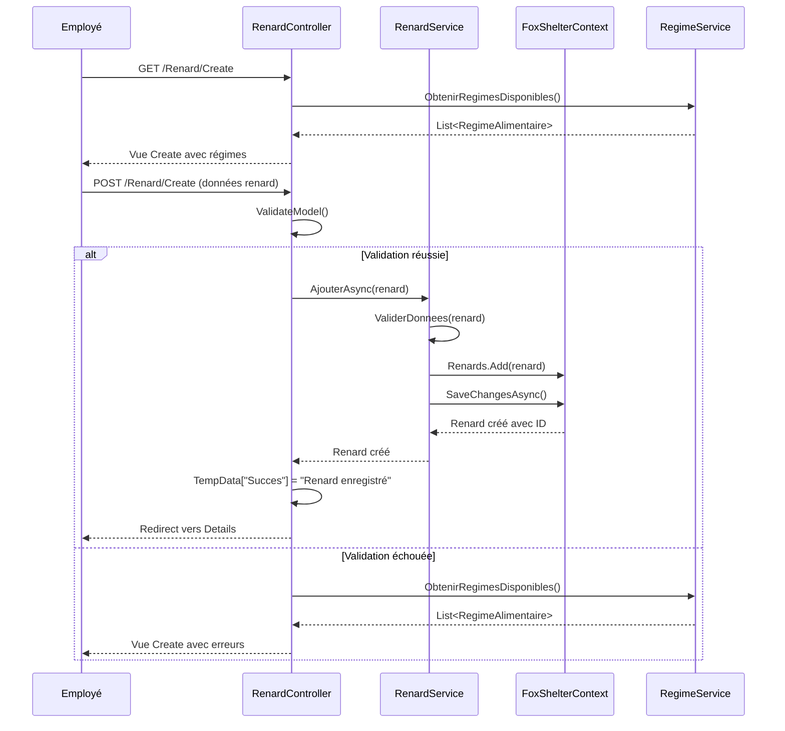
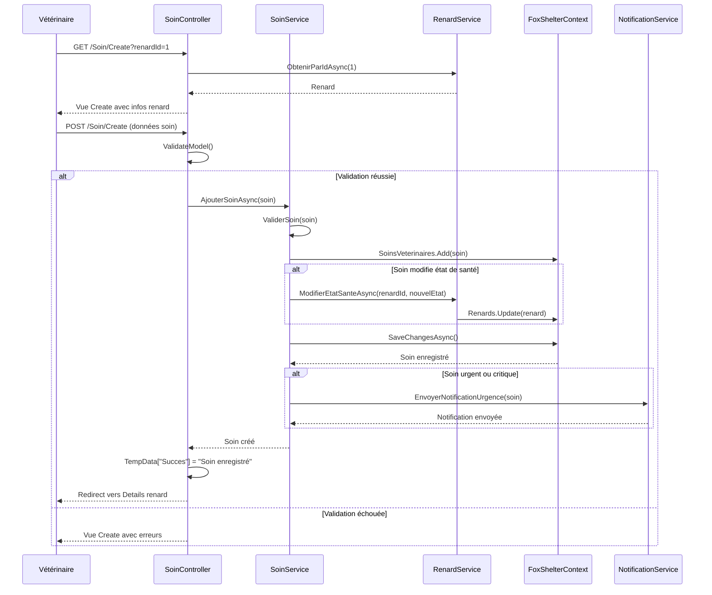
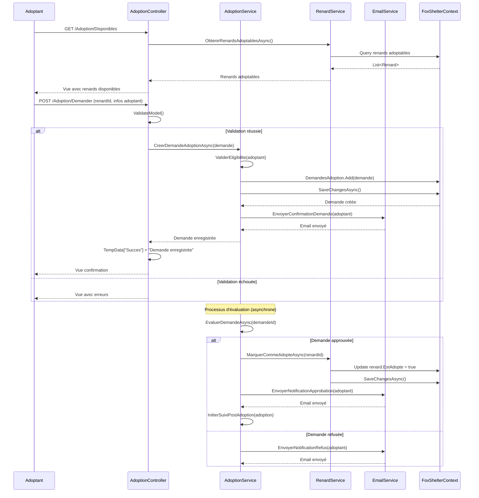
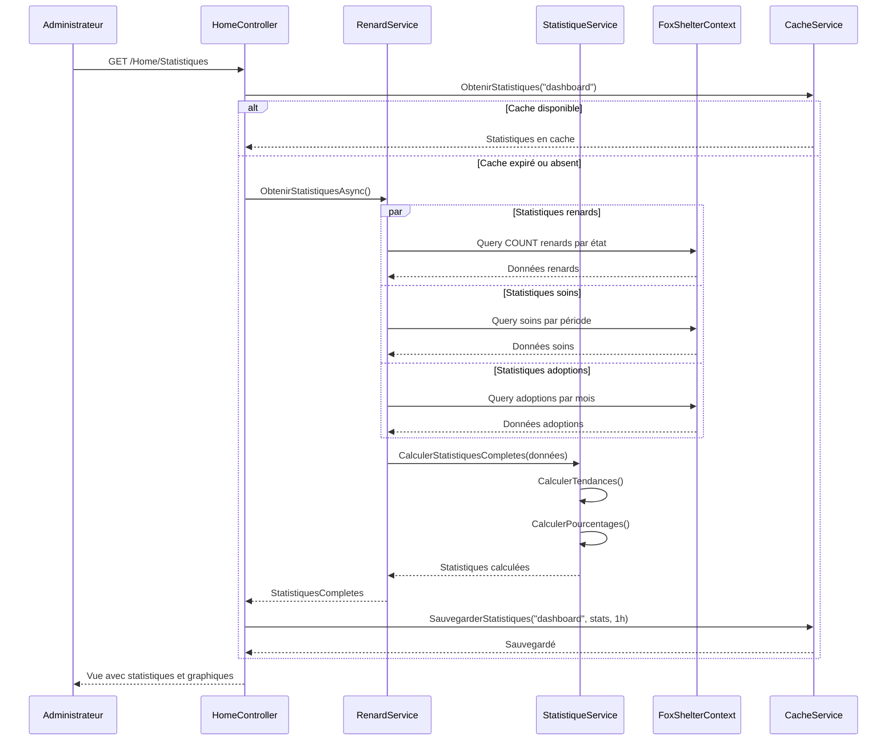
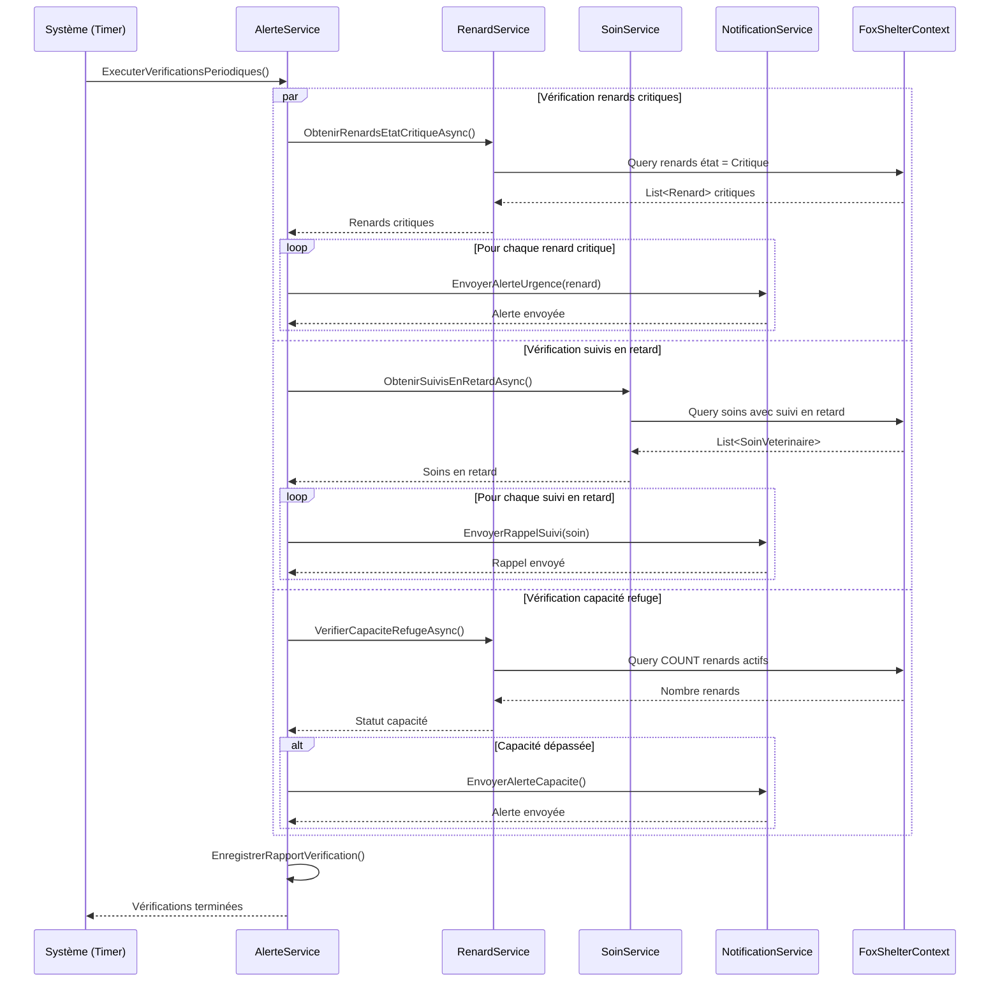
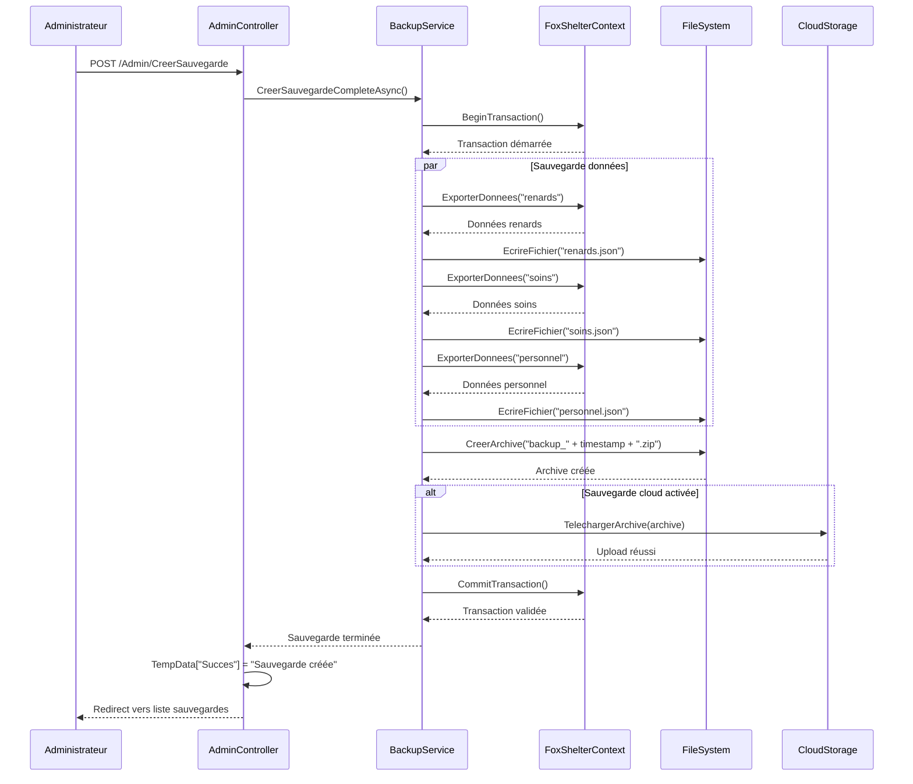

# Diagrammes de Séquence UML - FoxShelter

## Vue d'ensemble

Ce document présente les diagrammes de séquence pour les principaux scénarios d'utilisation du système FoxShelter.

## 1. Diagramme de Séquence : Enregistrement d'un nouveau renard

## 2. Diagramme de Séquence : Effectuer un soin vétérinaire

## 3. Diagramme de Séquence : Processus d'adoption

## 4. Diagramme de Séquence : Génération de statistiques

## 5. Diagramme de Séquence : Gestion des alertes système

## 6. Diagramme de Séquence : Sauvegarde et restauration

## Patterns et Principes Utilisés

### 1. Patterns Architecturaux
- **MVC (Model-View-Controller)** : Séparation des responsabilités
- **Service Layer** : Logique métier centralisée
- **Repository Pattern** : Abstraction de l'accès aux données via Entity Framework

### 2. Patterns de Conception
- **Command Pattern** : Pour les opérations complexes
- **Observer Pattern** : Pour les notifications
- **Strategy Pattern** : Pour les différents types de calculs

### 3. Principes SOLID
- **Single Responsibility** : Chaque service a une responsabilité unique
- **Open/Closed** : Extensions possibles sans modification
- **Dependency Inversion** : Dépendance vers les abstractions

## Gestion des Erreurs

### Types d'erreurs gérées
1. **Erreurs de validation** : Données invalides
2. **Erreurs métier** : Règles business non respectées
3. **Erreurs techniques** : Problèmes de base de données, réseau
4. **Erreurs de sécurité** : Accès non autorisé

### Stratégies de gestion
- **Try-catch** dans les services
- **Validation** côté client et serveur
- **Logging** des erreurs
- **Messages** utilisateur appropriés
- **Rollback** des transactions en cas d'erreur

## Performance et Optimisation

### Stratégies utilisées
1. **Mise en cache** des données fréquemment consultées
2. **Requêtes asynchrones** pour les opérations longues
3. **Pagination** pour les listes importantes
4. **Lazy loading** pour les relations Entity Framework
5. **Compression** des sauvegardes

### Points d'attention
- **N+1 queries** : Utilisation d'Include() approprié
- **Mémoire** : Disposal des ressources
- **Concurrence** : Gestion des accès simultanés
- **Scalabilité** : Architecture prête pour la montée en charge