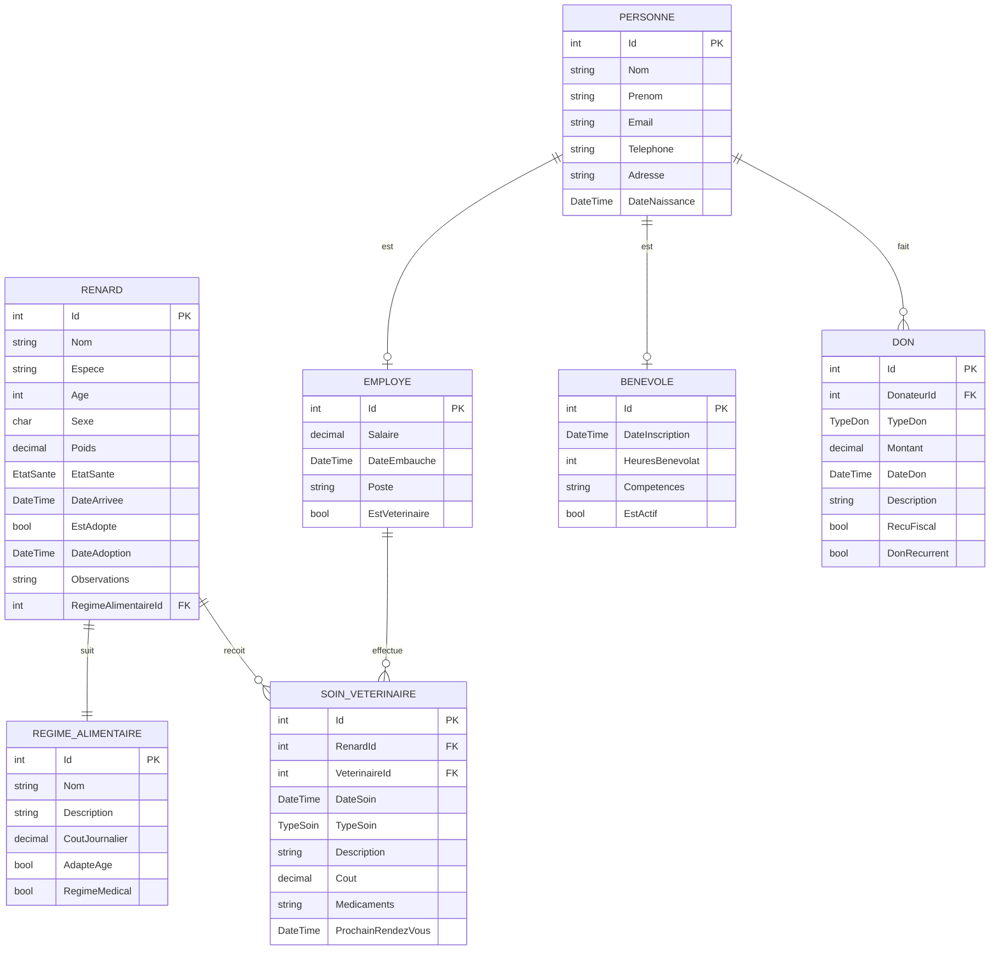

# Documentation Technique FoxShelter

## 📋 Table des Matières

1. [Architecture Générale](#architecture-générale)
2. [Modèle de Données](#modèle-de-données)
3. [Couches Applicatives](#couches-applicatives)
4. [Services et Logique Métier](#services-et-logique-métier)
5. [API et Endpoints](#api-et-endpoints)
6. [Sécurité](#sécurité)
7. [Performance et Optimisation](#performance-et-optimisation)
8. [Patterns et Bonnes Pratiques](#patterns-et-bonnes-pratiques)
9. [Tests](#tests)
10. [Déploiement](#déploiement)
11. [Monitoring et Logs](#monitoring-et-logs)
12. [Évolutions Futures](#évolutions-futures)

## 🏗️ Architecture Générale

### Vue d'Ensemble

FoxShelter suit une architecture **MVC (Model-View-Controller)** avec une séparation claire des responsabilités :

```
┌─────────────────┐    ┌─────────────────┐    ┌─────────────────┐
│   Présentation  │    │  Logique Métier │    │  Accès Données  │
│                 │    │                 │    │                 │
│  Controllers    │◄──►│    Services     │◄──►│ Entity Framework│
│  Views          │    │  Business Logic │    │  SQL Server     │
│  ViewModels     │    │  Validation     │    │  Repository     │
└─────────────────┘    └─────────────────┘    └─────────────────┘
```

### Technologies Utilisées

| Couche | Technologie | Version | Rôle |
|--------|-------------|---------|------|
| **Frontend** | HTML5, CSS3, JavaScript | - | Interface utilisateur |
| **Framework CSS** | Bootstrap | 5.3 | Responsive design |
| **Backend** | ASP.NET Core MVC | 8.0 | Framework web |
| **Langage** | C# | 12.0 | Logique applicative |
| **ORM** | Entity Framework Core | 8.0 | Accès aux données |
| **Base de données** | SQL Server | 2022 | Persistance |
| **Injection de dépendances** | Microsoft.Extensions.DI | 8.0 | IoC Container |

### Structure du Projet

```
FoxShelter/
├── Controllers/              # Contrôleurs MVC
│   ├── HomeController.cs     # Page d'accueil
│   └── RenardController.cs   # Gestion des renards
├── Models/                   # Modèles de données
│   ├── Entities/            # Entités métier
│   │   ├── Renard.cs
│   │   ├── Personne.cs
│   │   ├── Employe.cs
│   │   ├── Benevole.cs
│   │   ├── SoinVeterinaire.cs
│   │   ├── RegimeAlimentaire.cs
│   │   └── Don.cs
│   ├── Enums/              # Énumérations
│   │   ├── EtatSante.cs
│   │   ├── TypeSoin.cs
│   │   └── TypeDon.cs
│   └── ViewModels/         # Modèles de vue
│       ├── AccueilViewModel.cs
│       └── ErrorViewModel.cs
├── Views/                  # Vues Razor
│   ├── Home/
│   ├── Renard/
│   └── Shared/
├── Services/               # Services métier
│   └── RenardService.cs
├── Data/                   # Contexte EF
│   └── FoxShelterContext.cs
├── wwwroot/               # Ressources statiques
│   ├── css/
│   ├── js/
│   └── images/
├── Diagrammes/            # Documentation UML
├── Documentation/         # Documentation technique
├── Program.cs             # Point d'entrée
├── appsettings.json       # Configuration
└── FoxShelter.csproj     # Fichier projet
```

## 🗄️ Modèle de Données

### Diagramme Entité-Relation



### Entités Principales

#### Renard
```csharp
public class Renard
{
    public int Id { get; set; }
    public string Nom { get; set; }
    public string Espece { get; set; }
    public int Age { get; set; }
    public char Sexe { get; set; }
    public decimal Poids { get; set; }
    public EtatSante EtatSante { get; set; }
    public DateTime DateArrivee { get; set; }
    public bool EstAdopte { get; set; }
    public DateTime? DateAdoption { get; set; }
    public string? Observations { get; set; }
    
    // Relations
    public int RegimeAlimentaireId { get; set; }
    public RegimeAlimentaire RegimeAlimentaire { get; set; }
    public ICollection<SoinVeterinaire> SoinsVeterinaires { get; set; }
    
    // Propriétés calculées
    public int DureeSejourJours => (DateTime.Now - DateArrivee).Days;
    public bool NecessiteSuiviUrgent => EtatSante == EtatSante.Critique || EtatSante == EtatSante.Blesse;
}
```

#### Personne (Classe Abstraite)
```csharp
public abstract class Personne
{
    public int Id { get; set; }
    public string Nom { get; set; }
    public string Prenom { get; set; }
    public string Email { get; set; }
    public string Telephone { get; set; }
    public string Adresse { get; set; }
    public DateTime DateNaissance { get; set; }
    
    // Propriété calculée
    public int Age => DateTime.Now.Year - DateNaissance.Year;
    public string NomComplet => $"{Prenom} {Nom}";
}
```

### Énumérations

#### EtatSante
```csharp
public enum EtatSante
{
    Excellent = 1,
    Bon = 2,
    Moyen = 3,
    Faible = 4,
    Blesse = 5,
    Critique = 6
}
```

#### TypeSoin
```csharp
public enum TypeSoin
{
    Consultation = 1,
    Vaccination = 2,
    Chirurgie = 3,
    Traitement = 4,
    Urgence = 5,
    Suivi = 6
}
```

### Contraintes et Validations

#### Annotations de Validation
```csharp
public class Renard
{
    [Required(ErrorMessage = "Le nom est obligatoire")]
    [StringLength(50, ErrorMessage = "Le nom ne peut pas dépasser 50 caractères")]
    public string Nom { get; set; }
    
    [Range(0, 20, ErrorMessage = "L'âge doit être entre 0 et 20 ans")]
    public int Age { get; set; }
    
    [Range(0.1, 50.0, ErrorMessage = "Le poids doit être entre 0.1 et 50 kg")]
    public decimal Poids { get; set; }
    
    [RegularExpression("^[MF]$", ErrorMessage = "Le sexe doit être M ou F")]
    public char Sexe { get; set; }
}
```

#### Configuration Entity Framework
```csharp
protected override void OnModelCreating(ModelBuilder modelBuilder)
{
    // Configuration Renard
    modelBuilder.Entity<Renard>(entity =>
    {
        entity.HasKey(e => e.Id);
        entity.Property(e => e.Nom).IsRequired().HasMaxLength(50);
        entity.Property(e => e.Espece).IsRequired().HasMaxLength(100);
        entity.Property(e => e.Poids).HasPrecision(5, 2);
        entity.Property(e => e.Sexe).HasMaxLength(1);
        
        // Index pour les recherches fréquentes
        entity.HasIndex(e => e.Nom);
        entity.HasIndex(e => e.EtatSante);
        entity.HasIndex(e => e.EstAdopte);
    });
    
    // Relations
    modelBuilder.Entity<Renard>()
        .HasOne(r => r.RegimeAlimentaire)
        .WithMany()
        .HasForeignKey(r => r.RegimeAlimentaireId);
        
    modelBuilder.Entity<SoinVeterinaire>()
        .HasOne(s => s.Renard)
        .WithMany(r => r.SoinsVeterinaires)
        .HasForeignKey(s => s.RenardId);
}
```

## 🏛️ Couches Applicatives

### 1. Couche Présentation

#### Contrôleurs
```csharp
[Route("[controller]")]
public class RenardController : Controller
{
    private readonly RenardService _renardService;
    private readonly ILogger<RenardController> _logger;
    
    public RenardController(RenardService renardService, ILogger<RenardController> logger)
    {
        _renardService = renardService;
        _logger = logger;
    }
    
    [HttpGet]
    public async Task<IActionResult> Index(string recherche = "", EtatSante? etatSante = null)
    {
        try
        {
            var renards = await _renardService.ObtenirRenardsAsync(recherche, etatSante);
            return View(renards);
        }
        catch (Exception ex)
        {
            _logger.LogError(ex, "Erreur lors de la récupération des renards");
            return View("Error");
        }
    }
}
```

#### ViewModels
```csharp
public class AccueilViewModel
{
    public int NombreTotalRenards { get; set; }
    public int RenardsCritiques { get; set; }
    public int RenardsAdoptesRecemment { get; set; }
    public decimal TauxAdoption { get; set; }
    public List<Renard> RenardsUrgents { get; set; }
    public List<Renard> NouveauxArrivants { get; set; }
    public List<Renard> RenardsSuivi { get; set; }
}
```

### 2. Couche Logique Métier

#### Services
```csharp
public class RenardService
{
    private readonly FoxShelterContext _context;
    private readonly ILogger<RenardService> _logger;
    
    public RenardService(FoxShelterContext context, ILogger<RenardService> logger)
    {
        _context = context;
        _logger = logger;
    }
    
    public async Task<List<Renard>> ObtenirRenardsAsync(string recherche = "", EtatSante? etatSante = null)
    {
        var query = _context.Renards
            .Include(r => r.RegimeAlimentaire)
            .AsQueryable();
            
        if (!string.IsNullOrEmpty(recherche))
        {
            query = query.Where(r => r.Nom.Contains(recherche) || r.Espece.Contains(recherche));
        }
        
        if (etatSante.HasValue)
        {
            query = query.Where(r => r.EtatSante == etatSante.Value);
        }
        
        return await query.OrderBy(r => r.Nom).ToListAsync();
    }
    
    public async Task<bool> MarquerCommeAdopteAsync(int renardId)
    {
        var renard = await _context.Renards.FindAsync(renardId);
        if (renard == null) return false;
        
        renard.EstAdopte = true;
        renard.DateAdoption = DateTime.Now;
        
        await _context.SaveChangesAsync();
        _logger.LogInformation($"Renard {renard.Nom} marqué comme adopté");
        
        return true;
    }
}
```

### 3. Couche Accès aux Données

#### Contexte Entity Framework
```csharp
public class FoxShelterContext : DbContext
{
    public FoxShelterContext(DbContextOptions<FoxShelterContext> options) : base(options) { }
    
    public DbSet<Renard> Renards { get; set; }
    public DbSet<Personne> Personnes { get; set; }
    public DbSet<Employe> Employes { get; set; }
    public DbSet<Benevole> Benevoles { get; set; }
    public DbSet<SoinVeterinaire> SoinsVeterinaires { get; set; }
    public DbSet<RegimeAlimentaire> RegimesAlimentaires { get; set; }
    public DbSet<Don> Dons { get; set; }
    
    protected override void OnModelCreating(ModelBuilder modelBuilder)
    {
        // Configuration des entités
        ConfigurerRenard(modelBuilder);
        ConfigurerPersonne(modelBuilder);
        ConfigurerSoinVeterinaire(modelBuilder);
        
        // Données de test
        SeedData(modelBuilder);
    }
    
    private void SeedData(ModelBuilder modelBuilder)
    {
        // Régimes alimentaires par défaut
        modelBuilder.Entity<RegimeAlimentaire>().HasData(
            new RegimeAlimentaire { Id = 1, Nom = "Standard", Description = "Régime équilibré pour renard adulte", CoutJournalier = 5.50m },
            new RegimeAlimentaire { Id = 2, Nom = "Jeune", Description = "Régime riche pour renardeau", CoutJournalier = 7.00m },
            new RegimeAlimentaire { Id = 3, Nom = "Médical", Description = "Régime spécialisé pour convalescence", CoutJournalier = 12.00m }
        );
    }
}
```

## 🔧 Services et Logique Métier

### Architecture des Services

```csharp
public interface IRenardService
{
    Task<List<Renard>> ObtenirRenardsAsync(string recherche = "", EtatSante? etatSante = null);
    Task<Renard> ObtenirRenardParIdAsync(int id);
    Task<Renard> CreerRenardAsync(Renard renard);
    Task<bool> ModifierRenardAsync(Renard renard);
    Task<bool> SupprimerRenardAsync(int id);
    Task<bool> MarquerCommeAdopteAsync(int renardId);
    Task<List<Renard>> ObtenirRenardsUrgentsAsync();
    Task<StatistiquesRenards> ObtenirStatistiquesAsync();
}
```

### Implémentation des Services

#### RenardService Complet
```csharp
public class RenardService : IRenardService
{
    private readonly FoxShelterContext _context;
    private readonly ILogger<RenardService> _logger;
    
    public RenardService(FoxShelterContext context, ILogger<RenardService> logger)
    {
        _context = context;
        _logger = logger;
    }
    
    public async Task<List<Renard>> ObtenirRenardsAsync(string recherche = "", EtatSante? etatSante = null)
    {
        try
        {
            var query = _context.Renards
                .Include(r => r.RegimeAlimentaire)
                .AsQueryable();
                
            if (!string.IsNullOrEmpty(recherche))
            {
                query = query.Where(r => 
                    r.Nom.Contains(recherche) || 
                    r.Espece.Contains(recherche) ||
                    r.Observations.Contains(recherche));
            }
            
            if (etatSante.HasValue)
            {
                query = query.Where(r => r.EtatSante == etatSante.Value);
            }
            
            return await query
                .OrderBy(r => r.EstAdopte)
                .ThenByDescending(r => r.DateArrivee)
                .ToListAsync();
        }
        catch (Exception ex)
        {
            _logger.LogError(ex, "Erreur lors de la récupération des renards");
            throw;
        }
    }
    
    public async Task<Renard> CreerRenardAsync(Renard renard)
    {
        try
        {
            // Validation métier
            if (await _context.Renards.AnyAsync(r => r.Nom == renard.Nom && !r.EstAdopte))
            {
                throw new InvalidOperationException("Un renard avec ce nom existe déjà dans le refuge");
            }
            
            renard.DateArrivee = DateTime.Now;
            renard.EstAdopte = false;
            
            _context.Renards.Add(renard);
            await _context.SaveChangesAsync();
            
            _logger.LogInformation($"Nouveau renard créé : {renard.Nom} (ID: {renard.Id})");
            return renard;
        }
        catch (Exception ex)
        {
            _logger.LogError(ex, $"Erreur lors de la création du renard {renard.Nom}");
            throw;
        }
    }
    
    public async Task<StatistiquesRenards> ObtenirStatistiquesAsync()
    {
        var stats = new StatistiquesRenards
        {
            NombreTotal = await _context.Renards.CountAsync(),
            NombreAdoptes = await _context.Renards.CountAsync(r => r.EstAdopte),
            NombreCritiques = await _context.Renards.CountAsync(r => r.EtatSante == EtatSante.Critique),
            NouveauxCeMois = await _context.Renards.CountAsync(r => 
                r.DateArrivee.Month == DateTime.Now.Month && 
                r.DateArrivee.Year == DateTime.Now.Year),
            AdoptesCeMois = await _context.Renards.CountAsync(r => 
                r.EstAdopte && 
                r.DateAdoption.HasValue &&
                r.DateAdoption.Value.Month == DateTime.Now.Month && 
                r.DateAdoption.Value.Year == DateTime.Now.Year)
        };
        
        stats.TauxAdoption = stats.NombreTotal > 0 ? 
            (decimal)stats.NombreAdoptes / stats.NombreTotal * 100 : 0;
            
        return stats;
    }
}
```

### Gestion des Erreurs

#### Exception Handling Global
```csharp
public class GlobalExceptionMiddleware
{
    private readonly RequestDelegate _next;
    private readonly ILogger<GlobalExceptionMiddleware> _logger;
    
    public GlobalExceptionMiddleware(RequestDelegate next, ILogger<GlobalExceptionMiddleware> logger)
    {
        _next = next;
        _logger = logger;
    }
    
    public async Task InvokeAsync(HttpContext context)
    {
        try
        {
            await _next(context);
        }
        catch (Exception ex)
        {
            _logger.LogError(ex, "Une erreur non gérée s'est produite");
            await HandleExceptionAsync(context, ex);
        }
    }
    
    private static async Task HandleExceptionAsync(HttpContext context, Exception exception)
    {
        context.Response.StatusCode = exception switch
        {
            ArgumentNullException => 400,
            InvalidOperationException => 400,
            UnauthorizedAccessException => 401,
            _ => 500
        };
        
        var response = new
        {
            error = exception.Message,
            statusCode = context.Response.StatusCode
        };
        
        await context.Response.WriteAsync(JsonSerializer.Serialize(response));
    }
}
```

## 🌐 API et Endpoints

### Contrôleurs API

#### RenardApiController
```csharp
[ApiController]
[Route("api/[controller]")]
public class RenardApiController : ControllerBase
{
    private readonly RenardService _renardService;
    
    public RenardApiController(RenardService renardService)
    {
        _renardService = renardService;
    }
    
    [HttpGet]
    public async Task<ActionResult<ApiResponse<List<Renard>>>> GetRenards(
        [FromQuery] string recherche = "",
        [FromQuery] EtatSante? etatSante = null)
    {
        try
        {
            var renards = await _renardService.ObtenirRenardsAsync(recherche, etatSante);
            return Ok(new ApiResponse<List<Renard>>
            {
                Success = true,
                Data = renards,
                Message = "Renards récupérés avec succès"
            });
        }
        catch (Exception ex)
        {
            return StatusCode(500, new ApiResponse<List<Renard>>
            {
                Success = false,
                Message = ex.Message
            });
        }
    }
    
    [HttpPost]
    public async Task<ActionResult<ApiResponse<Renard>>> CreateRenard([FromBody] Renard renard)
    {
        if (!ModelState.IsValid)
        {
            return BadRequest(new ApiResponse<Renard>
            {
                Success = false,
                Message = "Données invalides",
                Errors = ModelState.Values.SelectMany(v => v.Errors.Select(e => e.ErrorMessage))
            });
        }
        
        try
        {
            var nouveauRenard = await _renardService.CreerRenardAsync(renard);
            return CreatedAtAction(nameof(GetRenard), new { id = nouveauRenard.Id }, 
                new ApiResponse<Renard>
                {
                    Success = true,
                    Data = nouveauRenard,
                    Message = "Renard créé avec succès"
                });
        }
        catch (Exception ex)
        {
            return StatusCode(500, new ApiResponse<Renard>
            {
                Success = false,
                Message = ex.Message
            });
        }
    }
}
```

### Modèles de Réponse API

```csharp
public class ApiResponse<T>
{
    public bool Success { get; set; }
    public T Data { get; set; }
    public string Message { get; set; }
    public IEnumerable<string> Errors { get; set; } = new List<string>();
}

public class PaginatedResponse<T> : ApiResponse<T>
{
    public int Page { get; set; }
    public int PageSize { get; set; }
    public int TotalCount { get; set; }
    public int TotalPages { get; set; }
}
```

## 🔒 Sécurité

### Validation des Données

#### Validation Côté Serveur
```csharp
public class RenardValidator : AbstractValidator<Renard>
{
    public RenardValidator()
    {
        RuleFor(r => r.Nom)
            .NotEmpty().WithMessage("Le nom est obligatoire")
            .Length(2, 50).WithMessage("Le nom doit contenir entre 2 et 50 caractères")
            .Matches(@"^[a-zA-ZÀ-ÿ\s-']+$").WithMessage("Le nom contient des caractères invalides");
            
        RuleFor(r => r.Age)
            .InclusiveBetween(0, 20).WithMessage("L'âge doit être entre 0 et 20 ans");
            
        RuleFor(r => r.Poids)
            .GreaterThan(0).WithMessage("Le poids doit être positif")
            .LessThanOrEqualTo(50).WithMessage("Le poids ne peut pas dépasser 50 kg");
            
        RuleFor(r => r.Sexe)
            .Must(s => s == 'M' || s == 'F').WithMessage("Le sexe doit être M ou F");
    }
}
```

#### Protection CSRF
```csharp
// Dans Program.cs
builder.Services.AddAntiforgery(options =>
{
    options.HeaderName = "X-CSRF-TOKEN";
    options.SuppressXFrameOptionsHeader = false;
});

// Dans les vues
@Html.AntiForgeryToken()
```

### Sanitisation des Entrées

```csharp
public static class InputSanitizer
{
    public static string SanitizeHtml(string input)
    {
        if (string.IsNullOrEmpty(input)) return string.Empty;
        
        return HttpUtility.HtmlEncode(input);
    }
    
    public static string SanitizeForDatabase(string input)
    {
        if (string.IsNullOrEmpty(input)) return string.Empty;
        
        // Supprimer les caractères dangereux
        return input.Replace("'", "''")
                   .Replace("--", "")
                   .Replace("/*", "")
                   .Replace("*/", "");
    }
}
```

## ⚡ Performance et Optimisation

### Optimisations Entity Framework

#### Requêtes Efficaces
```csharp
public async Task<List<Renard>> ObtenirRenardsAvecDetailsAsync()
{
    return await _context.Renards
        .Include(r => r.RegimeAlimentaire)
        .Include(r => r.SoinsVeterinaires.OrderByDescending(s => s.DateSoin).Take(5))
        .Where(r => !r.EstAdopte)
        .AsNoTracking() // Pour les lectures seules
        .ToListAsync();
}
```

#### Pagination
```csharp
public async Task<PaginatedResult<Renard>> ObtenirRenardsPageAsync(int page, int pageSize)
{
    var query = _context.Renards.AsQueryable();
    var totalCount = await query.CountAsync();
    
    var items = await query
        .Skip((page - 1) * pageSize)
        .Take(pageSize)
        .ToListAsync();
        
    return new PaginatedResult<Renard>
    {
        Items = items,
        Page = page,
        PageSize = pageSize,
        TotalCount = totalCount,
        TotalPages = (int)Math.Ceiling((double)totalCount / pageSize)
    };
}
```

### Cache

#### Cache en Mémoire
```csharp
public class CachedRenardService : IRenardService
{
    private readonly RenardService _renardService;
    private readonly IMemoryCache _cache;
    private readonly TimeSpan _cacheDuration = TimeSpan.FromMinutes(5);
    
    public CachedRenardService(RenardService renardService, IMemoryCache cache)
    {
        _renardService = renardService;
        _cache = cache;
    }
    
    public async Task<StatistiquesRenards> ObtenirStatistiquesAsync()
    {
        const string cacheKey = "statistiques_renards";
        
        if (_cache.TryGetValue(cacheKey, out StatistiquesRenards cachedStats))
        {
            return cachedStats;
        }
        
        var stats = await _renardService.ObtenirStatistiquesAsync();
        _cache.Set(cacheKey, stats, _cacheDuration);
        
        return stats;
    }
}
```

## 🎯 Patterns et Bonnes Pratiques

### Dependency Injection

#### Configuration des Services
```csharp
// Program.cs
builder.Services.AddDbContext<FoxShelterContext>(options =>
    options.UseSqlServer(connectionString));

builder.Services.AddScoped<IRenardService, RenardService>();
builder.Services.AddScoped<IValidator<Renard>, RenardValidator>();

// Décorateur pour le cache
builder.Services.Decorate<IRenardService, CachedRenardService>();
```

### Repository Pattern (Optionnel)

```csharp
public interface IRepository<T> where T : class
{
    Task<T> GetByIdAsync(int id);
    Task<IEnumerable<T>> GetAllAsync();
    Task<T> AddAsync(T entity);
    Task UpdateAsync(T entity);
    Task DeleteAsync(int id);
}

public class Repository<T> : IRepository<T> where T : class
{
    protected readonly FoxShelterContext _context;
    protected readonly DbSet<T> _dbSet;
    
    public Repository(FoxShelterContext context)
    {
        _context = context;
        _dbSet = context.Set<T>();
    }
    
    public virtual async Task<T> GetByIdAsync(int id)
    {
        return await _dbSet.FindAsync(id);
    }
    
    public virtual async Task<IEnumerable<T>> GetAllAsync()
    {
        return await _dbSet.ToListAsync();
    }
}
```

### Unit of Work Pattern

```csharp
public interface IUnitOfWork : IDisposable
{
    IRepository<Renard> Renards { get; }
    IRepository<SoinVeterinaire> SoinsVeterinaires { get; }
    Task<int> SaveChangesAsync();
}

public class UnitOfWork : IUnitOfWork
{
    private readonly FoxShelterContext _context;
    
    public UnitOfWork(FoxShelterContext context)
    {
        _context = context;
        Renards = new Repository<Renard>(_context);
        SoinsVeterinaires = new Repository<SoinVeterinaire>(_context);
    }
    
    public IRepository<Renard> Renards { get; }
    public IRepository<SoinVeterinaire> SoinsVeterinaires { get; }
    
    public async Task<int> SaveChangesAsync()
    {
        return await _context.SaveChangesAsync();
    }
    
    public void Dispose()
    {
        _context.Dispose();
    }
}
```

## 🧪 Tests

### Tests Unitaires

#### Test des Services
```csharp
[TestClass]
public class RenardServiceTests
{
    private FoxShelterContext _context;
    private RenardService _service;
    
    [TestInitialize]
    public void Setup()
    {
        var options = new DbContextOptionsBuilder<FoxShelterContext>()
            .UseInMemoryDatabase(databaseName: Guid.NewGuid().ToString())
            .Options;
            
        _context = new FoxShelterContext(options);
        _service = new RenardService(_context, Mock.Of<ILogger<RenardService>>());
    }
    
    [TestMethod]
    public async Task CreerRenard_AvecDonneesValides_RetourneRenard()
    {
        // Arrange
        var renard = new Renard
        {
            Nom = "Test",
            Espece = "Renard roux",
            Age = 2,
            Sexe = 'M',
            Poids = 5.5m,
            EtatSante = EtatSante.Bon,
            RegimeAlimentaireId = 1
        };
        
        // Act
        var result = await _service.CreerRenardAsync(renard);
        
        // Assert
        Assert.IsNotNull(result);
        Assert.AreEqual("Test", result.Nom);
        Assert.IsTrue(result.Id > 0);
    }
    
    [TestMethod]
    public async Task CreerRenard_AvecNomDuplique_LeveException()
    {
        // Arrange
        var renard1 = new Renard { Nom = "Duplicate", /* autres propriétés */ };
        var renard2 = new Renard { Nom = "Duplicate", /* autres propriétés */ };
        
        await _service.CreerRenardAsync(renard1);
        
        // Act & Assert
        await Assert.ThrowsExceptionAsync<InvalidOperationException>(
            () => _service.CreerRenardAsync(renard2));
    }
}
```

### Tests d'Intégration

```csharp
[TestClass]
public class RenardControllerIntegrationTests
{
    private WebApplicationFactory<Program> _factory;
    private HttpClient _client;
    
    [TestInitialize]
    public void Setup()
    {
        _factory = new WebApplicationFactory<Program>()
            .WithWebHostBuilder(builder =>
            {
                builder.ConfigureServices(services =>
                {
                    // Remplacer la base de données par une base en mémoire
                    services.RemoveAll<DbContextOptions<FoxShelterContext>>();
                    services.AddDbContext<FoxShelterContext>(options =>
                        options.UseInMemoryDatabase("TestDb"));
                });
            });
            
        _client = _factory.CreateClient();
    }
    
    [TestMethod]
    public async Task Get_Index_RetournePageAvecRenards()
    {
        // Act
        var response = await _client.GetAsync("/Renard");
        
        // Assert
        response.EnsureSuccessStatusCode();
        var content = await response.Content.ReadAsStringAsync();
        Assert.IsTrue(content.Contains("Liste des Renards"));
    }
}
```

## 🚀 Déploiement

### Configuration de Production

#### appsettings.Production.json
```json
{
  "ConnectionStrings": {
    "DefaultConnection": "Server=prod-server;Database=FoxShelterDB;User Id=app_user;Password=${DB_PASSWORD};TrustServerCertificate=true"
  },
  "Logging": {
    "LogLevel": {
      "Default": "Warning",
      "Microsoft.AspNetCore": "Warning"
    }
  },
  "FoxShelter": {
    "EmailUrgence": "urgence@foxshelter.fr",
    "CapaciteMaximale": 100
  }
}
```

### Docker

#### Dockerfile
```dockerfile
FROM mcr.microsoft.com/dotnet/aspnet:8.0 AS base
WORKDIR /app
EXPOSE 80
EXPOSE 443

FROM mcr.microsoft.com/dotnet/sdk:8.0 AS build
WORKDIR /src
COPY ["FoxShelter.csproj", "."]
RUN dotnet restore "FoxShelter.csproj"
COPY . .
RUN dotnet build "FoxShelter.csproj" -c Release -o /app/build

FROM build AS publish
RUN dotnet publish "FoxShelter.csproj" -c Release -o /app/publish

FROM base AS final
WORKDIR /app
COPY --from=publish /app/publish .
ENTRYPOINT ["dotnet", "FoxShelter.dll"]
```

#### docker-compose.yml
```yaml
version: '3.8'
services:
  foxshelter-app:
    build: .
    ports:
      - "8080:80"
    environment:
      - ASPNETCORE_ENVIRONMENT=Production
      - ConnectionStrings__DefaultConnection=Server=db;Database=FoxShelterDB;User Id=sa;Password=YourPassword123!
    depends_on:
      - db
      
  db:
    image: mcr.microsoft.com/mssql/server:2022-latest
    environment:
      - ACCEPT_EULA=Y
      - SA_PASSWORD=YourPassword123!
    ports:
      - "1433:1433"
    volumes:
      - sqldata:/var/opt/mssql

volumes:
  sqldata:
```

## 📊 Monitoring et Logs

### Configuration des Logs

```csharp
// Program.cs
builder.Logging.ClearProviders();
builder.Logging.AddConsole();
builder.Logging.AddDebug();

if (builder.Environment.IsProduction())
{
    builder.Logging.AddFile("Logs/foxshelter-{Date}.txt");
}
```

### Métriques Personnalisées

```csharp
public class MetricsService
{
    private readonly ILogger<MetricsService> _logger;
    
    public void LogRenardCreation(string nom)
    {
        _logger.LogInformation("Nouveau renard créé: {Nom} à {Timestamp}", nom, DateTime.Now);
    }
    
    public void LogAdoption(string nom)
    {
        _logger.LogInformation("Renard adopté: {Nom} à {Timestamp}", nom, DateTime.Now);
    }
}
```

## 🔮 Évolutions Futures

### Fonctionnalités Prévues

1. **Authentification et Autorisation**
   - Système de connexion utilisateur
   - Rôles (Admin, Vétérinaire, Bénévole)
   - Permissions granulaires

2. **Notifications**
   - Emails automatiques
   - SMS pour urgences
   - Notifications push

3. **Rapports Avancés**
   - Génération PDF
   - Graphiques interactifs
   - Export Excel

4. **API Mobile**
   - Application mobile
   - Synchronisation offline
   - Géolocalisation

### Architecture Évolutive

```csharp
// Interface pour futurs services
public interface INotificationService
{
    Task EnvoyerNotificationUrgenceAsync(Renard renard);
    Task EnvoyerRappelSuiviAsync(SoinVeterinaire soin);
}

public interface IReportService
{
    Task<byte[]> GenererRapportPdfAsync(int renardId);
    Task<Stream> ExporterDonneesExcelAsync();
}
```

---

*Documentation Technique FoxShelter - Version 1.0*
*Dernière mise à jour : Janvier 2024*