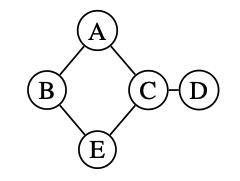
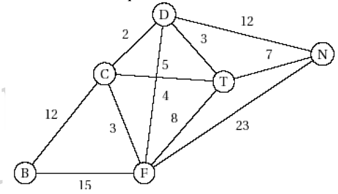
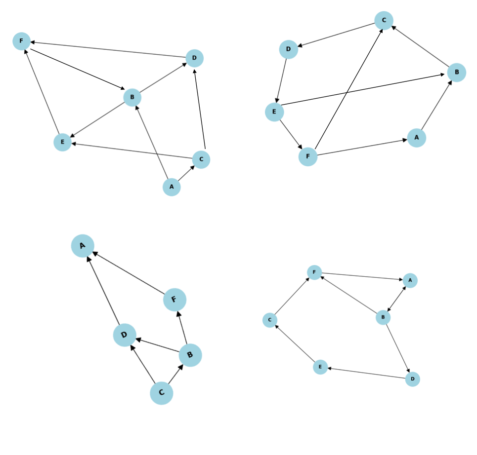

# Fiche d'exercices : Graphes

**Exercice 1:**

On dispose du graphe ci-dessous.

Ce graphe est composé de noeuds $A,B,C,D$.
Ils sont reliés par un certain nombre d'arêtes.

1. Le graphe suivant est-il connexe? Justifier.
2. Donner le chemin reliant tous les sommets partant B et allant vers D.

**Exercice 2:**

On dispose du graphe ci-dessous.

Il est composé des noeuds $B,C,D,F,T,N$.

1. Construire un tableau représentant le degré des sommets du graphe.
2. Ce graphe est-il connexe? Justifier.
3. Ce graphe est-il complet? Justifier.
4. On souhaite relier par un chemin tous les sommets du graphe. Cela est-il possible? Si oui, en donner un.
5. Donner le chemin de poids minimal partant de B et allant à N.

**Exercice 3:**

1. Dessiner un graphe complet à 4 sommets.
2. Dessinez un graphe cyclique à 5 sommets.
3. Dessiner un graphe à 5 sommets et que pour chaque sommet, leur degré entrant vaille 2 et leur degré sortant 2 aussi.

**Exercice 4:**

On considère les graphes orientés ci-dessous.

 
 
 

1. Pour chacun de ces graphes:
- Donner l'ordre du graphe
- Existe-t-il un circuit ?
- un chemin eulérien ? donner la longueur

2. Ces graphes sont-ils connexes? 

**Exercice 5 :**

1. Dessiner le graphe non orienté représenté par la matrice d'adjacence suivante :

0 1 1 0 1
1 0 0 1 1
1 0 0 1 0
0 1 1 0 0
1 1 0 0 0

2. Donner la liste d'adjacence de ce graphe.
3. Existe-t-il une chaine eulérienne dans ce graphe ?

 
 
 
 

**Exercice 6 :**

1. Dessiner le graphe orienté représenté par la matrice d'adjacence suivante :

0 1 1 0
1 0 0 1
0 1 0 1
1 0 0 0

2. Donner la liste d'adjacence de ce graphe.

1. Dessiner le graphe orienté représenté par la liste d'adjacence suivante :

0: 1, 2
1: 3, 4
2: 0, 3, 4
3: 4
4: 2, 3

2. Donner la matrice d'adjacence de ce graphe.

 
 
 

**Exercice 7:**

Un groupe d'amis souhaite créer un graphe de leurs relations amicales pour déterminer jusqu'à quelle taille peut avoir un graphe de relations. Les amis ont fourni les informations suivantes sur leurs relations :

- **Alice** est amie avec **Bob**, **Claire** et **David**.
- **Bob** est ami avec **Alice**, **Claire** et **Élise**.
- **Claire** est amie avec **Alice**, **Bob**, **David** et **Élise**.
- **David** est ami avec **Alice** et **Claire**.
- **Élise** est amie avec **Bob** et **Claire**.

1. Quel type de graphe est le plus adapté pour représenter ce problème ?
     
2. Représenter ce réseau d'amitié sous forme de graphe en utilisant une matrice d'adjacence.

3. Calculer le nombre total d'amitiés dans ce groupe.
4. Existe t-il un cycle dans ce graphe d'amitié? Si oui, en donner un.

5. Ajoutez un nouvel ami (**François**) qui est ami avec **Bob**, **David** et **Élise**. Mettez à jour le graphe en conséquence.

6. Calculez le degré moyen des amis dans le nouveau réseau.

7. Envisagez la possibilité qu'**Alice** ne soit plus amie avec **Bob** et **Claire**. Mettez à jour le graphe suite à ce changement.

**Exercice 8:**

Un réseau social s'interesse au suvi de ses utilisateurs. Chaque suivi n'est par symétrique. Cela indique que si un utilisateur en suit un autre (à la manière de Twitter).

On dispose de la liste d'adjacence suivante :

* Sophie : Lucas, Emma, Léa
* Lucas : Sophie, Thomas, Léa
* Emma : Sophie, Thomas
* Thomas : Lucas, Emma
* Léa : Sophie, Lucas

1. Donner le graphe qui représente ces relations de suivi.
2. Quel est ce type de graphe?
3. Donner le degré entrant et sortant de chaque sommet du graphe.
4. Donner les excentricité de chaque sommets du graphe.
5. En déduire le centre de ce graphe.
6. Donner la distance du chemin le plus court de ce graphe.
7. Donner le rayon et le diamètre de ce graphe.
