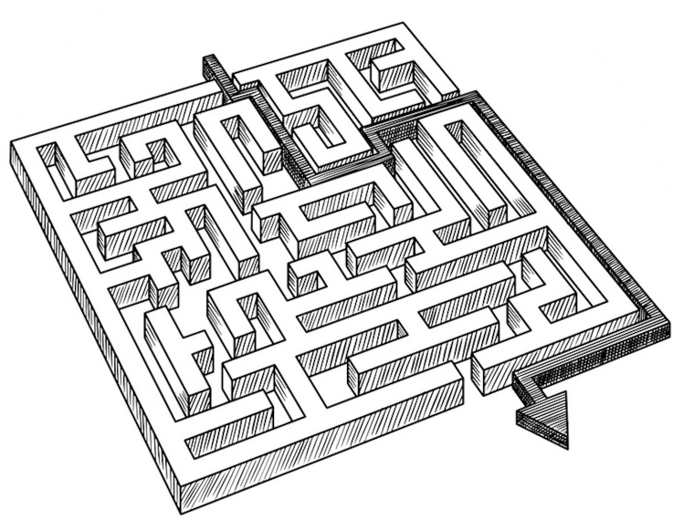

# <u> Projet TNSI Sortir du Labyrinthe</u>

## Le projet

Dans ce projet, on cherche à concevoir puis implanter un algorithme permettant à un robot de sortir de façon autonome d'un labyrinthe quelconque. Voici les differentes étapes que vous allez réaliser :

- Etape 1 : Représentation d'un labyrinthe
- Etape 2 : Création d'une classe Labyrinthe
- Etape 3 : Création d'une fonction pour rechercher les
déplacements possibles à partir d'une case donnée.
- Etape 4 : Recherche du chemin de façon autonome
- Etape 5 (facultative) : Construction d'une visualisation
graphique
- Etape 6 (facultative) : Chargement de labyrinthes stockées dans des fichiers textes



<I> Il est fortement conseillé de tester chaque méthode juste après l'avoir réalisée </I>

## Etape N°1

On modélise un labyrinthe par un tableau à deux dimensions à n lignes et m colonnes avec n et m des entiers strictement positifs.

Les lignes sont numérotées de 0 à n - 1 et les colonnes de 0 à m - 1. La case en haut à gauche est repérée par (0; 0) et la case en bas à droite par (n - 1; m - 1).

Dans ce tableau :

- 0 représente une case vide, hors case de départ et arrivée,
- 1 représente un mur,
- 2 représente le départ du labyrinthe,
- 3 représente l'arrivée du labyrinthe.

Ainsi, en Python, le labyrinthe ci-dessous est représenté par le tableau de tableaux `tab1.`


Le labyrinthe ci-dessous est censé être représenté par le tableau de tableaux `tab2.`
Cependant, dans ce tableau, un mur se trouve à la place du départ du labyrinthe.
Ecrire une instruction permettant de placer le départ au bon endroit dans `tab2.`


## Etape N°2

1. Créer la classe Labyrinthe. L'attribut sera la liste de listes `self.tab`
2. Créer la méthode `affiche` qui affiche le labyrinthe.
3. Créer les méthodes `nblignes` et `nbcolonnes` de la classe Labyrinthe.
4. Ecrire les méthodes `depart` et `arrivee` qui renvoient respectivement la position de la case du départ et
de l'arrivée sous la forme d'un tuple.
5. Ecrire une méthode `est_valide(self, i, j)` qui prend en paramètres deux nombres entiers i et j
et qui renvoie `True` si le couple `(i, j)` correspond à des coordonnées valides pour un labyrinthe et `False` sinon.
On donne ci-dessous des exemples d'appels.

```python
>>> lab1.est_valide(5, 2)
True
>>> lab1.est_valide(-3, 12)
False
```

6. Ecrire une méthode `nb_cases_vides` qui renvoie le nombre de cases vides d'un labyrinthe (comprenant donc l'arrivée et le départ).

    Par exemple, l'instruction `lab1.nb_cases_vides()` doit renvoyer la valeur 58.

## Etape N°3

On va devoir parcourir les cases vides de proche en proche. Lors d'un tel parcours, afinn d'éviter de tourner
en rond, on choisit de marquer les cases visitées.
Pour cela, on remplace la valeur d'une case visitée dans le tableau représentant le labyrinthe par la valeur 4.

1. Ecrire la méthode `est_visite(self, i ,j )` qui modifie l'attribut tab du labyrinthe en notant la case  `(i, j)` comme visitée en lui attribuant le chiffre 4.
2. On dit que deux cases d'un labyrinthe sont voisines si elles ont un côté commun. On considère
une méthode `liste_voisines_libres(self, i, j)` qui prend en arguments deux entiers i et j
représentant les coordonnées d'une case du labyrinthe.
Cette fonction renvoie la liste des coordonnées des cases voisines de la case de coordonnées `(i, j)` qui
sont valides, non visitées et qui ne sont pas des murs. L'ordre des éléments de cette liste n'importe pas. 

On donne ci-dessous des exemples d'appels.
```
>>> lab1.liste_voisines(1, 2)
[(1, 1), (1,3)] # peu importe l'ordre
>>> lab1.liste_voisines(5, 9)
[(4, 9), (6,9), (5,10)]# peu importe l'ordre
>>> lab1.liste_voisines(5, 0)
[(5, 1)]
```

3. Il faudra aussi une méthode `case_fausse(self,x,y)` qui remplace la valeur de la case de coordonnées `(i,j)` par 5 si elle a été visitée mais a mené à une impasse.


## Etape N°4

Dans la suite, on appellera solution du labyrinthe : un chemin allant du départ à l'arrivée sans repasser par
la même case.
Pour déterminer la solution d'un labyrinthe, on parcourt les cases vides de proche en proche.
On marquera la valeur d'une case visitée dans le tableau représentant le labyrinthe par la valeur 4. On
rappelle aussi, qu'une case est dite libre si elle a pour valeur 1, 2 ou 3.

L'objectif est d'écrire un programme qui détermine s'il existe un chemin de l'entrée vers la sortie en se
déplaçant vers le haut, le bas, la gauche ou la droite (mais pas en diagonale).

L'idée est de parcourir le labyrinthe depuis l'entrée, en utilisant une pile pour stocker le chemin parcouru
au fur et à mesure, pour pouvoir dépiler lorsque le chemin n'aboutit pas et redémarrer sur une autre voie.

1. Un exemple sera sans doute plus efficace qu'un long discours, pour cela aller consulter le document.
2. Si, au cours de l'exécution la pile se trouve vide, que cela signifie-t-il ?
3. Ecrire et importer un module comportant une classe `Pile`avec les méthodes dont vous aurez besoin.
4. Ecrire  un programme permettant de trouver la solution d'un labyrinthe.