# Chasse aux renards

## Édition 2024-2025

  

    
    

      <h4><b>Le Semeur et le Renard (Christopher)</b></h4>
      
d'après "Le Semeur" de Vincent van Gogh (1888)

    

  

  

    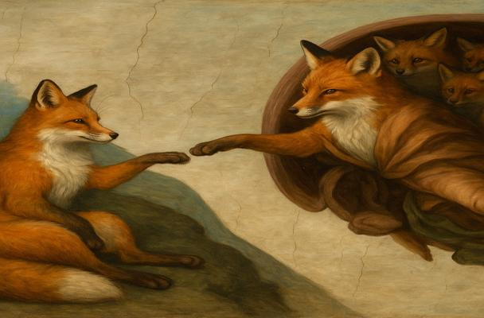
    

      <h4><b>La Création du Renard (Elliott)</b></h4>
      
d'après "La Création d’Adam" de Michel-Ange (vers 1511)

    

  

  

    
    

      <h4><b>La fable du renard et de la proie (Ethan)</b></h4>
      
d'après "La fable du chien et de la proie" de Paul de Vos (17e siècle)

    

  

  

    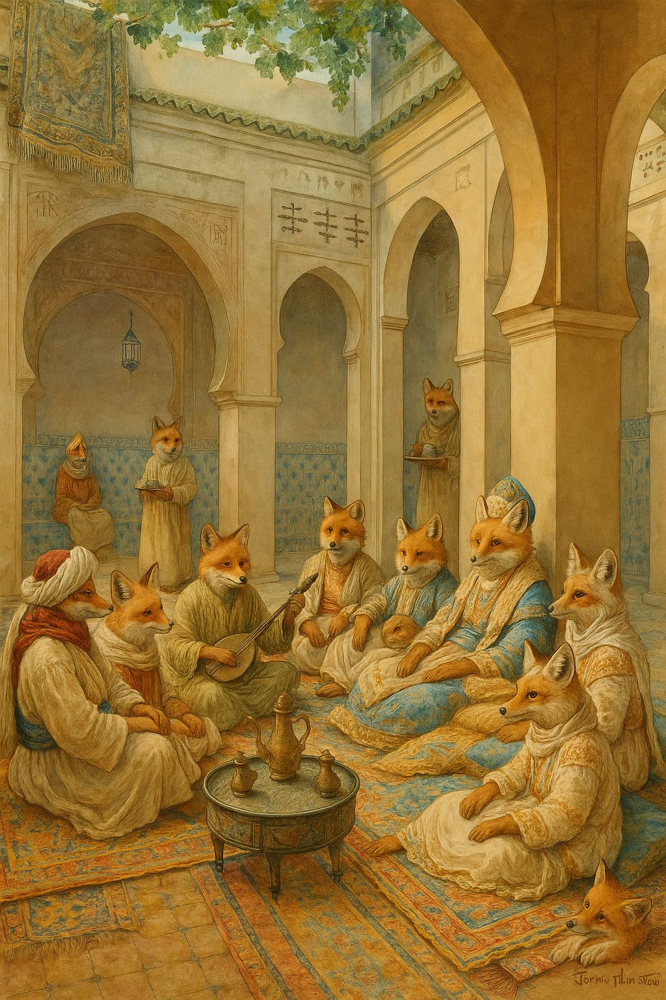
    

      <h4><b>Conversation de renards dans un patio (Enzo)</b></h4>
      
d'après "Conversation dans un patio à Alger" de Rudolf Ernst (Fin XIXe)

    

  

  

    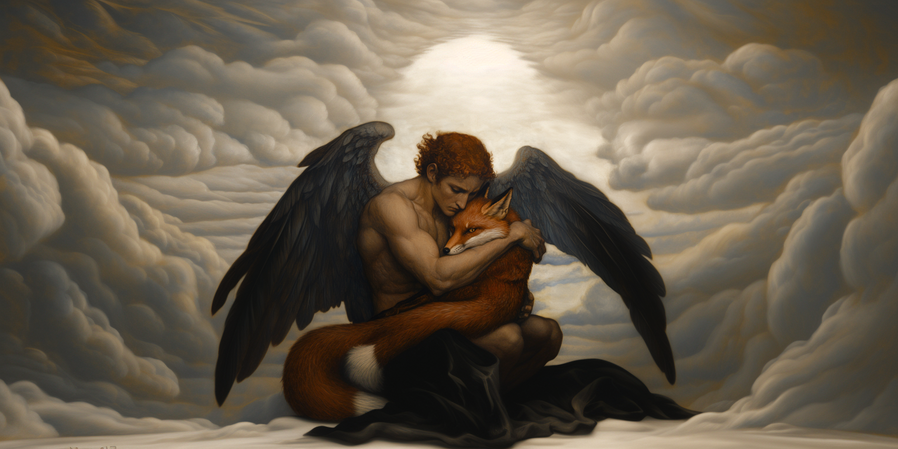
    

      <h4><b>L'Ange renard déchu (Ewan)</b></h4>
      
d'après "L’Ange déchu" d'Alexandre Cabanel (1847)

    

  

  

    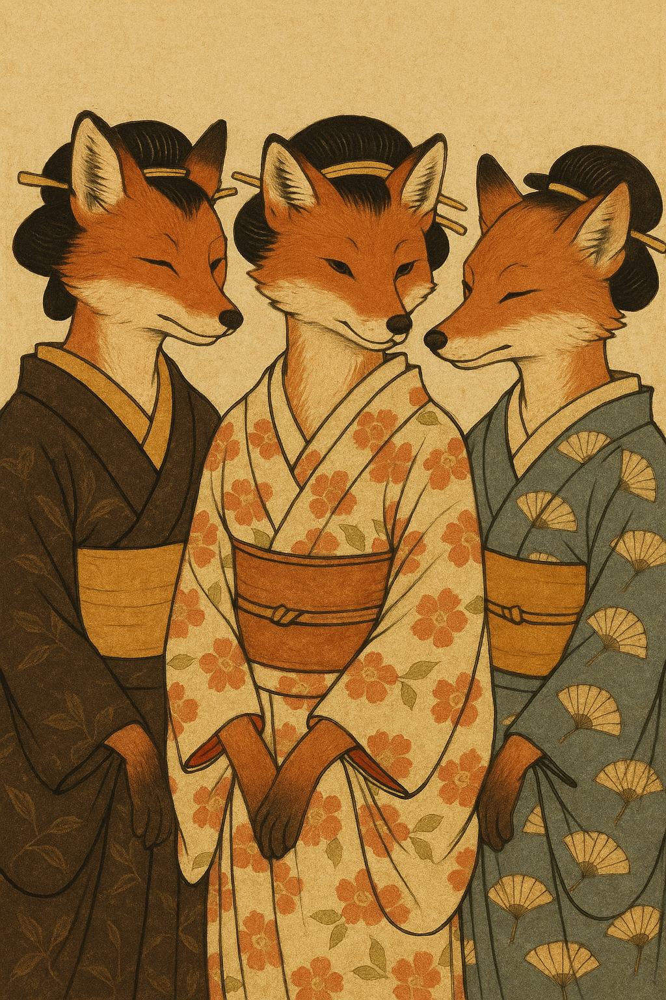
    

      <h4><b>Kitagawa UtamaRen'Art (Hugo)</b></h4>
      
d'après "Kōmei San Bijin - Trois beautés célèbres" d'Utamaro (1792-1793)

    

  

  

    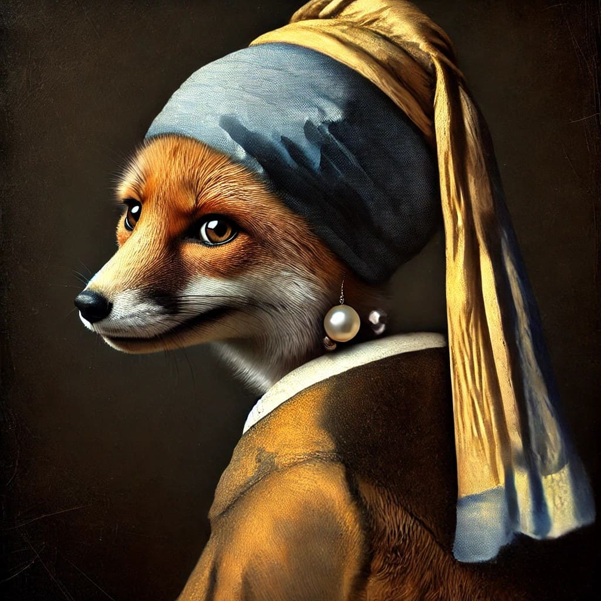
    

      <h4><b>Le renard à la perle (Léon)</b></h4>
      
d'après "La Jeune Fille à la perle" de Johannes Vermeer (1665)

    

  

  

    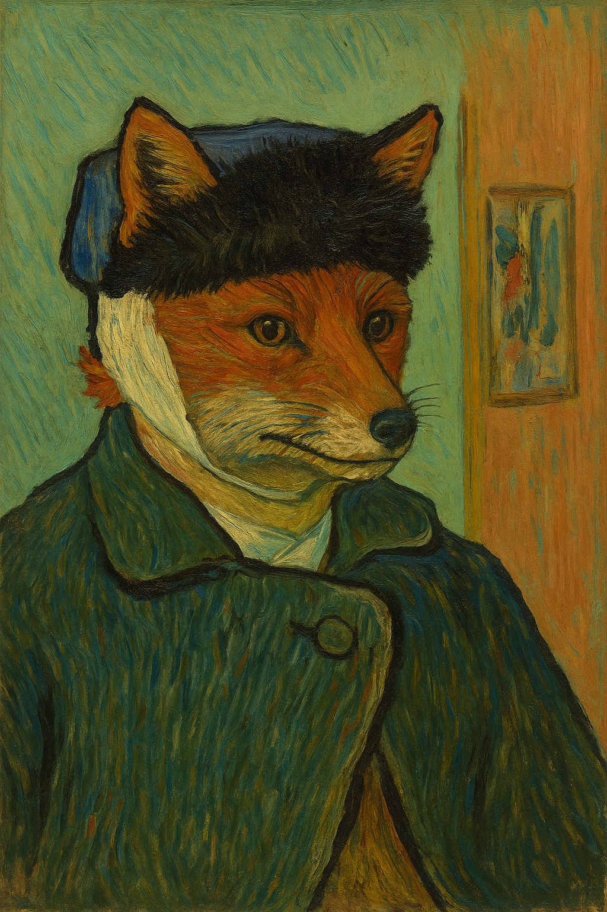
    

      <h4><b>Autoportrait du renard à l'oreille bandée (Lino)</b></h4>
      
d'après "Autoportrait à l'oreille bandée" de Vincent van Gogh (1889)

    

  

  

    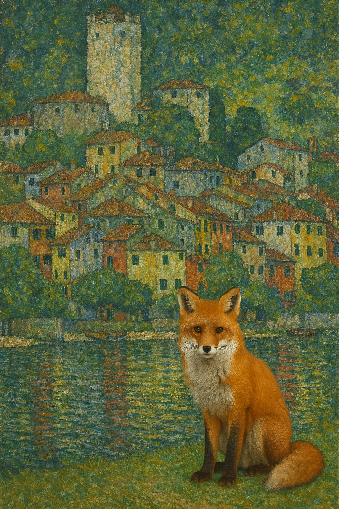
    

      <h4><b>Malcesine aux renards (Lois)</b></h4>
      
d'après "Malcesine sur le lac de Garde" de Gustav Klimt

    

  

  

    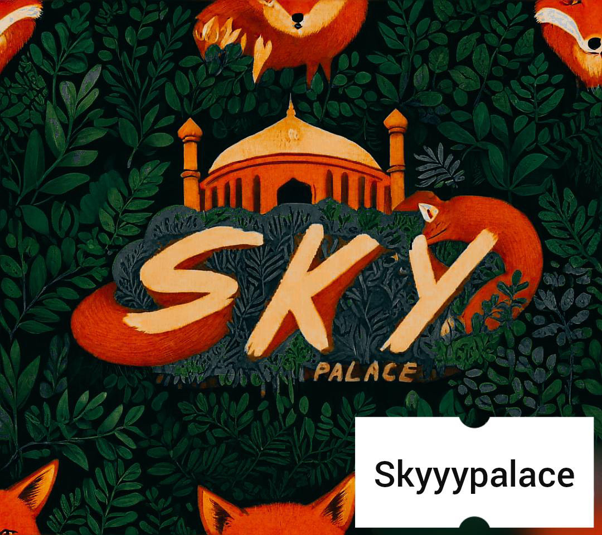
    

      <h4><b>Sky Palace Renardisé (Lowen)</b></h4>
      
Création originale de Lowen L. (2024)

    

  

  

    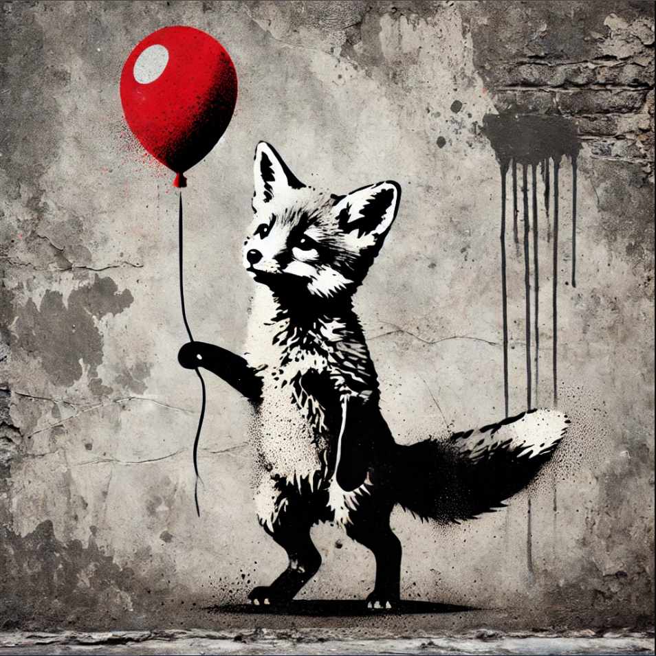
    

      <h4><b>Renard au ballon (Lucas)</b></h4>
      
d'après "La Petite Fille au Ballon" de Banksy

    

  

  

    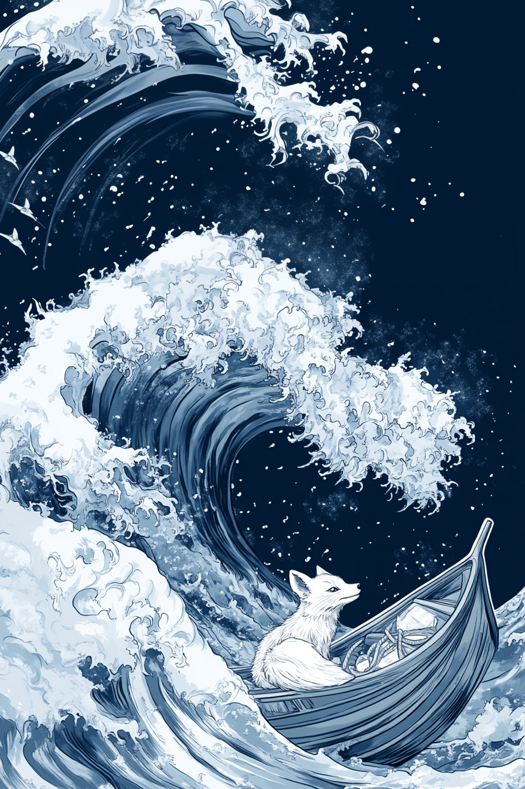
    

      <h4><b>La Vague de Kanagafox (M. Braun)</b></h4>
      
d'après "La Grande Vague de Kanagawa" de Katsushika Hokusai (1830-1833)

    

  

  

    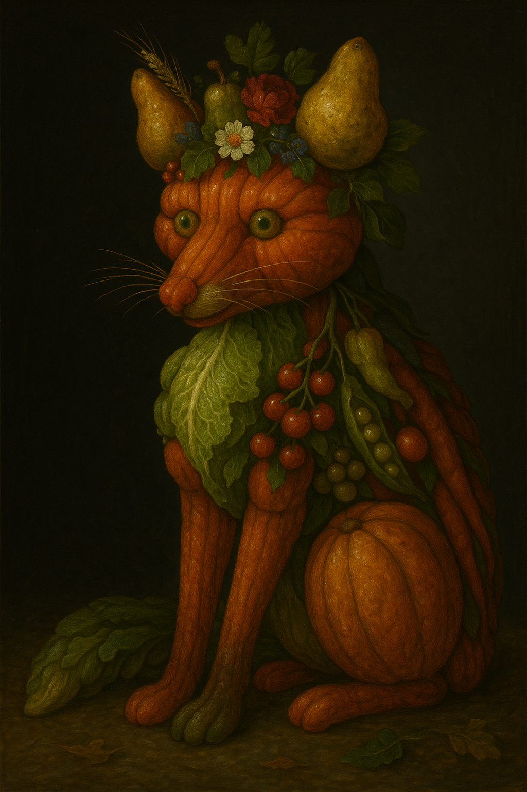
    

      <h4><b>Renartumne (Mathis)</b></h4>
      
d'après "Vertumne" de Giuseppe Arcimboldo (1590)

    

  

  

    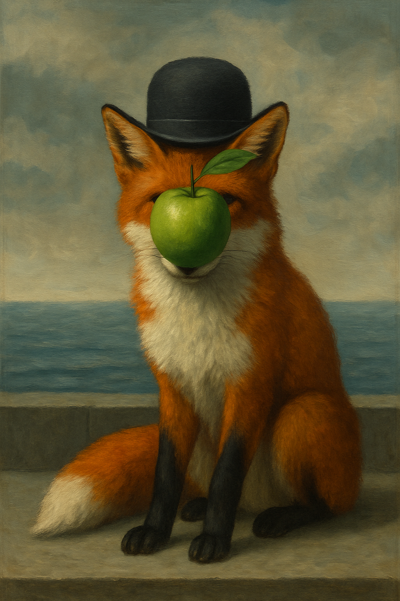
    

      <h4><b>Le Fils du Renard (Maxime)</b></h4>
      
d'après "Le Fils de l'homme" de René Magritte (1964)

    

  

  

    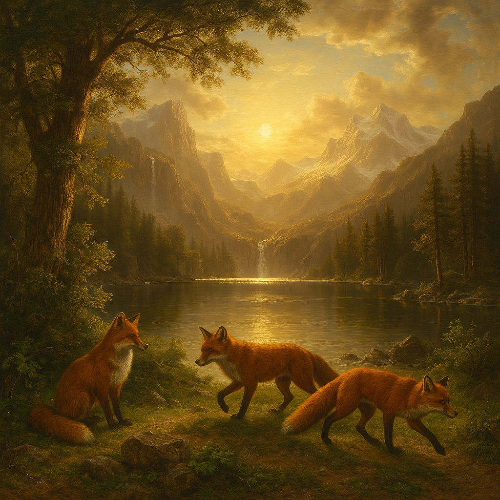
    

      <h4><b>Foxes around the mountains (Nathan)</b></h4>
      
d'après "Among the Sierra Nevada, California" d'Albert Bierstadt (1868)

    

  

  

    
    

      <h4><b>La Laitière aux aguets (Nolann)</b></h4>
      
d'après "La Laitière" de Johannes Vermeer (vers 1658-1660)

    

  

  

    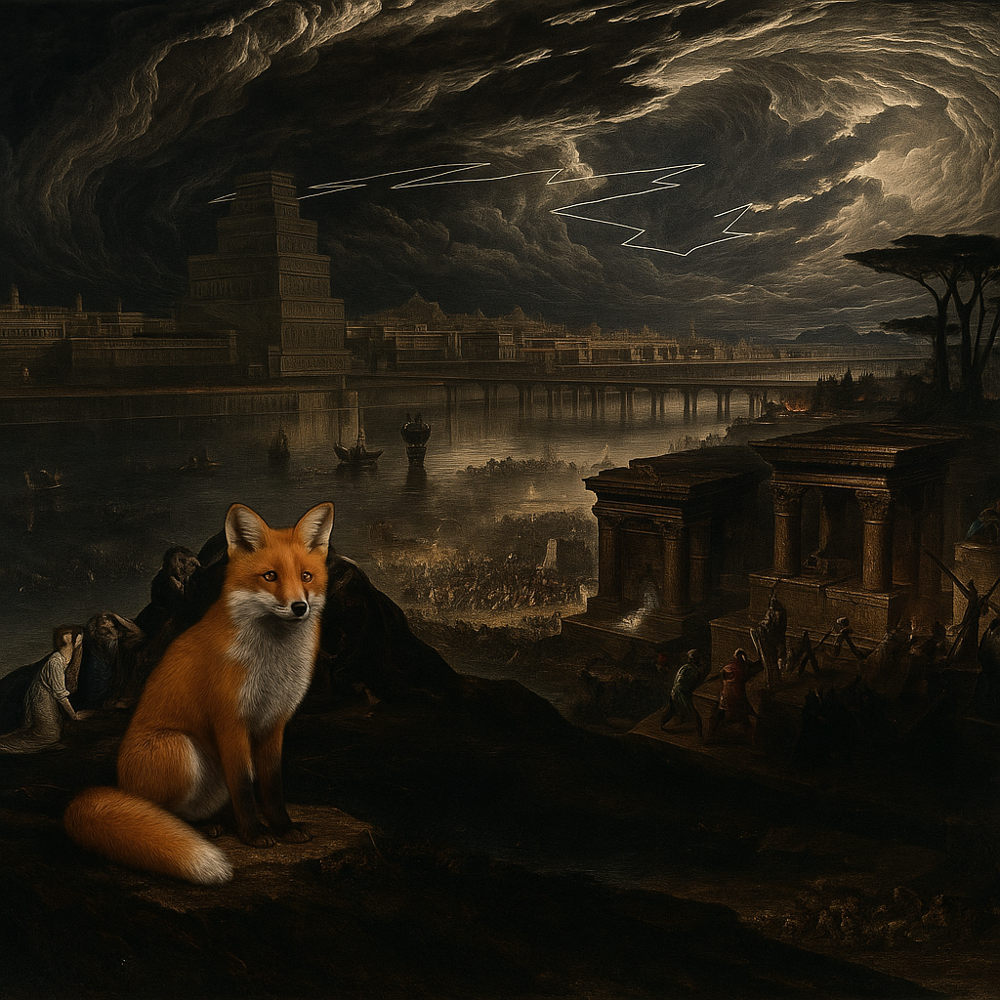
    

      <h4><b>The Fox of Babylone (Terry)</b></h4>
      
d'après "The Fall of Babylon" de John Martin (1831)

    

  

