# üé® Chasse aux Ren'Arts

    

        <h2>Galerie des Œuvres d'Art Renardisées</h2>
        
Découvrez les créations artistiques de nos élèves qui ont revisité les grands classiques de l'art en y intégrant notre mascotte renard !

    

!!! fox_correction "Navigation dans la galerie"

    Cliquez sur une œuvre pour l'agrandir et découvrir tous les détails. Utilisez les flèches du clavier ou les boutons pour naviguer.

## 🖼️ Édition 2024-2025

  

    <button class="gallery-btn prev-btn" onclick="changeSlide(-1)">‹</button>
    

      1 / 17
    

    <button class="gallery-btn next-btn" onclick="changeSlide(1)">›</button>
  

  
  

    

      

        

          
        

        

          <h3>Le Semeur et le Renard</h3>
          
Christopher

          
d'après "Le Semeur" de Vincent van Gogh (1888)

        

      

    

    

      

        

          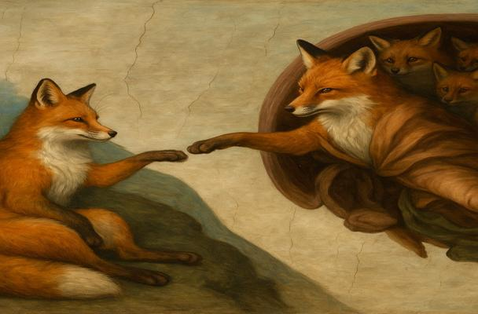
        

        

          <h3>La Création du Renard</h3>
          
Elliott

          
d'après "La Création d'Adam" de Michel-Ange (vers 1511)

        

      

    

    

      

        

          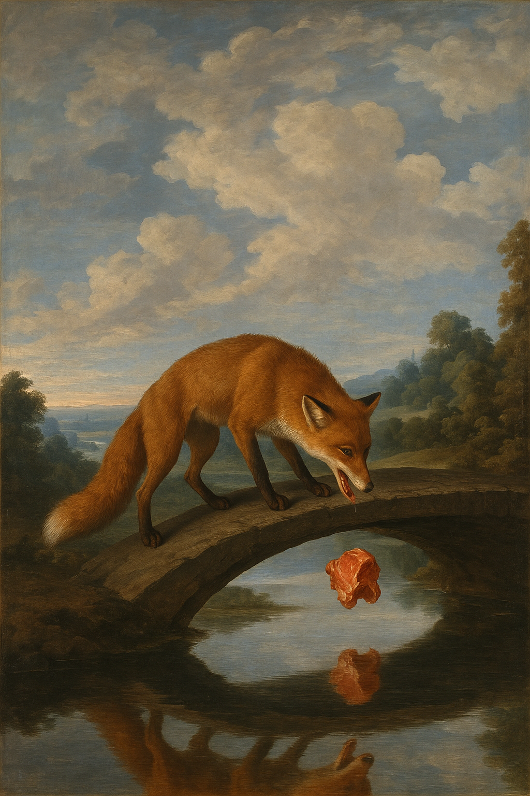
        

        

          <h3>La fable du renard et de la proie</h3>
          
Ethan

          
d'après "La fable du chien et de la proie" de Paul de Vos (17e siècle)

        

      

    

    

      

        

          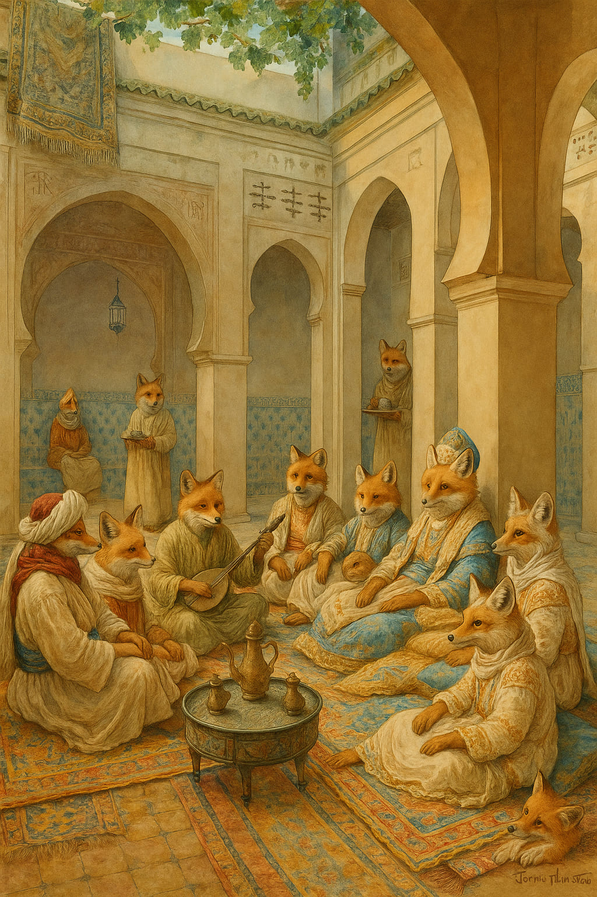
        

        

          <h3>Conversation de renards dans un patio</h3>
          
Enzo

          
d'après "Conversation dans un patio à Alger" de Rudolf Ernst (Fin XIXe)

        

      

    

    

      

        

          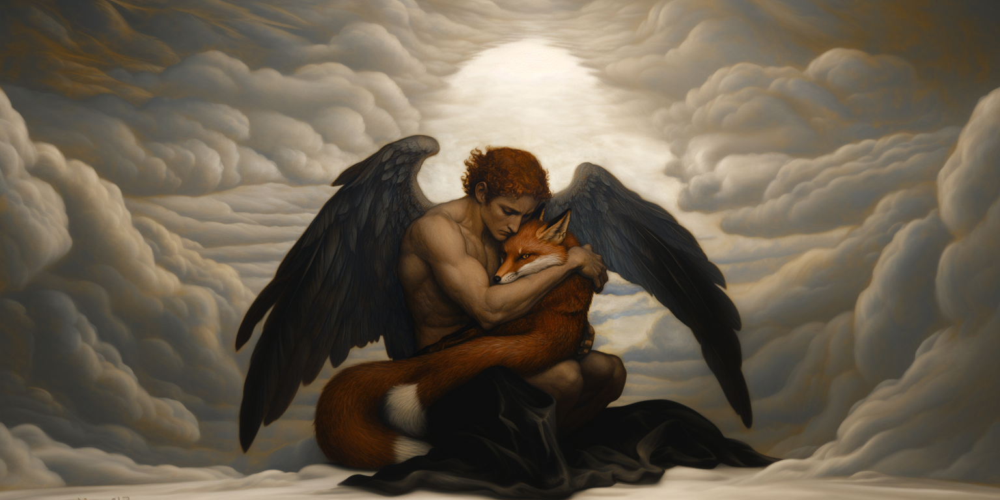
        

        

          <h3>L'Ange renard déchu</h3>
          
Ewan

          
d'après "L'Ange déchu" d'Alexandre Cabanel (1847)

        

      

    

    

      

        

          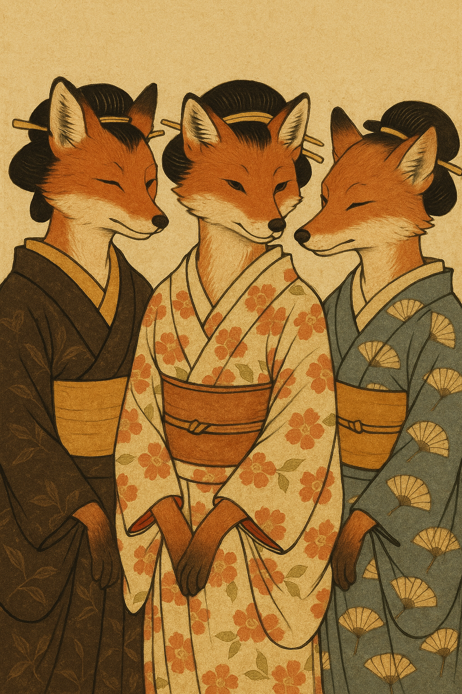
        

        

          <h3>Kitagawa UtamaRen'Art</h3>
          
Hugo

          
d'après "Kōmei San Bijin - Trois beautés célèbres" d'Utamaro (1792-1793)

        

      

    

    

      

        

          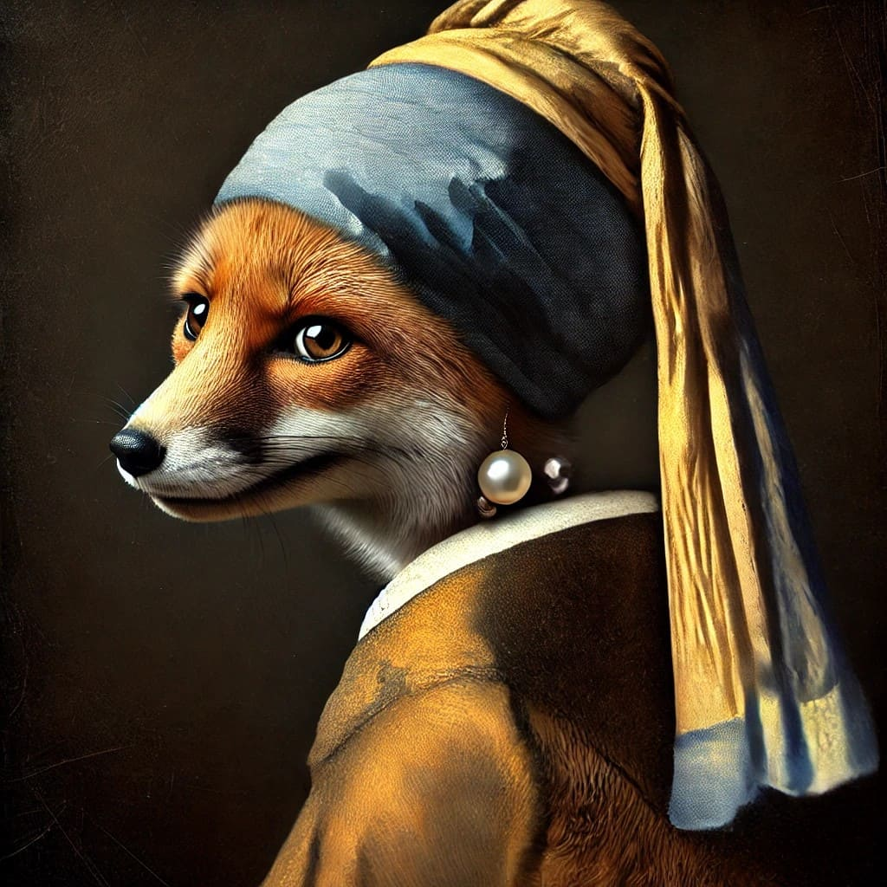
        

        

          <h3>Le renard à la perle</h3>
          
Léon

          
d'après "La Jeune Fille à la perle" de Johannes Vermeer (1665)

        

      

    

    

      

        

          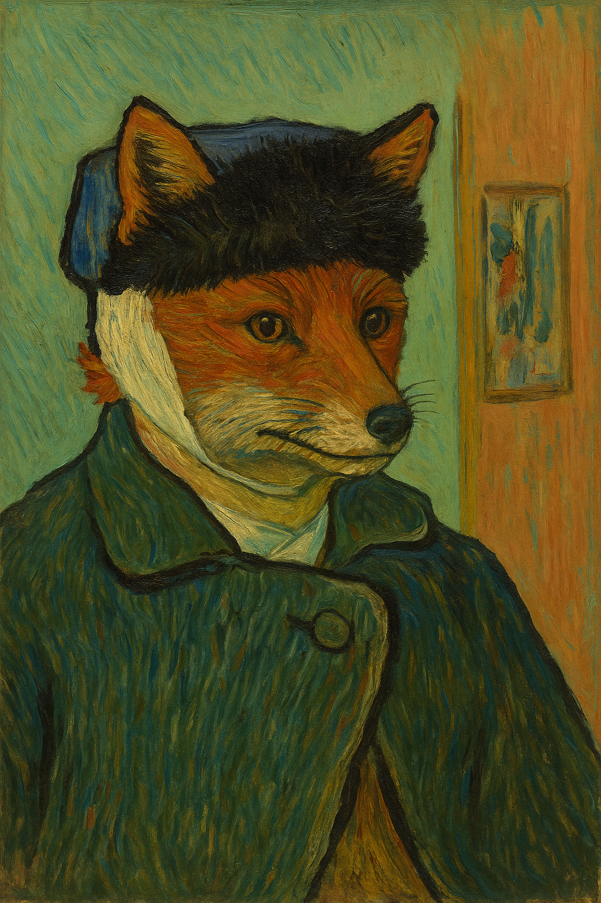
        

        

          <h3>Autoportrait du renard à l'oreille bandée</h3>
          
Lino

          
d'après "Autoportrait à l'oreille bandée" de Vincent van Gogh (1889)

        

      

    

    

      

        

          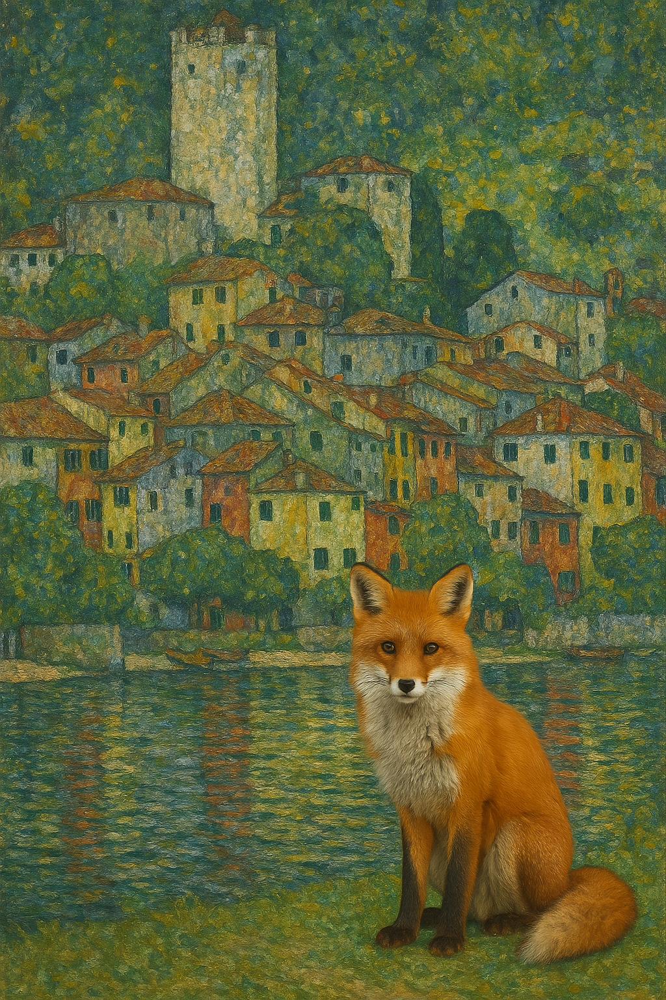
        

        

          <h3>Malcesine aux renards</h3>
          
Lois

          
d'après "Malcesine sur le lac de Garde" de Gustav Klimt

        

      

    

    

      

        

          
        

        

          <h3>Sky Palace Renardisé</h3>
          
Lowen

          
Création originale de Lowen L. (2024)

        

      

    

    

      

        

          
        

        

          <h3>Renard au ballon</h3>
          
Lucas

          
d'après "La Petite Fille au Ballon" de Banksy

        

      

    

    

      

        

          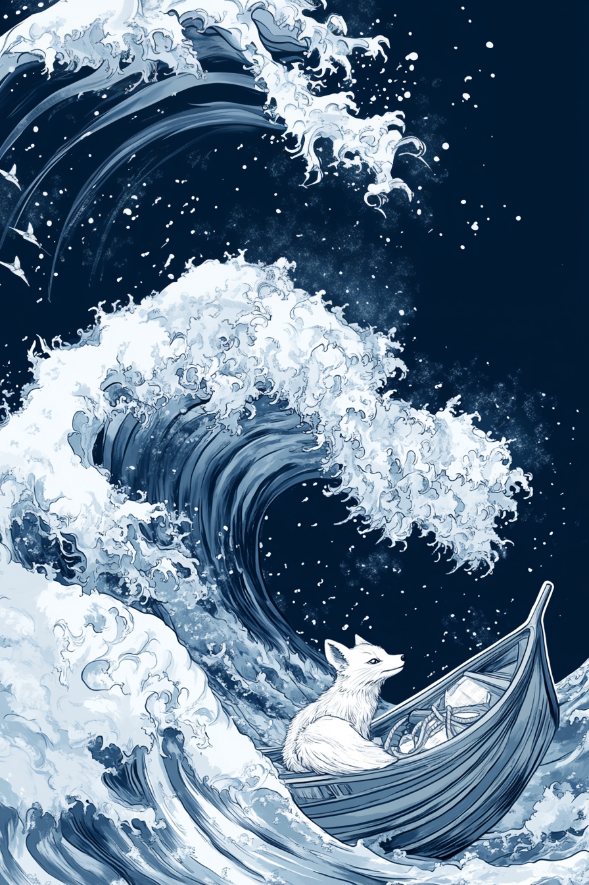
        

        

          <h3>La Vague de Kanagafox</h3>
          
M. Braun

          
d'après "La Grande Vague de Kanagawa" de Katsushika Hokusai (1830-1833)

        

      

    

    

      

        

          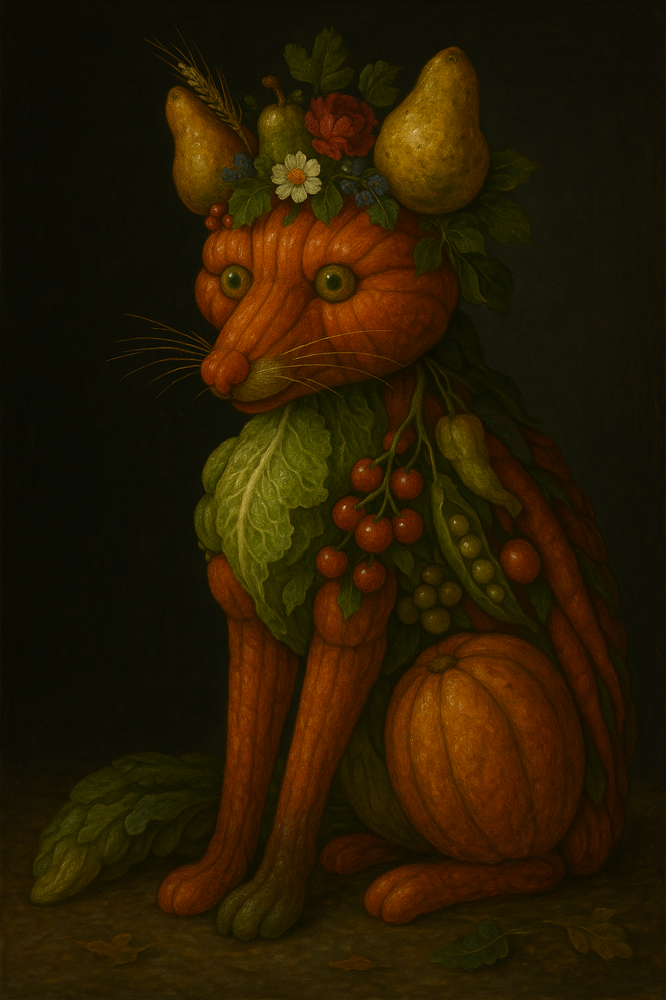
        

        

          <h3>Renartumne</h3>
          
Mathis

          
d'après "Vertumne" de Giuseppe Arcimboldo (1590)

        

      

    

    

      

        

          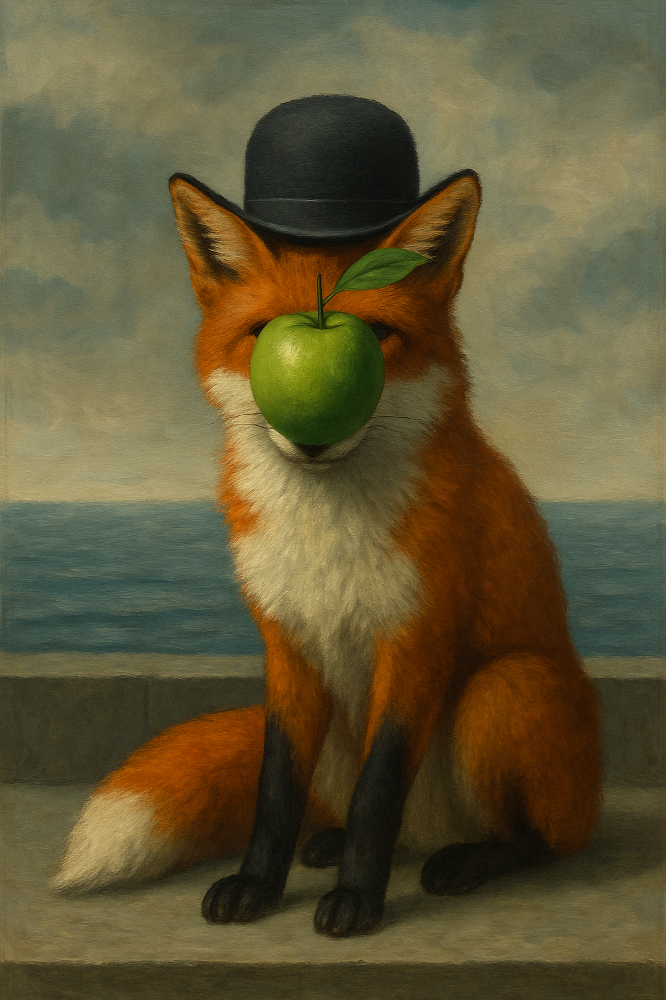
        

        

          <h3>Le Fils du Renard</h3>
          
Maxime

          
d'après "Le Fils de l'homme" de René Magritte (1964)

        

      

    

    

      

        

          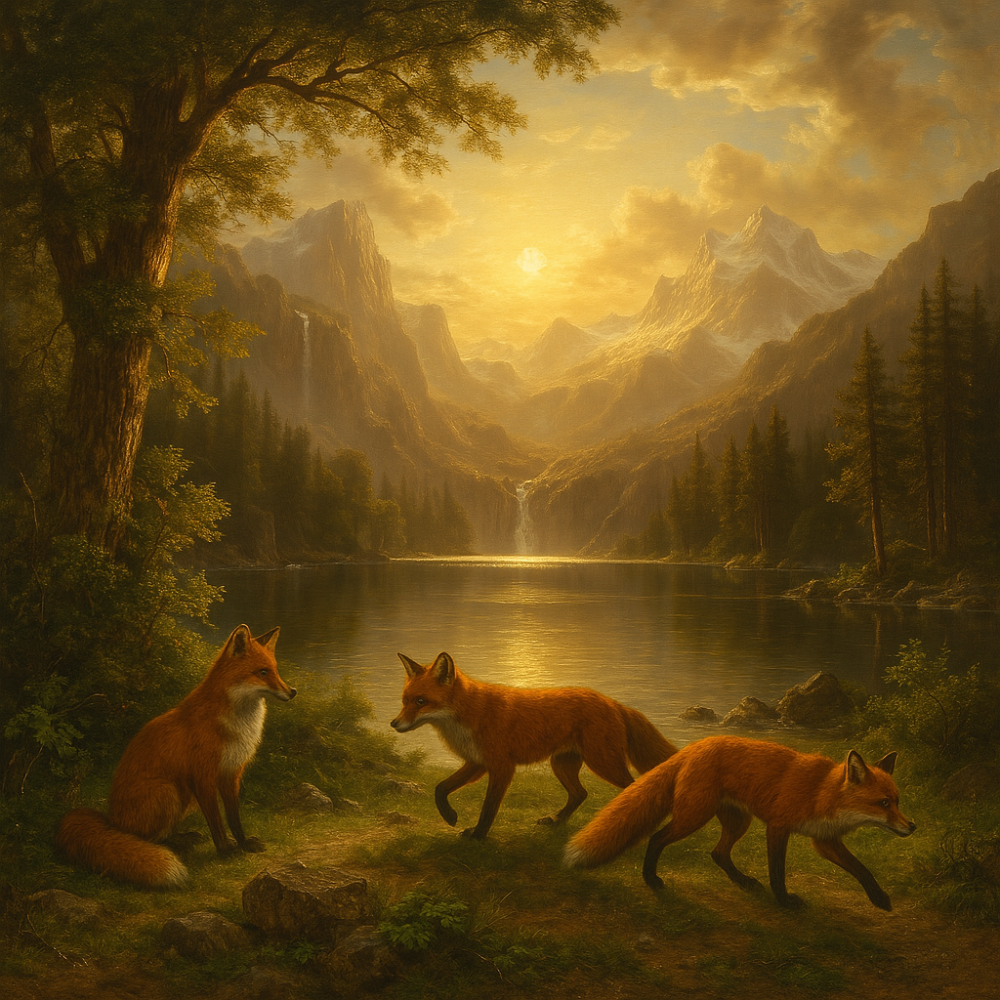
        

        

          <h3>Foxes around the mountains</h3>
          
Nathan

          
d'après "Among the Sierra Nevada, California" d'Albert Bierstadt (1868)

        

      

    

    

      

        

          
        

        

          <h3>La Laitière aux aguets</h3>
          
Nolann

          
d'après "La Laitière" de Johannes Vermeer (vers 1658-1660)

        

      

    

    

      

        

          
        

        

          <h3>The Fox of Babylone</h3>
          
Terry

          
d'après "The Fall of Babylon" de John Martin (1831)

        

      

    

  

  
  

    

      

        
      

      

        
      

      

        
      

      

        
      

      

        
      

      

        
      

      

        
      

      

        
      

      

        
      

      

        
      

      

        
      

      

        
      

      

        
      

      

        
      

      

        
      

      

        
      

      

        
      

    

  

