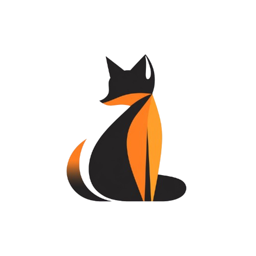
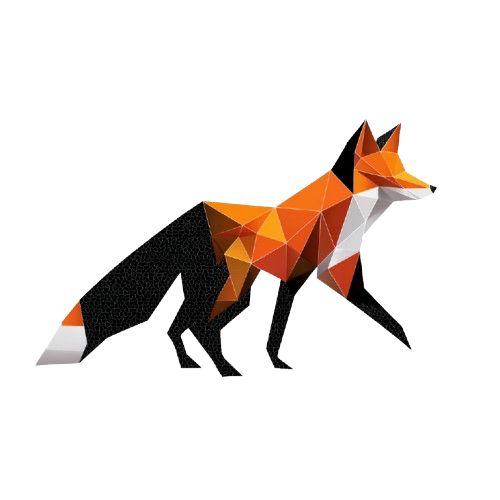
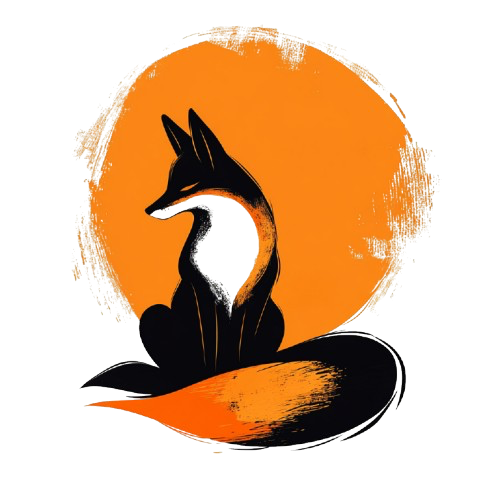

# Clément Braun - NSI

---

<!-- Script d'animation de loading -->

<!-- Script de protection par mot de passe -->

    

        
        <h2>SNT - Seconde</h2>
        
Sciences Numériques et Technologie : découverte des enjeux du numérique dans notre société

        <a href="seconde/seconde" class="btn">Accéder aux ressources</a>
    

    

        
        <h2>NSI - Première</h2>
        
Numérique et Sciences Informatiques : initiation à la programmation et aux concepts fondamentaux

        <a href="premiere/premiere" class="btn">Accéder aux ressources</a>
    

    

        
        <h2>NSI - Terminale</h2>
        
Approfondissement en informatique : structures de données, bases de données et projets avancés

        <a href="terminale/terminale" class="btn">Accéder aux ressources</a>
    

    

        
        <h2>Chasse aux Ren'arts</h2>
        
Défi ludique et pédagogique pour mettre en pratique les compétences NSI de manière créative

        <a href="chasse_aux_renards" class="btn">Participer au défi</a>
    

---

### 📋 Programmes officiels
- [Bulletin officiel de la SNT](https://www.education.gouv.fr/bo/19/Special1/MENE1901641A.htm)
- [Bulletin officiel de la première NSI](https://www.education.gouv.fr/bo/19/Special1/MENE1901633A.htm)
- [Bulletin officiel de la terminale NSI](https://www.education.gouv.fr/bo/19/Special8/MENE1921247A.htm)

## 💻 Logiciels utiles

    

        

            
        

        <h3 class="software-name">Visual Studio Code</h3>
        
Éditeur de code moderne avec extensions pour Python, JavaScript, C++. Interface intuitive et débogage intégré.

        ✓ Disponible au lycée
    

    
    

        

            
        

        <h3 class="software-name">Thonny</h3>
        
IDE Python simple et pédagogique, parfait pour débuter. Visualisation des variables et débogage pas à pas.

        ✓ Disponible au lycée
    

    
    
    

        

            
        

        <h3 class="software-name">VSCodium</h3>
        
Version open-source de VS Code sans télémétrie Microsoft. Mêmes fonctionnalités, plus de confidentialité.

        ✓ Disponible au lycée
    

    
    

        

            
        

        <h3 class="software-name">PyCharm</h3>
        
IDE professionnel pour Python avec refactoring avancé, débogage puissant et gestion de projets complexes.

        ⚠ Installation personnelle
    

    

    

        <h2 class="bac-title">🎓 Baccalauréat NSI</h2>
        
        

            Le baccalauréat NSI est composé de deux épreuves complémentaires évaluant les compétences théoriques et pratiques.
        

        
        

            

                

                    
📝

                    <h3 class="exam-title">Épreuve Écrite</h3>
                

                
                

                    

                        Durée
                        3h30
                    

                    

                        Exercices
                        3 exercices
                    

                    

                        Répartition
                        2×6pts + 1×8pts
                    

                

                
                

                    3/4
                    <small>de la note finale</small>
                

                
                

                    Épreuve théorique couvrant les concepts du cours, algorithmes et résolution de problèmes informatiques.
                

            

            
            

                

                    
💻

                    <h3 class="exam-title">Épreuve Pratique</h3>
                

                
                

                    

                        Durée
                        1h00
                    

                    

                        Exercices
                        2 exercices
                    

                    

                        Sujets
                        ~40 sujets
                    

                

                
                

                    1/4
                    <small>de la note finale</small>
                

                
                

                    Programmation sur machine : rédaction d'algorithme et complétion de code à trous.
                

            

        

    

    

        <h2 class="section-title">👥 Ont contribué à ce site</h2>
        
        

            

                
🦊

                
BRAUN Clément

                
Enseignant d'informatique

            

            
            

                
💻

                
DELPLACE Nicolas

                
Enseignant d'informatique

            

            
            

                
🎓

                
RAMSTEIN Stéphane

                
Enseignant d'informatique Lycée Raymond Queneau

            

            
            

                
🏫

                
PAPEGAY Benoit

                
Enseignant à l'Université de Lille

            

            
            

                
🎯

                
MARCHAND Mathieu

                
Enseignant d'informatique Lycée Benjamin Franklin

            

        

    

    <h2 class="section-title" style="color: var(--md-default-fg-color); margin-bottom: 2rem;">🌐 Sites de collègues de NSI</h2>
    
    

        <button class="carousel-nav prev" onclick="moveCarousel(-2)">‹</button>
        <button class="carousel-nav next" onclick="moveCarousel(2)">›</button>
        
        

            

                

                    
📚

                    <h3 class="colleague-name">RELMY Lucas</h3>
                

                
Ressources complètes et exercices pratiques pour NSI

                <a href="http://lucasrelmynsi.gitlab.io/site_cours/" class="colleague-link" target="_blank">Visiter le site</a>
            

            
            

                

                    
🔬

                    <h3 class="colleague-name">DEMERVILLE Erwan</h3>
                

                
Cours détaillés et projets innovants en NSI

                <a href="https://nsi.erwandemerville.fr" class="colleague-link" target="_blank">Visiter le site</a>
            

            
            

                

                    
⚡

                    <h3 class="colleague-name">RAMSTEIN Stéphane</h3>
                

                
Approche pédagogique moderne et interactive

                <a href="https://stephane_ramstein.gitlab.io/nsi/" class="colleague-link" target="_blank">Visiter le site</a>
            

            
            

                

                    
🚀

                    <h3 class="colleague-name">MARCHAND Mathieu</h3>
                

                
Contenus avancés et méthodologie rigoureuse

                <a href="https://mmarchand-nsi.github.io" class="colleague-link" target="_blank">Visiter le site</a>
            

            

                

                    
🚀

                    <h3 class="colleague-name">LEAL Nicolas</h3>
                

                
Contenus avancés et méthodologie rigoureuse

                <a href="http://www.prof-leal.fr" class="colleague-link" target="_blank">Visiter le site</a>
            

        

    

    
    

        <button class="carousel-indicator active" onclick="goToSlide(0)"></button>
        <button class="carousel-indicator" onclick="goToSlide(1)"></button>
        <button class="carousel-indicator" onclick="goToSlide(2)"></button>
        <button class="carousel-indicator" onclick="goToSlide(3)"></button>
        <button class="carousel-indicator" onclick="goToSlide(4)"></button>
    

