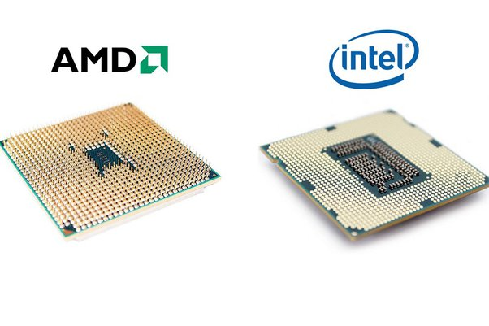

# Architecture d'une machine I : le modèle de Von Neumann

## Définition et Histoire

On définit un ordinateur comme étant une machine qui réalise des calculs de manière ordonnée (on parlait d'ordonnateur).
Il existe divers modèles pour créer des machines qui résolvent des calculs (comme la machine de Turing par exemple) mais celui qui a été retenu pour réaliser les machines que l'on utilise quotidiennement est celui de John Von Neumann.

John Von Neumann était un mathématicien de la fin du XVIIIe - début XIXe siècle et son but était d'augmenter les puissances de calcul des machines déjà existantes à cause notamment de la seconde guerre mondiale.

Il reprend le modèle de calcul du projet **EDVAC** qui était une machine de calcul militaire (qui pouvait réaliser des opérations mathématiques en utilisant le binaire) mais y ajoute la notion de mémoire de programme pour créer son modèle.

Ce modèle réalise des calculs de manière séquentielle, ordonnée : on peut appeler ce modèle un **modèle de calcul séquentiel**.

## Les composants du modèle de Von Neumann

Le modèle de Von Neumann est caractérisé par la présence de 4 composants notables.

### UAL et UC

Le cerveau de la machine, les composants qui réalisent les calculs, résolvent les algorithmes et les ordonnent : **l'Unité Arithmético Logique** et **l'Unité de Contrôle**

L'Unité Arithmético-logique (ou UAL) est une unité de traitement qui sert à réaliser des calculs et opérations de base. Elle peut réaliser des opérations mathématiques, des opérations de logique, de comparaisons ou des décalages.

Cette unité est composé de milliards de transistors qui sont des composants électroniques qui servent à réaliser notamment des opérations et comparaisons suivant la logique booléenne. Cet ensemble de transistor peut être appelé **circuit de portes logiques ou circuit logique**.

L'Unité de contrôle comme son nom l'indique réalise la gestion des flux électriques provenant de la mémoire ou de l'Unité Arithmético-Logique.
Elle permet de réaliser la séquence des opérations ; Elle est responsable de l'appellation de modèle séquentielle.

Cet ensemble d'unité est ce que l'on appelle le **micro-processeur** ou communément le **processeur**.
Il existe divers types de processeurs qui peuvent réaliser des opérations en "quasi simultané" et qui sont cadencés par des signaux d'horloges : on parle de **fréquence du processeur**.
Cette fréquence est en général exprimée en *GHz* (prononcé *Giga-Hertz*).

### La mémoire

### Les bus et périphériques

## Le langage machine