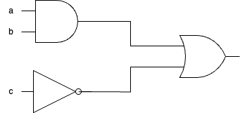
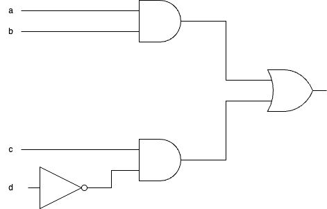

# Fiche d'exercices : Circuits logiques

Les circuits électroniques sont schématisés à l'aide des portes logiques qui les contiennent.

Chacune des portes logiques (OR, AND, OR etc...) ont leur propre représentation : en norme américaine ou norme européenne.

Pour les exercices suivants, on utilisera la norme américaine.

## Exercice 1 : Circuits et portes

**1. Pour les deux schémas suivants, donner les portes logiques qui les composent. Quelle est la différence entre ces 2 schémas?**

*Astuce : il est possible de partir du début et retranscrire tous les résultats des portes logiques.*

**2. Donner la table de vérité du deuxième circuit, c'est à dire la valeur de la sortie (1 ou 0) en fonction de chacune des combinaisons d'entrées possibles.**

*Astuce : il y a $2^n$ cas pour n variable booléennes en entrée de circuit. Si 3 variables, il y a $2^3=8$ combinaisons possibles.*

## Exercice 2 : Circuits électronique vers équations booléennes

**Pour chacun de ces circuits, donner l'équation booléenne correspondante**

## Exercice 3 : Équations booléennes vers Circuit électronique

**Pour chacune des équations booléennes proposées, donner le circuit électronique associé.**

1. (a **and** b) **and** (b **and** c)
2. ((**not**a) **and** b) **or** (a **and** (**not**b))
3. (a **and** b) **or** (c **and** a **or** b)