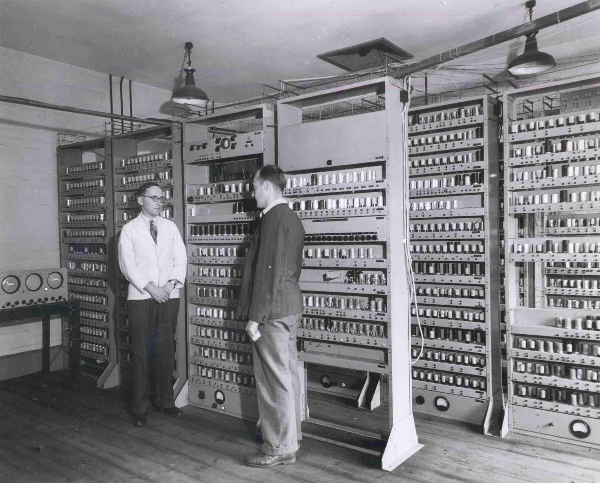
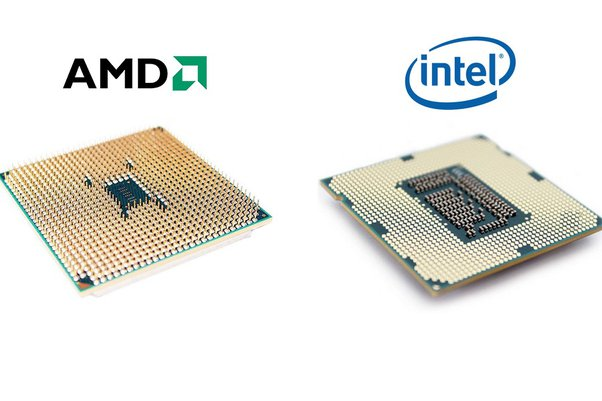

# 📚 💻 Architecture d'une machine : le modèle de Von Neumann

## 📚 Définition et Histoire

On définit un ordinateur comme étant une machine qui réalise des calculs de manière ordonnée (on parlait d'ordonnateur).  
Il existe divers modèles pour créer des machines qui résolvent des calculs (comme la machine de Turing par exemple) mais celui qui a été retenu pour réaliser les machines que l'on utilise quotidiennement est celui de John Von Neumann.

👨‍🔬 John Von Neumann était un mathématicien de la fin du XIXe - début XXe siècle et son but était d'augmenter les puissances de calcul des machines déjà existantes à cause notamment de la seconde guerre mondiale.

Il reprend le modèle de calcul du projet **EDVAC** qui était une machine de calcul militaire (qui pouvait réaliser des opérations mathématiques en utilisant le binaire) mais y ajoute la notion de mémoire de programme pour créer son modèle.

Ce modèle réalise des calculs de manière séquentielle, ordonnée : on peut appeler ce modèle un **modèle de calcul séquentiel**.

## 📖 🔧 Les composants du modèle de Von Neumann

Le modèle de Von Neumann est caractérisé par la présence de 4 composants notables.

### 🧮 UAL et UC

Le cerveau de la machine, les composants qui réalisent les calculs, résolvent les algorithmes et les ordonnent : **l'Unité Arithmético Logique** et **l'Unité de Contrôle**

L'Unité Arithmético-logique (ou UAL) est une unité de traitement qui sert à réaliser des calculs et opérations de base. Elle peut réaliser des opérations mathématiques, des opérations de logique, de comparaisons ou des décalages.  
L'UAL peut aussi contenir un ensemble d'espaces de données nommé **registres**.

Cette unité est composé de milliards de transistors qui sont des composants électroniques qui servent à réaliser notamment des opérations et comparaisons suivant la logique booléenne. Cet ensemble de transistor peut être appelé **circuit de portes logiques ou circuit logique**.

🎛️ L'Unité de contrôle comme son nom l'indique réalise la gestion des flux électriques provenant de la mémoire ou de l'Unité Arithmético-Logique.  
Elle permet de réaliser la séquence des opérations ; Elle est responsable de l'appellation de modèle séquentielle.

Cette Unité de Contrôle suit un cycle précis pour organiser les programmes.  
Il est composé de 3 étapes :

1. 🔄 L'UC récupère les instructions dans la mémoire. (Fetch)
2. 🔍 L'UC décode ces instructions en langage proche de la machine. (Decode)
3. ⚡ L'UC transmet l'instruction à l'UAL et celle-çi lui renvoie le résultat. (Execute)
4. 💾 L'UC transmet le résultat dans la mémoire. (Store)

Cet ensemble d'unité est ce que l'on appelle le **micro-processeur** ou communément le **processeur**.  
Il existe divers types de processeurs qui peuvent réaliser des opérations en "quasi simultané" et qui sont cadencés par des signaux d'horloges : on parle de **fréquence du processeur**.  
Cette fréquence est en général exprimée en *GHz* (prononcé *Giga-Hertz*).

### 💾 La mémoire

Tous les calculs, opérations et programmes ont besoin de valeurs pour fonctionner ou doivent renvoyer et stocker des résultats pour les utiliser.  
Les machines ont aussi besoin de mémoire pour stocker de manière temporaire des variables de programmes ou de stockage à long terme pour enregistrer des fichers par exemple.

Il existe divers types de mémoire qui permettent le bon fonctionnement d'une machine.

#### ⚡ Le cache du processeur

Le cache du processeur est une mémoire d'accès très rapide, située entre le processeur et la RAM.  
Elle permet de stocker temporairement les instructions utilisées par le processeur pour éviter de tout le temps les calculer. Cela permet d'optimiser l'utilisation du processeur.

#### 🔄 La mémoire volatile (RAM)

La mémoire volatile ou mémoire **RAM (Random Access Memory)** correspond à la mémoire court terme de la machine.  
Cette mémoire n'est pas aussi conséquente qu'une mémoire de stockage mais possède des fréquences d'accès très rapides (de l'ordre du *GHz*).

Cette mémoire permet de stocker temporairement les données à des programmes en cours d'exécution.  
Le fait de stocker ces données dans la RAM (qui est une mémoire d'accès très rapide) permet au processeur d'accéder à des données très rapidement et de réaliser d'autant plus rapidement les diverses opérations.

#### 📀 La mémoire morte (ROM)

La mémoire ROM **(ou Read-Only Memory)** est une mémoire qui est non-volatile. Elle est conservée même lorsque la machine est éteinte. Elle contient les instructions nécessaires au démarrage de l'ordinateur (BIOS ou firmware).

#### 💿 La mémoire à long terme

La mémoire à long terme permet de stocker des données et des fichiers. Elle est celle qui correspond aux disques durs, clefs USB ou SSD.  
Elle permet de stocker le système d'exploitation, les applications ou les données (fichiers, programmes etc...).

### 🔌 Les bus et périphériques

On a vu précédemment l'utilité du processeur et de la mémoire mais comment tout cela interragit-il?

Les **bus** permettent de relier tous ces composants pour leur permettre de communiquer. Un bus au sens physique est un ensemble de câbles  
Il existe divers bus :

* 🎮 Bus de contrôle : Transfère les signaux de contrôle et de commande entre les composants.
* 📊 Bus de données : Transfère les données entre le processeur, la mémoire et les périphériques.
* 🔍 Bus d'adresses : Transfère les adresses mémoire ou des périphériques pour avoir accès aux diverses données nécessaires à l'exécution de la machine.

Les périphériques font aussi partie de la machine.  
Qu'ils soient d'entrée comme un clavier, un micro ou des capteures, de sortie comme des enceintes ou un écran, tous permettent de rajouter des fonctionnalités à une machine.

### ⚠️ La limite du modèle de Von Neumann

Ce modèle est un modèle efficace et qui a fait ses preuves depuis les années 70.  
Cependant il souffre d'un gros problème : la communication entre les divers composants.

Les composants ont tous des fréquences de fonctionnement ou des débits différents. Le modèle de Von Neumann est confronté à un problème de **goulots d'étranglements** (ou connu sous le nom de **bottleneck** en anglais).

🚰 On peut imager cela comme un système de plomberie.  
Imaginons en entrée un tube de 100mm de diamètre qui est alimenté de manière complète. Si celui-ci est suivi d'un tube de 40mm, cette portion va ralentir le debit global.  
Cela fonctionne pareil avec un ordinateur : si la mémoire fonctionne à une fréquence de 1 GHZ, le processeur à 1 GHz mais que les bus ne transmettent qu'à une fréquence de 20 MHz, l'ensemble de la machine sera ralenti.

🎮 *Pour ceux qui jouent sur PC:*  
Il peut arriver qu'il y ait un bottleneck entre le processeur et la carte graphique. Si l'un des deux composants est trop faible comparé à l'autre, il peut ralentir de manière globale les performances en jeu.