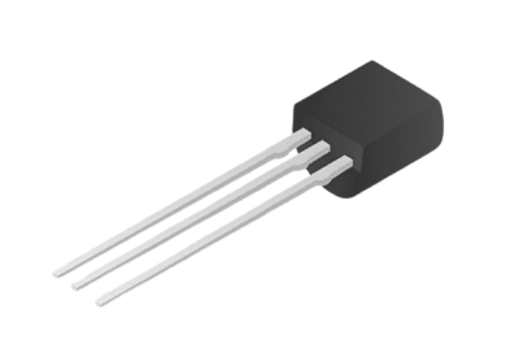
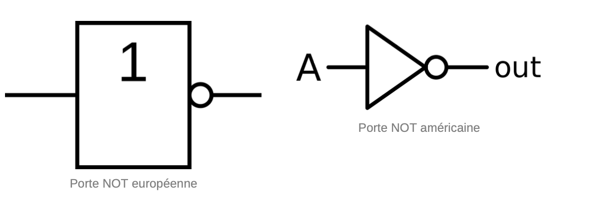
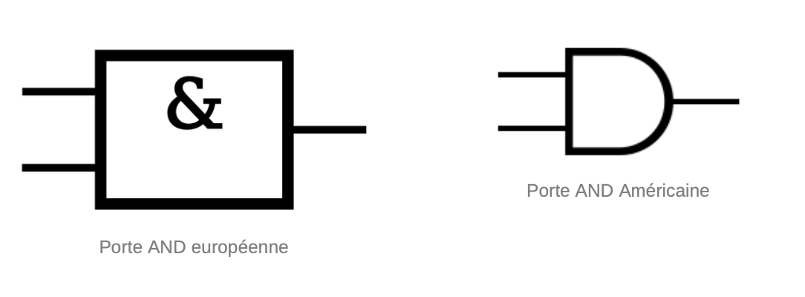
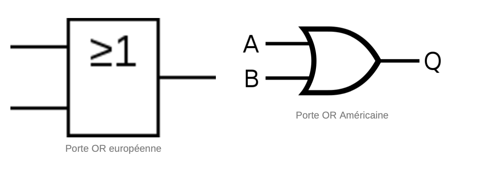
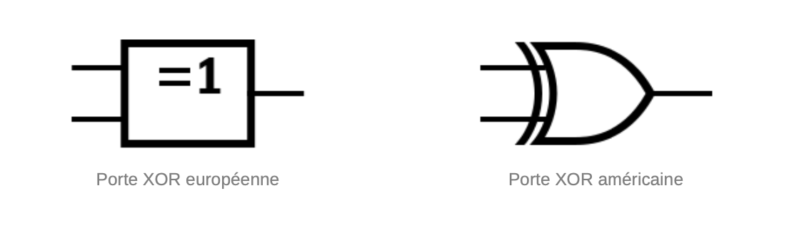

# 📚 Les circuits électroniques

    

        
📖 Définition

        <h3 class="course-title">Définitions</h3>
        

            Les circuits logiques sont des éléments fondamentaux de l'informatique, qui permettent de traiter l'information de manière numérique. Ils sont utilisés dans une multitude d'applications, allant des ordinateurs et des téléphones portables aux dispositifs de contrôle de la circulation et des systèmes de sécurité. Les circuits logiques sont construits à partir de composants électroniques, tels que des transistors, qui sont les briques de base des portes logiques.  Les transistors sont des dispositifs électroniques qui permettent de contrôler le flux de courant électrique. Ils peuvent être utilisés pour amplifier un signal ou pour activer ou désactiver un circuit. Les portes logiques sont des circuits électroniques qui effectuent des opérations logiques de base, telles que la conjonction, la disjonction, l'inversion, etc. Les portes logiques sont construites à partir de transistors, et peuvent être combinées pour former des circuits logiques plus complexes.  
        

    

    
    

        
📖 Définition

        <h3 class="course-title">Les portes logiques</h3>
        

            Une porte logique est un composant électronique qui effectue une opération logique sur un ou plusieurs signaux d'entrée pour produire un signal de sortie. Les portes logiques sont les briques de base des circuits logiques, et sont utilisées pour construire des circuits plus complexes.  On peut associer à une porte logique une <strong>table de vérité</strong>. Elle retranscrit les résultats de l'opération suivant chaque combinaison possible des variables d'entrée.  ### Porte NOT  Cette porte logique produit un signal de sortie qui est l'inverse du signal d'entrée. Si le signal d'entrée est "1", le signal de sortie est "0", et vice versa. L’écriture de l’opération logique est : $S = \overline{A}$.  #### Table de vérité  |entrée|sortie| |------|------| |0|1| |1|0|  #### Représentation    ### Porte AND  Cette porte logique produit un signal de sortie "1" uniquement si tous les signaux d'entrée sont "1". Sinon, le signal de sortie est "0". L’écriture de l’opération logique est :  $S = A \vee B$ ou $S = A \times B$  #### Table de vérité  |a|b|sortie| |-|-|------| |0|0|0| |0|1|0| |1|0|0| |1|1|1|  #### Représentation électronique    ### Porte OR  Cette porte logique produit un signal de sortie "1" si l'un des signaux d'entrée est "1" ou si les deux signaux d’entrée sont “1”. Si tous les signaux d'entrée sont "0", le signal de sortie est "0". L’écriture de l’opération logique est :  $S = A \wedge B$ ou $S = A + B$  #### Table de vérité  |a|b|sortie| |-|-|------| |0|0|0| |0|1|1| |1|0|1| |1|1|1|  #### Représentation électronique    ### Porte XOR  Cette porte logique produit un signal de sortie "1" si un seul des signaux d'entrée est "1". Si tous les signaux d'entrée sont "0" ou "1", le signal de sortie est "0".  La porte XOR est une porte de combinaison. Elle est équivalente à l'équation logique $S = \overline{A}B + A \overline{B}$. On l'écrit $A \oplus B$.  #### Table de vérité  |a|b|sortie| |-|-|------| |0|0|0| |0|1|1| |1|0|1| |1|1|0|  #### Représentation électronique  
        

    

    
    

        
📖 Définition

        <h3 class="course-title">Les équations logiques</h3>
        

            Une équation logique est une expression algébrique qui représente une fonction logique en utilisant des variables logiques, des opérateurs logiques et des constantes logiques. L'équation logique permet de décrire le comportement d'un circuit logique ou d'une fonction logique de manière formelle. Les équations logiques suivent des règles de priorité d'opérations similaires à PEMDAS. Par exemple, une équation logique simple pourrait être $S = A \vee B \oplus C$. Elle se lit "A et B ou C".
        

    

    

