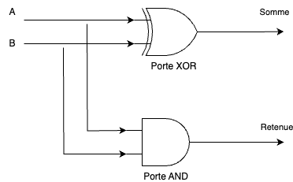

# 📚 Ludopédagogie : Redstone dans Minecraft

## 📖 Pourquoi Minecraft ?

Minecraft est un jeu vidéo sorti en 2009 qui met le joueur dans un mode en 3D créé aléatoirement en utilisant la méthode procédurale.

Pour faire court, la génération d'un monde Minecraft est aléatoire grâce à du pseudo-aléatoire au niveau de la création des terrains en utilisant un outil mathématique appelé le **bruit de Perlin**.

Le bruit de Perlin est une méthode mathématique utilisée pour générer des paysages réalistes dans les jeux vidéo, comme Minecraft. Il permet de créer des terrains qui semblent naturels, avec des montagnes, des vallées, et d'autres variations progressives.

Dans Minecraft, le bruit de Perlin est utilisé pour :
- Simuler les reliefs des terrains (collines, montagnes).
- Répartir les biomes (déserts, forêts, océans) en répartissant l'humidité et la température.
- Générer des variations progressives et cohérentes dans le monde.

> **Note : Bruit de Perlin**
> Cette technique fonctionne en générant des "grilles" de valeurs qui sont mélangées et interpolées pour créer des transitions progressives. Cela permet de créer des terrains où une montagne peut doucement devenir une plaine, au lieu d'avoir des changements brusques.

Minecraft est un jeu particulier car il met le joueur dans un monde composé de **voxels** qui ne sont que des pixels dans un univers en 3 dimensions (pixels étant un élément dans un univers de 2 dimensions).

De plus, ce jeu ayant reçu énormément d'évolutions depuis, a rajouté une mécanique assez novatrice qu'est la **redstone**.

La redstone (ou poudre rouge en français) permet de simuler des circuits électriques et de réaliser des opérations logiques.

## 📖 La notion de Turing-complet

Un système est dit Turing-complet s'il peut exécuter tous les calculs possibles qu'un ordinateur peut réaliser, à condition de disposer de suffisamment de temps et de mémoire. Cela signifie qu'il peut simuler une machine théorique appelée machine de Turing.

Minecraft et la redstone sont considérés comme Turing-complets car il est possible, avec les composants du jeu (poudre de redstone, torches, leviers, etc.), de construire des circuits logiques capables d'effectuer des calculs complexes. Par exemple, il est possible de :
- Réaliser des additions ou des multiplications.
- Créer des mémoires pour stocker des données.
- Construire un ordinateur entier dans Minecraft capable de jouer à Minecraft !

> **Astuce : Pourquoi est-ce important ?**
> Être Turing-complet signifie que Minecraft avec la redstone peut être utilisé pour simuler n'importe quel calcul ou programme, tout comme un vrai ordinateur.

> **Note : Notion de Turing-Complet**
> La notion de Turing-complet est liée à l'idée de simuler une machine de Turing, un modèle théorique de calcul inventé par Alan Turing. Ce modèle, à proprement parler, n'est pas au programme du lycée, mais il est intéressant de savoir que Minecraft peut être aussi puissant, en théorie, qu'un ordinateur moderne.

## 📖 Composants de redstone

Il existe un bon nombre de composants en redstone mais uniquement 5 composants seront necessaires pour ce TD.

| Composant | Image | Explication |
|-----------|-------|-------------|
| Poudre de redstone | | La poudre de redstone est l'élément principal des circuits. Elle permet de réaliser tous les tracés et de relier les composants à l'instar d'un cable de cuivre ou d'un tracé fait sur une carte-mère. |
| Répéteur de redstone | | Le répéteur de redstone permet de redonner de l'intensité au tracé de poudre de redstone créé. En effet, comme pour un vrai câble électrique, on peut retrouver des déperditions lors de longues distances. |
| Lampe de redstone | | Comme son nom l'indique, la lampe de redstone est une représentation d'une ampoule que l'on peut relier à une platine comme lors des simulations de circuits électroniques au collège. Elle s'allume si elle reçoit un courant en entrée. Elle nous servira à analyser les résultats lors des tests. |
| Torche de redstone | | La torche de redstone permet d'alimenter un circuit. |
| Leviers ou boutons | | Ces composants permettent au joueur de manipuler les entrées du circuits en leur donnant un état fixe (levier) ou temporaire (bouton). |

## 📖 Objectifs de la séance

L'objectif principal de la séance est la réalisation de circuits logiques dans Minecraft. Cela permet de se rendre compte de la difficulté de créer des circuits logiques compacts et qui sont entièrement fonctionnels (c'est à dire sans court-circuits par exemple).

Il faudra ainsi savoir créer les différentes portes logiques vues dans les cours précédents (AND, OR, NOT) et de les mettre ensemble pour recréer des circuits logiques analysés dans les exercices.

## 📖 Portes logiques dans Minecraft

Il est possible de réaliser toutes les portes logiques dans Minecraft.

Pour se faire, il existe une mécanique importante dans Minecraft : l'inversion grâce à un bloc.

En adossant ou en posant une torche de redstone sur un bloc, si ce bloc reçoit en entrée un courant, celle-ci permet d'inverser le courant (comme une porte NOT).

## 📖 Exercices

### Porte NOT

- Placez un levier, un bloc et une torche de redstone.
- Reliez une lampe au circuit.

### Porte AND

- Placez deux leviers comme entrées.
- Reliez-les à un circuit qui inclut deux torches de redstone sur 3 blocs et une poudre entre les deux pour relier les deux torches.
- Ajoutez une troisième torche sur un bloc pour produire la sortie.
- **Question :** Quand la lampe s'allume-t-elle ?

### Porte OR

- Placez deux leviers.
- Reliez-les à un circuit commun avec de la poudre de redstone.
- Ajoutez une lampe en sortie.
- **Question :** Quand la lampe s'allume-t-elle ?

---

## 📖 Circuits combinés

### Porte NAND
La porte NAND correspond à **l'inverse d'une porte AND**.
- Une lampe de redstone reliée à une porte NAND s'éteint uniquement si **au moins une entrée est allumée**, sinon s'allume.
- **Consigne :**
  1. Construisez une porte AND.
  2. Retirez la torche de redstone sur le bloc de sortie pour inverser le signal.

---

### Porte XOR
La porte XOR correspond au **ou exclusif**.
- Une lampe de redstone reliée à une porte XOR est une porte correspondant au **ou exclusif** : elle s'éteint si **toutes les entrées sont activées ou fermées** mais s'allume si une seule est activée.
- **Consigne :**
  1. Déduire le schéma logique sur papier.
  2. Réaliser la construction en jeu.

---

### Schéma combiné
Réaliser les schémas logiques des expressions booléennes suivantes (indication : chacune des entrées A, B et C sont des leviers ou des boutons):
- A **and** **not** B
- A **or** C **and** **B**

## 📖 Pour aller plus loin : Défis avancés

### Demi Additionneur

Un demi-additionneur produit deux sorties :
- **Somme (S)** : s'allume si une seule des deux entrées est activée (utilisez une porte XOR).
- **Retenue (R)** : s'allume si **les deux** entrées sont activées (utilisez une porte AND).
- **Consigne :** Construisez un circuit avec deux leviers comme entrées, une lampe pour la somme, et une autre lampe pour la retenue.

**Aide:**

Voici le schéma logique d'un demi-additionneur : 

## 📖 Correction

Pour réaliser le demi-additionneur, il faudra que vous ayiez réussi à construire les deux portes précédentes.
Si besoin, voila la correction :

