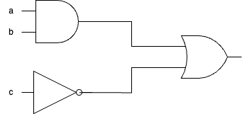
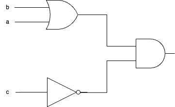
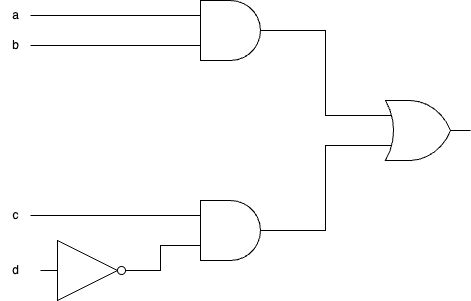

# Fiche d'exercices : Circuits logiques

Les circuits électroniques sont schématisés à l'aide des portes logiques qui les contiennent.

Chacune des portes logiques (OR, AND, OR etc...) ont leur propre représentation : en norme américaine ou norme européenne.

Pour les exercices suivants, on utilisera la norme américaine.

## Exercice 1 : Circuits et portes

**1. Pour les deux schémas suivants, donner les portes logiques qui les composent. Quelle est la différence entre ces 2 schémas?**

*Astuce : il est possible de partir du début et retranscrire tous les résultats des portes logiques.*

**2. Donner la table de vérité du deuxième circuit, c'est à dire la valeur de la sortie (1 ou 0) en fonction de chacune des combinaisons d'entrées possibles.**

*Astuce : il y a $2^n$ cas pour n variable booléennes en entrée de circuit. Si 3 variables, il y a $2^3=8$ combinaisons possibles.*

## Exercice 2 : Circuits électronique vers équations booléennes

**Pour chacun de ces circuits, donner l'équation booléenne correspondante**

## Exercice 3 : Équations booléennes vers Circuit électronique

**Pour chacune des équations booléennes proposées, donner le circuit électronique associé.**

1. (a **and** b) **and** (b **and** c)
2. ((**not** a) **and** b) **or** (a **and** (**not** b))
3. (a **and** b) **or** (c **and** a **or** b)

## Exercice 4 : Simplification de circuits

**Simplifiez les expressions booléennes suivantes en utilisant les lois de De Morgan et les propriétés de l'algèbre booléenne :**

1. **not** (a **and** b) **or** (**not** a **or** **not** b)
2. (a **and** b) **or** (a **and** **not** b)
3. **not** (**not** a **or** **not** b) **and** (a **or** b)

*Rappel des lois principales :*
- Loi de De Morgan : **not**(A **and** B) = (**not** A) **or** (**not** B)
- Distributivité : A **and** (B **or** C) = (A **and** B) **or** (A **and** C)
- Idempotence : A **and** A = A, A **or** A = A

## Exercice 5 : Analyse de circuits complexes

**Analysez ce circuit et répondez aux questions :**

Soit un circuit avec 3 entrées A, B, C et une sortie S, défini par :
S = (A **and** B) **or** (B **and** C) **or** (A **and** C)

**Questions :**
1. Construisez la table de vérité complète de ce circuit
2. Dans quels cas la sortie S vaut-elle 1 ?
3. Ce circuit implémente quelle fonction logique ? (Indice : fonction de vote)
4. Combien de portes logiques minimum faut-il pour réaliser ce circuit ?

## Exercice 6 : Conception d'un additionneur

**Concevez un circuit additionneur 1 bit :**

Un additionneur 1 bit prend en entrée :
- A et B : les deux bits à additionner
- Cin : la retenue d'entrée

Et produit en sortie :
- S : la somme
- Cout : la retenue de sortie

**Questions :**
1. Établissez la table de vérité de cet additionneur
2. Trouvez les équations booléennes pour S et Cout
3. Dessinez le circuit correspondant

*Aide : S = 1 quand un nombre impair de bits d'entrée valent 1*

## Exercice 7 : Multiplexeur

**Analysez ce multiplexeur 2 vers 1 :**

Un multiplexeur 2→1 a :
- Deux entrées de données : D0, D1
- Une entrée de sélection : S
- Une sortie : Y

Fonctionnement :
- Si S = 0, alors Y = D0
- Si S = 1, alors Y = D1

**Questions :**
1. Écrivez l'équation booléenne de Y
2. Construisez la table de vérité
3. Dessinez le circuit avec des portes AND, OR et NOT
4. À quoi sert un multiplexeur dans un ordinateur ?

## Exercice 8 : Décodeur

**Concevez un décodeur 2 vers 4 :**

Un décodeur 2→4 a :
- Deux entrées : A1, A0
- Quatre sorties : Y3, Y2, Y1, Y0

Fonctionnement : Une seule sortie est active (=1) à la fois, selon la valeur binaire des entrées.

**Questions :**
1. Complétez la table de vérité :

| A1 | A0 | Y3 | Y2 | Y1 | Y0 |
|----|----|----|----|----|----|
| 0  | 0  | ?  | ?  | ?  | ?  |
| 0  | 1  | ?  | ?  | ?  | ?  |
| 1  | 0  | ?  | ?  | ?  | ?  |
| 1  | 1  | ?  | ?  | ?  | ?  |

2. Écrivez les équations booléennes pour chaque sortie
3. À quoi sert un décodeur dans l'architecture d'un processeur ?