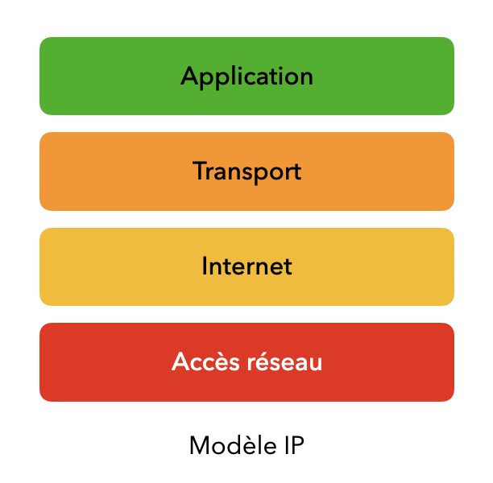

# 📚 🌐 Introduction aux réseaux

## 🔌 Qu'est ce qu'un réseau internet

> **📖 Définition**

Un **réseau local** est un ensemble de machines reliées entre elles qui échangent des informations en ne passant que par le routeur ou un switch.

Un **réseau internet** est un ensemble de réseaux locaux qui communiquent entre eux en passant par Internet.

Dans un réseau, on retrouve un certain nombre de machines :

- 💻 Des ordinateurs, smartphones, tablettes, consoles ...
- 🏠 IOT : ensemble des objets connectés (par exemple : domotique)
- 🔄 Un (ou plusieurs) switchs est un élément d'un réseau qui permet de relier les machines entre elles pour s'échanger des données dans un réseau local.
- 📡 un routeur (ou plusieurs) routeur est un élément qui permet de relier plusieurs réseaux entre eux.

Ces machines sont reliées par :

- 🔌 des câbles (RJ45)
- 📶 Ondes (exemple : WiFi (Wireless Fidelity) ou 5G)
- 💡 par fibre optique

La communication est définie et régie par des protocoles.
Un protocole est un ensemble de règles et d'actions prédéfinies à réaliser dans un ordre précis.

### 🌍 Distinction Web et Internet

Internet correspond à **l'ensemble des réseaux organisés** communiquant ensemble.

Le Web correspond à une application d'Internet qui rend accessible des ressources grâce aux **liens hypertextes** (que l'on nomme usellement hyperliens).

#### 🔄 Topologies de réseaux

Une topologie dans les réseaux correspond à la disposition des machines dans un réseau.

On en distingue plusieurs :

- ⭕ Anneau
- ⭐ Étoile (en général celui utilisé de manière domestique)
- 📊 Bus
- 🌳 Hierarchique
- 🤝 P2P

## 🔍 Adresse MAC et IP

> **📖 Définition**

### 💳 Adresse MAC

Une adresse MAC (Media Access Control) correspond à l'adresse physique d'une interface d'une carte Réseau qui est **unique** et propre à la carte.
Elle est constituée d'un ensemble de 6 groupes de 16 bits représentés en hexadécimal.
Exemple : a8:9f:d9:4c:5c:d9
**Remarque : Un ordinateur possède une carte réseau qui a plusieurs interfaces.**

Le switch dans un réseau utilise l'adresse MAC de la carte réseau pour retransmettre les données à la bonne machine.

### 🌐 Adresse IP

L'adresse IP est l'adresse d'une machine sur un réseau. Elle est attribuée à la première connexion de la machine sur le réseau.

Elle est constituée d'un ensemble de 4 octects représentés en décimal ou pour la machine leur représentation en binaire.
Exemple : $123.32.41.74_2$ pour les humains et $01111011.00100000.00101001.01001010_2$ pour les machines.

Grâce à ce modèle on peut définir $2^{24}$ adresse différentes, soient $4 294 967 296$ adresses différentes.

Une adresse IP est composée de deux choses :

- Une partie correspondant à l'adresse réseau, c'est à dire à quel réseau elle est rattachée.
- Une partie machine qui correspond au numéro de la machine dans le réseau précédemment choisi.

Ces deux parties sont distinguées dans l'adresse par le nombre de bits qui leurs sont associés.

On définit un **masque** comme étant le nombre de bits nécessaires pour représenter l'adresse du réseau.
En général, pour retrouver l'adresse du réseau d'une machine à l'aide de son adresse IP, on réalise une opération logique **ET** sur chacun des bits.
Ce masque est représenté à la fin de l'adresse IP précédée d'un / (slash), on appelle cela la notation **CIDR** de l'adresse.

Exemple :
On dispose de l'adresse 123.32.41.74/16.
Cela veut dire qu'il y a 16 bits réservés pour représenter l'adresse réseau.

On a alors le masque suivant : $11111111.11111111.00000000.00000000_2$ et l'adresse suivante $01111011.00100000.00101001.01001010_2$.

Pour retrouver l'adresse réseau, on réalise une opération **ET logique** (+ ou &) sur les deux adresses.

$~~~~11111111.11111111.00000000.00000000_2\newline\And~01111011.00100000.00101001.01001010_2\newline~~~~01111011.00100000.00000000.00000000_2$

On retrouve l'adresse du réseau qui est 123.32.0.0.

> **⚠️ Adresses réservées**
>
> Il existe diverses adresse d'un réseau qui sont réservées.
> On a :
> - L'adresse du réseau, explicitée précédemment qui est inutilisable.
> - L'adresse de multiplexage (ou broadcast) qui se termine par 255.
>   Celle-ci sert à l'envoi de messages sur le réseau entier, donc réservée.

On peut définir un certain nombre de machines pour un réseau et cela est défini par le nombre de bits réservés à la partie machine (moins les 2 précédemment citées).

> **💡 Calculer le nombre de machines d'un réseau**
>
> On peut calculer le nombre d'adresses disponibles facilement : $\texttt{nombre d'adresses disponibles} = 2^{\texttt{nombre de bits de la partie machine}}-2$.

Pour notre exemple, on sait que l'on a 16 bits réservés à l'identification de machines, cela revient à $2^{16}-2 = 65536 - 2= 65534$ machines possibles.

Historiquement, on regroupait les adresses IP dans des classes pour les attribuer à divers organismes.

#### Classes d'adresses IP

| Classe | Plage d'adresses            | Nombre de réseaux | Nombre d'hôtes par réseau | Utilisation                            |
|--------|-----------------------------|-------------------|---------------------------|----------------------------------------|
| A      | 1.0.0.0 - 126.0.0.0         | 128               | 16 777 214                | Principalement pour des réseaux très grands comme les gouvernements ou les grandes entreprises. |
| B      | 128.0.0.0 - 191.255.0.0     | 16 384            | 65 534                    | Pour des réseaux de taille moyenne comme les universités ou les entreprises de taille moyenne. |
| C      | 192.0.0.0 - 223.255.255.0   | 2 097 152         | 254                       | Pour des petits réseaux comme les petites entreprises. |
| D      | 224.0.0.0 - 239.255.255.255 | -                 | -                         | Pour le multicast (transmission de données à plusieurs destinataires simultanément). |
| E      | 240.0.0.0 - 255.255.255.255 | -                 | -                         | Réservé pour des utilisations futures et des fins expérimentales. |

#### IPv6

L'adresse IPv6 est composée d'un ensemble de 8 groupes de 4 symboles en hexadécimal.
Un symbole hexadécimal est composé de 4 bits.
Cela revient à $2^{8*16} = 2^{128} \approx 3.40 \times 10^{38}$ adresses différentes.

### Modèle TCP/IP

Le modèle TCP/IP est un modèle en couche qui permet d'illustrer l'encapsulation des données pour permettre leur envoi, leur réception et leur traitement.

#### Processus d'Encapsulation

L'encapsulation est un concept clé du modèle TCP/IP :

1. Les données sont générées au niveau de la couche Application
2. Chaque couche inférieure ajoute ses propres informations (en-têtes)
3. À la réception, chaque couche retire ses informations
4. Les données sont reconstituées dans leur état original

> **💡 Analogie Postale**
>
> On peut comparer le modèle TCP/IP à un système postal :
> - Couche Application = Rédaction de la lettre
> - Couche Transport = Mise sous enveloppe, numérotation
> - Couche Internet = Adressage, choix de l'acheminement
> - Couche Accès Réseau = Distribution physique

#### Structure des Couches

Chaque couche a sa tâche prédéfinie, notamment grâce aux protocoles qui sont en jeu.

##### Couche Accès Réseau

La couche accès réseau explicite la liaison entre les machines de manière physique (câbles, WiFi...) et la réception des données brutes (bits, ondes lumineuses, signal analogique) aux machines via les switchs ou les routeurs grâce aux adresses physiques (MAC).

##### Couche Internet

La couche Internet assure le routage des paquets de données. Elle utilise les adresses IP pour identifier et acheminer les paquets entre différents réseaux. Les protocoles principaux de cette couche sont :

- IP (Internet Protocol) pour l'adressage et le routage
- ICMP (Internet Control Message Protocol) pour les messages de contrôle et de diagnostic

##### Couche Transport

Cette couche garantit la qualité et la fiabilité de la transmission des données. Deux protocoles principaux existent :

- TCP (Transmission Control Protocol)
  - Offre une transmission fiable
  - Garantit l'ordre et l'intégrité des données
  - Adapté aux transmissions nécessitant une précision (web, emails)

- UDP (User Datagram Protocol)
  - Transmission rapide
  - Sans garantie de réception
  - Utilisé pour les flux temps réel (streaming, jeux en ligne)

##### Couche Application

C'est la couche la plus haute qui gère les protocoles spécifiques aux applications. Quelques exemples de protocoles :

- HTTP/HTTPS pour le web
- FTP pour le transfert de fichiers
- SMTP pour les emails
- DNS pour la résolution de noms de domaine