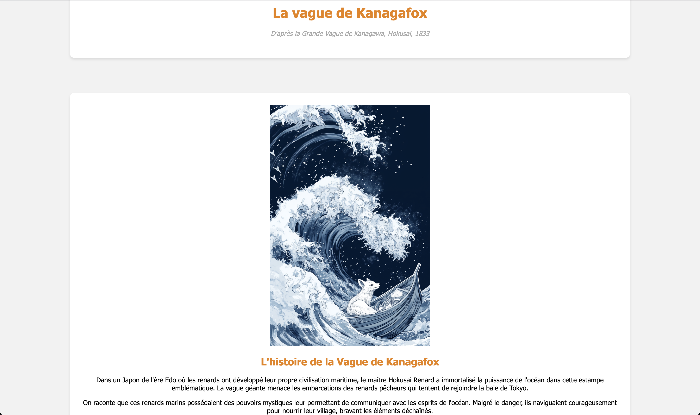

# Création de pages WEB dynamiques : Tableaux de maîtres revisités avec des renards

Le but de ce projet est de créer une page web présentant un tableau de maître revisité avec des renards. Chaque élève travaillera sur un tableau différent, qu'il choisira ou tirera au sort parmi une sélection de 18 tableaux.

Vous retrouverez un dossier contenant une exemple de CSS, une fonction javascript pouvant gérant le changement d'images et le formulaire.  

Voici la maquette [**maquette**](maquette_.zip).

## La page Web et son style

Vous devrez créer une page web présentant le tableau revisité qui vous a été attribué. Votre page devra inclure :

- Une présentation du tableau original (titre, auteur, date, contexte historique)
- Une présentation du tableau revisité avec des renards
- Une histoire inventée autour de ce tableau et de ses personnages renards
- Des éléments visuels et textuels mettant en valeur votre créativité

Vous réaliserez une arborescence correcte avec :

- Les images dans le dossier **images**
- Les feuilles de style dans un dossier **styles**
- Les scripts JavaScript dans un dossier **scripts**
- La page web nommée **index.html** à la racine de l'arborescence

### Organisation des fichiers

```
projet-tableau-renard/
├── index.html
├── images/
│   ├── tableau-original.jpg
│   └── tableau-renard.jpg
├── styles/
│   └── style.css
└── scripts/
    └── script.js
```

Voici un exemple de structure de fichiers pour votre projet :



## 2 - Dynamiser la page

Pour rendre votre page plus interactive, vous allez implémenter quelques fonctionnalités JavaScript simples. Vous n'avez pas besoin d'avoir des connaissances avancées en JavaScript, des modèles de code vous seront fournis que vous pourrez adapter à votre projet.

Voici les fonctionnalités que vous devrez implémenter  :

### Démarche de projet

Vous devrez rajouter une de ces fonctionnalités à votre projet :

#### Mode Jour/Nuit

- Ajoutez un bouton permettant de basculer entre un thème clair et sombre  

- Modifiez les couleurs de fond, du texte et des bordures  

- Sauvegardez la préférence de l'utilisateur dans le localStorage

#### Galerie de détails

- Créez une section avec des miniatures de détails du tableau  

- Au clic sur une miniature, affichez une version agrandie dans une fenêtre modale  

- Ajoutez des effets de transition fluides

#### Comparaison interactive

- Créez un curseur (slider) pour faire apparaître progressivement la version renard  

- Ajoutez des points d'intérêt cliquables sur l'image  

- Affichez des informations au survol des points

## Ressources

- [MDN Web Docs - JavaScript](https://developer.mozilla.org/fr/docs/Web/JavaScript)
- [W3Schools - JavaScript Tutorial](https://www.w3schools.com/js/)