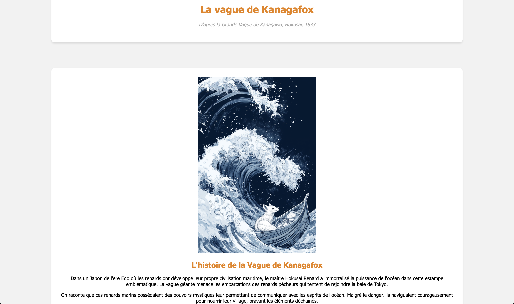

    <h1 class="course-title">🎨 Création de pages WEB dynamiques</h1>
    
Tableaux de maîtres revisités avec des renards

    

        
🎯 Objectif du projet

        

            Le but de ce projet est de créer une page web présentant un tableau de maître revisité avec des renards. Chaque élève travaillera sur un tableau différent, qu'il choisira ou tirera au sort parmi une sélection de 18 tableaux.
        

    

    
    

        
📁 Ressources fournies

        

            Vous retrouverez un dossier contenant :
            <ul>
                <li>Un exemple de CSS</li>
                <li>Une fonction JavaScript gérant le changement d'images</li>
                <li>Le formulaire de base</li>
            </ul>
             
            Voici la maquette : <a href="maquette_.zip"><strong>📦 maquette</strong></a>
        

    

    <h2 class="section-title">🎨 La page Web et son style</h2>
    
    

        
📋 Contenu requis

        

            Vous devrez créer une page web présentant le tableau revisité qui vous a été attribué. Votre page devra inclure :
            <ul>
                <li>Une présentation du tableau original (titre, auteur, date, contexte historique)</li>
                <li>Une présentation du tableau revisité avec des renards</li>
                <li>Une histoire inventée autour de ce tableau et de ses personnages renards</li>
                <li>Des éléments visuels et textuels mettant en valeur votre créativité</li>
            </ul>
        

    

    
    

        
📁 Structure des dossiers

        

            Vous réaliserez une arborescence correcte avec :
            <ul>
                <li>Les images dans le dossier <strong>images</strong></li>
                <li>Les feuilles de style dans un dossier <strong>styles</strong></li>
                <li>Les scripts JavaScript dans un dossier <strong>scripts</strong></li>
                <li>La page web nommée <strong>index.html</strong> à la racine de l'arborescence</li>
            </ul>
        

    

    
    

        
📂 Organisation des fichiers

        <pre>
projet-tableau-renard/
├── index.html
├── images/
│   ├── tableau-original.jpg
│   └── tableau-renard.jpg
├── styles/
│   └── style.css
└── scripts/
    └── script.js
        </pre>
    

    
    

        

            <strong>💡 Exemple :</strong> Voici un exemple de structure de fichiers pour votre projet : 
            
        

    

    <h2 class="section-title">⚡ 2 - Dynamiser la page avec JavaScript</h2>
    
    

        
🎯 Objectif

        

            Pour rendre votre page plus interactive, vous allez ajouter <strong>une seule fonctionnalité JavaScript simple</strong>. Le code complet vous est fourni, vous devrez simplement le copier et l'adapter à votre projet.
        

    

    
    

        
📋 Étapes à suivre

        

            

                

                    
1

                    
Choisissez UNE fonctionnalité parmi celles proposées

                

                

                    
2

                    
Copiez le code HTML dans index.html

                

                

                    
3

                    
Copiez le JavaScript dans scripts/script.js

                

                

                    
4

                    
Copiez le CSS dans styles/style.css

                

                

                    
5

                    
Testez votre page dans le navigateur

                

            

        

    

    

        
🖼️ Option 1 : Bouton pour changer d'image (FACILE)

        

            <strong>Ce que ça fait :</strong> Un bouton qui permet de passer du tableau original au tableau avec des renards.
        

        
        

            
📝 Code HTML à ajouter dans votre page

            <pre>&lt;button id="bouton-image"&gt;Voir la version renard&lt;/button&gt;
&lt;img id="image-tableau" src="images/tableau-original.jpg" alt="Tableau"&gt;</pre>
        

        
        

            
⚡ Code JavaScript à mettre dans scripts/script.js

            <pre>// Variables pour stocker les éléments
const bouton = document.getElementById('bouton-image');
const image = document.getElementById('image-tableau');

// Variable pour savoir quelle image est affichée
let imageOriginale = true;

// Fonction qui s'exécute quand on clique sur le bouton
bouton.addEventListener('click', function() {
    if (imageOriginale) {
        // Changer vers l'image renard
        image.src = 'images/tableau-renard.jpg';
        bouton.textContent = 'Voir l\'original';
        imageOriginale = false;
    } else {
        // Revenir à l'image originale
        image.src = 'images/tableau-original.jpg';
        bouton.textContent = 'Voir la version renard';
        imageOriginale = true;
    }
});</pre>
        

        
        

            
🎨 Code CSS à ajouter dans styles/style.css

            <pre>#bouton-image {
    background-color: #ff6b35;
    color: white;
    border: none;
    padding: 10px 20px;
    font-size: 16px;
    border-radius: 5px;
    cursor: pointer;
    margin: 20px 0;
}

#bouton-image:hover {
    background-color: #e55a2b;
}

#image-tableau {
    max-width: 100%;
    height: auto;
    border-radius: 10px;
    box-shadow: 0 4px 8px rgba(0,0,0,0.3);
}</pre>
        

    

    

        
🌙 Option 2 : Mode Jour/Nuit (MOYEN)

        

            <strong>Ce que ça fait :</strong> Un bouton qui change les couleurs de toute la page (fond sombre/clair).
        

        
        

            
📝 Code HTML à ajouter

            <pre>&lt;button id="bouton-mode"&gt;🌙 Mode nuit&lt;/button&gt;</pre>
        

        
        

            
⚡ Code JavaScript à mettre dans scripts/script.js

            <pre>// Récupérer le bouton et le body de la page
const boutonMode = document.getElementById('bouton-mode');
const body = document.body;

// Fonction qui s'exécute quand on clique sur le bouton
boutonMode.addEventListener('click', function() {
    // Ajouter ou enlever la classe 'mode-nuit'
    body.classList.toggle('mode-nuit');
    
    // Changer le texte du bouton selon le mode
    if (body.classList.contains('mode-nuit')) {
        boutonMode.textContent = '☀️ Mode jour';
    } else {
        boutonMode.textContent = '🌙 Mode nuit';
    }
});</pre>
        

        
        

            
🎨 Code CSS à ajouter dans styles/style.css

            <pre>/* Style du bouton */
#bouton-mode {
    background-color: #4a90e2;
    color: white;
    border: none;
    padding: 10px 15px;
    border-radius: 20px;
    cursor: pointer;
    font-size: 14px;
    position: fixed;
    top: 20px;
    right: 20px;
}

/* Styles pour le mode nuit */
.mode-nuit {
    background-color: #1a1a1a;
    color: #ffffff;
}

.mode-nuit h1, .mode-nuit h2, .mode-nuit h3 {
    color: #ffffff;
}

.mode-nuit p {
    color: #cccccc;
}</pre>
        

    

    

        
👆 Option 3 : Affichage de texte au clic (TRÈS FACILE)

        

            <strong>Ce que ça fait :</strong> Cliquer sur l'image affiche un texte caché avec des informations sur le tableau.
        

        
        

            
📝 Code HTML à ajouter

            <pre>&lt;img id="image-cliquable" src="images/tableau-renard.jpg" alt="Tableau" style="cursor: pointer;"&gt;
&lt;p id="texte-cache" style="display: none;"&gt;🦊 Les renards ont envahi ce tableau ! Découvrez leur histoire...&lt;/p&gt;</pre>
        

        
        

            
⚡ Code JavaScript à mettre dans scripts/script.js

            <pre>// Récupérer l'image et le texte
const imageCliquable = document.getElementById('image-cliquable');
const texteCache = document.getElementById('texte-cache');

// Fonction qui s'exécute quand on clique sur l'image
imageCliquable.addEventListener('click', function() {
    // Vérifier si le texte est caché ou visible
    if (texteCache.style.display === 'none') {
        texteCache.style.display = 'block'; // Montrer le texte
    } else {
        texteCache.style.display = 'none';  // Cacher le texte
    }
});</pre>
        

        
        

            
🎨 Code CSS à ajouter dans styles/style.css

            <pre>#image-cliquable {
    max-width: 100%;
    height: auto;
    border-radius: 10px;
    transition: transform 0.2s;
}

#image-cliquable:hover {
    transform: scale(1.02);
}

#texte-cache {
    background-color: #fff3cd;
    border: 2px solid #ffeaa7;
    padding: 15px;
    border-radius: 8px;
    margin-top: 15px;
    font-style: italic;
    text-align: center;
}</pre>
        

    

    <h2 class="section-title">📚 Ressources utiles</h2>
    
    

        
🔗 Liens utiles

        

            <ul>
                <li><a href="https://developer.mozilla.org/fr/docs/Web/JavaScript" target="_blank">MDN Web Docs - JavaScript</a></li>
                <li><a href="https://www.w3schools.com/js/" target="_blank">W3Schools - JavaScript Tutorial</a></li>
                <li><a href="https://css-tricks.com/" target="_blank">CSS Tricks</a></li>
                <li><a href="https://fonts.google.com/" target="_blank">Google Fonts</a></li>
            </ul>
        

    

    
    

        

            <strong>🎉 Bon travail et amusez-vous bien avec ce projet créatif !</strong> 🦊🎨
        

    

