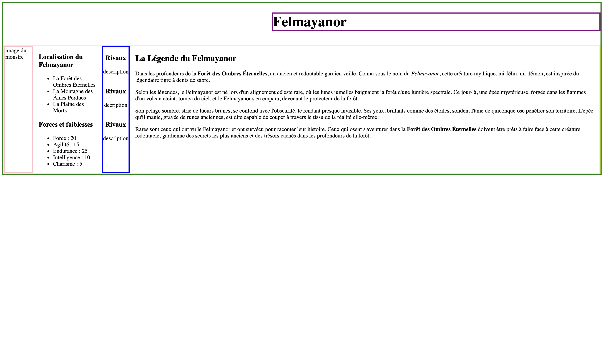
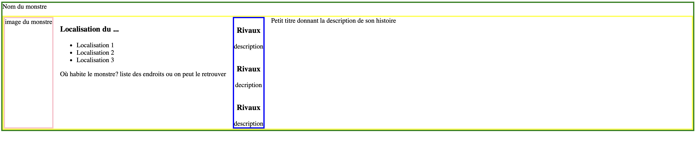
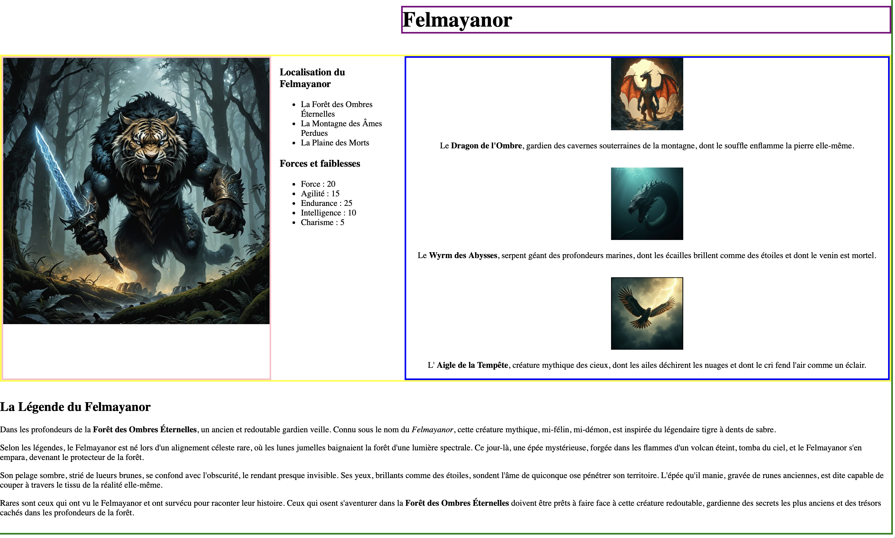

# Projet : Création du Bestiaire

Pour la création du bestiaire, téléchargez l'archive correspondante en cliquant sur le lien hypertexte suivant : [maquette_vide](./projet_site_eleve.zip).

Vous retrouverez : 

- un fichier `index.html` qui correspond au site web à remplir.
- un dossier `image` qui contiendra l'image de votre monstre.
- un dossier `style` qui contiendra tous les éléments de style de votre page.

## Partie 1 : Remplir le site comme la maquette

Voici ce que vous devez reproduire lors de la première séance: 



Chacun des blocs de couleur correspond à une partie bien précise du site.
On les nomme `div` pour division d'une page web. Ils permettent de scinder la page en diverses parties.

Le site est aussi régi par une feuille de style qui n'est pas à modifier pour cette première étape.



À cause d'un soucis d'affichage, le Nom du monstre correspond au bloc violet.

Vous allez devoir pour cette première partie : 

**Modifier le Nom du monstre pour qu'il corresponde à un titre de niveau 1.**

**Dans le bloc bleu : Ajouter un paragraphe expliquant la rivalité/l'amitié entre votre monstre/personnage et ses rivaux/amis.**

**Dans le bloc turquoise : Ajouter chacune des localisations où l'on peut retrouver votre monstre (Conservez la liste si vous souhaitez une liste, sinon supprimez la et écrivez un paragraphe).**

**Dans le bloc turquoise : Ajouter une liste à puce correspondant à ses statistiques si l'on souhaite transformer ce bestiaire en un jeu de rôle sinon une histoire par rapport à son lieu d'habitat.**

**Ajouter dans le bloc contenant la description et l'histoire de son monstre, un petit titre de niveau 3 permettant de structurer la page et un paragraphe expliquant l'histoire du monstre/personnage.**

Par la suite, on ajoutera les images des rivaux/personnages (quand votre monstre est disponible [ici](./monstres.md)).

**Ajouter à la place de `image du monstre` l'image du monstre associée.**

Pour se faire, vous rajouterez la balise suivante :  

```html
    
```

**Ajouter l'image du rival avec la balise suivante.**

```html
    
```

## Partie 2 : Retirer les bordures

Le fichier `style.css` rassemble tous les éléments de style de la page.

La syntaxe est telle que : 

```css
    .classe_de_l_element{
        propriete_1 : valeurs;
        propriete_2 : valeurs;
        ...
    }

```

Un des éléments de style présent sur votre maquette est l'ensemble des bordures délimitant les `div` pour que vous puissiez vous repérer.

Consigne : **Dans le fichier `style.css`, retirer l'ensemble des lignes qui ont un rapport avec les bordures.**
*Vous chercherez sur internet comment réaliser des bordures en CSS pour retrouver les mots-clefs correspondants.*



## Partie 3 : Fond d'écran et couleurs de police d'écriture

La dernière étape de ce projet correspond à l'ajout du fond d'écran et de la modification de la police d'écriture en blanc.

La *classe* `container` est la classe qui contient le plus d'éléments sur lesquels on veut appliquer ces propriété.

Consigne : **Dans la classe container du fichier `style.css`, rajouter les propriétés permettant de changer le fond d'écran et de mettre la police d'écriture en blanc.**

```css
    .container{
        background-image : url(../image/background.png);
        color : white;

    }

```

*Indication : le chemin de l'image du fond d'écran a pour point de départ le dossier style et pour point d'arrivée le dossier image. Pour "remonter" d'un dossier, il faut écrire `../` lors de l'écriture du lien vers l'image de fond d'écran.*

Vous devez avoir ainsi :

