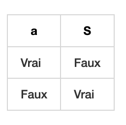
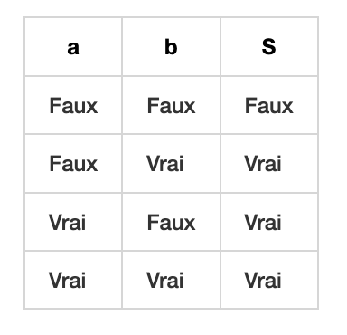
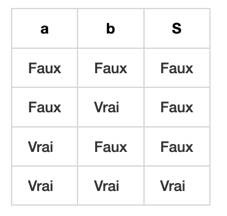

# Structures conditionnelles

## Définitions

Une **variable** booléenne est une variable qui peut prendre **deux états** : **Vrai ou Faux**. Ces états peuvent être équivalents à des valeurs numériques : Vrai = 1 et Faux = 0.
Ces états correspondent en machine **à la présence du courant ou non**.

Une **fonction booléenne** est une fonction qui prend en paramètre **des variables booléennes** et en ressort un résultat.

Une **équation booléenne** est un ensemble de fonctions booléenne prenant en paramètre un certain nombre de variables et renvoie un résultat en sortie.

## Fonctions booléennes

| Fonction NOT | Fonction OR | Fonction AND |
| :----------: | :---------: | :----------: |
| | | |

## Exemples

En Python, on peut réaliser des opérations booléennes pour réaliser des **conditions**. Ces conditions permettent de réaliser du code, comme ce qui a été vu au collège avec les `logigrammes` ou `algorigrammes`.

En Python, pour indiquer qu'une chose est vraie, on écrit `True` ou fausse `False`.

Il existe les opérateurs : 

- a == b : qui signifie `Est-ce que a est égal à b?`
- a != b : qui signifie `Est-ce que a est différent de b?`
- Les opérateurs mathématiques de base : `> , < , >= , <=`
 
1. `10 > 5` ➔ `True`
2. `7 == 9` ➔ `False`
3. `3 <= 3` ➔ `True`
4. `False != True` ➔ `_______` 
5. `not False` ➔ `_______` (Fonction booléenne NOT, voir tableau)
7. `5 != 5` ➔ `False`
8. `False != True and 5 == 5` ➔ `True` (Fonction booléenne AND, voir tableau)
9. `not True or 4 > 99` ➔ `False` (Fonction booléenne OR, voir tableau)
