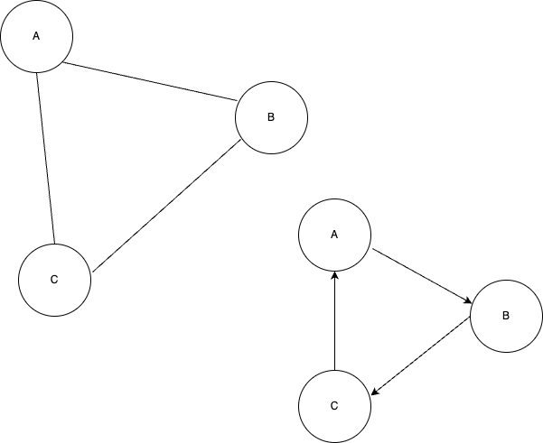
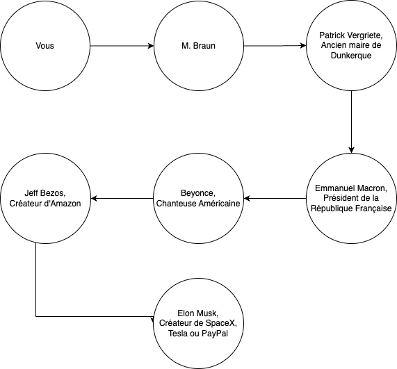

# 📱 Les Réseaux Sociaux : Définitions et Enjeux

## 💰 Modèles économiques des réseaux sociaux

### 📊 Comment les réseaux sociaux génèrent-ils des revenus ?

| Modèle | Description | Exemples | Avantages | Inconvénients |
|--------|-------------|----------|-----------|---------------|
| **Publicité** | Affichage d'annonces ciblées | Facebook, Instagram, Twitter | Gratuit pour l'utilisateur | Collecte de données personnelles |
| **Freemium** | Version gratuite + premium payante | LinkedIn Premium, Discord Nitro | Choix pour l'utilisateur | Fonctionnalités limitées en gratuit |
| **Abonnement** | Accès payant à la plateforme | OnlyFans, certains Discord | Revenus stables | Barrière à l'entrée |
| **Commission** | Pourcentage sur les transactions | TikTok Shop, Instagram Shopping | Facilite le commerce | Dépendance aux ventes |

!!! info
    **Le paradoxe de la gratuité** : Si c'est gratuit, c'est que vous êtes le produit ! Les données personnelles sont la véritable monnaie d'échange.

**Activité : Analyse économique**

**Analysez le modèle économique de votre réseau social préféré :**
- **Comment génère-t-il ses revenus ?**
- **Quelles données collecte-t-il sur vous ?**
- **Comment ces données sont-elles utilisées ?**

## 📖 Qu'est-ce qu'un réseau social ?

> **📖 Définition**

Un **réseau social numérique** est une plateforme en ligne qui permet aux utilisateurs de créer un profil, de se connecter avec d'autres personnes et de partager du contenu (textes, images, vidéos).

### 🔗 Caractéristiques fondamentales

| Élément | Description | Exemples |
|---------|-------------|----------|
| **Profil utilisateur** | Identité numérique personnalisée | Photo, bio, informations personnelles |
| **Connexions** | Liens entre utilisateurs | Amis, abonnés, followers |
| **Contenu** | Informations partagées | Posts, photos, vidéos, stories |
| **Interactions** | Actions entre utilisateurs | Likes, commentaires, partages |
| **Algorithme** | Système de recommandation | Fil d'actualité personnalisé |

**Activité : Analyse comparative**

**Choisissez un réseau social et analysez :**
- **Fondateur(s) et date de création**
- **Spécificité principale** (texte, image, vidéo...)
- **Public cible et nombre d'utilisateurs**
- **Modèle économique**

## 📱 Types de contenus et spécialisations

### 🎯 Diversité des contenus numériques

| Type de contenu | Caractéristiques | Réseaux spécialisés | Impact |
|-----------------|------------------|---------------------|--------|
| **Texte court** | Messages limités (280 caractères) | Twitter, Threads | Information rapide, débats |
| **Images** | Photos, illustrations, memes | Instagram, Pinterest | Expression créative, lifestyle |
| **Vidéos courtes** | 15s à 3min, format vertical | TikTok, YouTube Shorts, Reels | Divertissement, viralité |
| **Vidéos longues** | Contenu éducatif, entertainment | YouTube, Twitch | Apprentissage, communautés |
| **Audio** | Podcasts, discussions en direct | Clubhouse, Spaces, Discord | Conversations approfondies |
| **Professionnel** | CV, articles, networking | LinkedIn | Carrière, business |

### 🔄 Évolution des formats

Les réseaux sociaux s'adaptent constamment :
- **Stories** (24h) : contenu éphémère
- **Live streaming** : interaction en temps réel
- **Réalité augmentée** : filtres et effets
- **Commerce social** : achat intégré

**Activité : Cartographie des contenus**

**Créez un tableau comparatif de 3 réseaux sociaux :**
- **Type de contenu principal**
- **Durée de vie du contenu**
- **Public cible**
- **Algorithme de recommandation**

## 📚 Histoire des réseaux sociaux

Les réseaux sociaux ont vu le jour au début des années 2000, en plein dans l'expansion du numérique dans les foyers.
Certains n'avaient pas forcément comme but d'être ceux qu'ils sont actuellement (comme Facebook qui initialement servait à relier les étudiants de Harvard).

## 📖 Financement d'un réseau social

Un réseau social est associé à un modèle économique. De grandes sociétés financent des réseaux sociaux à des fins lucratives (pour créer des bénéfices).
Il existe un bon nombre de coûts liés à l'utilisation pour les particuliers de réseaux sociaux.

**Lister quels coûts peuvent être associés au fonctionnement d'un réseau social**

_______________________________________________________________________________________
______________________________________________________________________________________________________________________________________________________________________________

Ces entreprises doivent donc rémunérer ou financer toutes les fonctionnalités de leurs réseaux sociaux et cela avec diverses méthodes.

**Lister des méthodes de financement des réseaux sociaux**

_______________________________________________________________________________________
______________________________________________________________________________________________________________________________________________________________________________
    
## 📖 Contenus disponibles sur un réseau social

Sur un réseau social, il existe bons nombre de contenus différents qui sont publiés pour des utilisateurs par des utilisateurs.

**Lister quels contenus peuvent être présents sur un réseau social**

______________________________________________________________________________________________________________________________________________________________________________

Les contenus sont soumis à un réglement spécifique au réseau social et même à la loi.
En effet,chaque utilisateur est pénalement responsable de ce qu'il poste sur un réseau social.
Les contenus publiés sur un réseau social sont considérés publics et à visée de tous.
*Par exemple : il est strictement interdit de publier des contenus à caractères discriminatoires, diffamant et à visée de harcèlement envers autrui.*

Ces contenus peuvent être produits par des créateurs qui souhaitent partager leurs passions, des entreprises ou des magasins qui veulent étendre leur clientèle ou par des influenceurs payés par des marques pour réaliser des publicités.

### Réputation de l'utilisateur en ligne

Ces contenus (prises de parole, opinions, photos, vidéo, placements de produits) peuvent notamment affecter la réputation de l'utilisateur en ligne : on l'appelle **e-reputation**.
Elle renvoie directement à tous les utilisateurs l'image de celui qui publie du contenu en ligne.

Une bonne e-reputation permet de créer un sentiment de confiance à l'égard de l'utilisateur qui poste des contenus en ligne.
    
## 🔐 Utilisation responsable des réseaux sociaux

### ⚖️ Cadre légal et majorité numérique

> **📖 Définition**

La **majorité numérique** est l'âge à partir duquel un mineur peut consentir seul au traitement de ses données personnelles sur les plateformes numériques.

| Âge | Droits et obligations | Supervision requise |
|-----|----------------------|--------------------|
| **< 15 ans** | Autorisation parentale obligatoire | Contrôle parental recommandé |
| **15-18 ans** | Inscription autonome possible | Accompagnement conseillé |
| **> 18 ans** | Autonomie complète | Responsabilité personnelle |

!!! warning
    Cette règle protège les mineurs mais n'empêche pas les risques. La sensibilisation reste essentielle à tout âge.

### 👤 Création et gestion de profil

#### 🛠️ Étapes de création

| Étape | Action | Conseils de sécurité |
|-------|--------|---------------------|
| **1. Inscription** | Email/téléphone + mot de passe | Utiliser une adresse email dédiée |
| **2. Identité** | Nom d'utilisateur + photo | Éviter les informations trop personnelles |
| **3. Profil** | Bio, centres d'intérêt | Limiter les détails privés |
| **4. Confidentialité** | Paramètres de visibilité | Profil privé par défaut |
| **5. Contacts** | Ajout d'amis/abonnés | Vérifier l'identité des demandes |

#### 🔒 Sécurité et bonnes pratiques

**Authentification forte :**
- **Mot de passe unique** : 12+ caractères, majuscules, chiffres, symboles
- **Authentification à 2 facteurs** : SMS ou application dédiée
- **Vérification régulière** : sessions actives et appareils connectés

**Protection des données :**
- **Informations minimales** : ne partager que le nécessaire
- **Géolocalisation désactivée** : éviter le tracking automatique
- **Révision périodique** : nettoyer les anciens posts et photos

**Activité : Audit de sécurité**

**Vérifiez votre profil sur un réseau social :**
- **Quelles informations sont publiques ?**
- **Vos paramètres de confidentialité sont-ils optimaux ?**
- **Votre mot de passe respecte-t-il les bonnes pratiques ?**
    
## 📰 Communication sur les réseaux sociaux

### 🔄 Fils d'actualité et algorithmes

> **📖 Définition**

Le **fil d'actualité** (ou feed) est un flux personnalisé de contenus sélectionnés par un algorithme selon les préférences et comportements de l'utilisateur.

#### 🤖 Fonctionnement des algorithmes

| Critère | Poids | Impact sur l'affichage |
|---------|-------|------------------------|
| **Engagement** | ⭐⭐⭐⭐⭐ | Likes, commentaires, partages |
| **Proximité sociale** | ⭐⭐⭐⭐ | Amis proches, famille |
| **Récence** | ⭐⭐⭐ | Publications récentes privilégiées |
| **Type de contenu** | ⭐⭐⭐ | Vidéos > Images > Texte |
| **Temps passé** | ⭐⭐ | Durée de visionnage |

!!! info
    **Bulle de filtres** : L'algorithme peut créer une "chambre d'écho" en montrant principalement des contenus similaires à nos préférences.

### 💬 Messages privés et communication directe

#### 🔐 Fonctionnalités et sécurité

| Type de message | Chiffrement | Fonctionnalités | Risques |
|-----------------|-------------|-----------------|----------|
| **Texte** | End-to-end (WhatsApp, Signal) | Émojis, réactions | Captures d'écran |
| **Vocal** | Variable selon plateforme | Transcription auto | Enregistrement possible |
| **Vidéo** | Souvent non chiffré | Filtres, effets | Diffusion non consentie |
| **Fichiers** | Dépend du service | Tous formats | Virus, malwares |

**Activité : Analyse d'algorithme**

**Observez votre fil d'actualité pendant une semaine :**
- **Quels types de contenus apparaissent le plus ?**
- **Comment vos interactions influencent-elles les recommandations ?**
- **Identifiez-vous des biais dans les contenus proposés ?**

## ⚠️ Cyberviolence et protection numérique

### 🎯 Typologie des violences en ligne

| Type | Description | Exemples | Conséquences |
|------|-------------|----------|-------------|
| **Cyberharcèlement** | Attaques répétées et coordonnées | Messages d'insultes, moqueries publiques | Anxiété, dépression, isolement |
| **Doxxing** | Publication d'informations privées | Adresse, téléphone, photos intimes | Atteinte à la vie privée, chantage |
| **Revenge porn** | Diffusion non consentie d'images | Photos/vidéos intimes partagées | Humiliation, détresse psychologique |
| **Cyberstalking** | Surveillance et traque numérique | Géolocalisation, espionnage | Sentiment d'insécurité permanent |
| **Hate speech** | Discours de haine ciblé | Propos racistes, homophobes | Discrimination, radicalisation |

### 🛡️ Stratégies de protection

#### 🚨 Actions immédiates
1. **Bloquer** l'utilisateur malveillant
2. **Signaler** le contenu aux modérateurs
3. **Capturer** les preuves (screenshots)
4. **Ne pas répondre** aux provocations
5. **Informer** son entourage

#### 📞 Ressources d'aide

| Service | Contact | Spécialité |
|---------|---------|------------|
| **3018** | Numéro gratuit | Violences numériques (mineurs) |
| **3919** | Numéro national | Violences faites aux femmes |
| **Net Écoute** | 0800 200 000 | Accompagnement jeunes |
| **Pharos** | pharos.gouv.fr | Signalement contenus illicites |

**Activité : Plan de protection**

**Créez votre stratégie de protection :**
- **Paramètres de confidentialité optimaux**
- **Liste de contacts de confiance**
- **Procédure en cas de cyberviolence**
- **Ressources d'aide à mémoriser**

**Activité : activité Pix sur les réseaux sociaux**

## 📊 Modélisation mathématique : les graphes

### 🔗 Représentation des réseaux sociaux

> **📖 Définition**

Un **graphe** est une structure mathématique qui modélise les relations entre entités. Dans le contexte des réseaux sociaux, il représente les connexions entre utilisateurs.

#### 🏗️ Composants d'un graphe social

| Élément | Représentation | Exemple concret |
|---------|----------------|----------------|
| **Sommets (nœuds)** | Utilisateurs du réseau | Profils Facebook, comptes Twitter |
| **Arêtes (liens)** | Relations entre utilisateurs | Amitié, abonnement, mention |
| **Poids** | Force de la relation | Fréquence d'interaction, proximité |
| **Direction** | Sens de la relation | Abonnement unilatéral vs amitié mutuelle |

#### 📐 Types de graphes sociaux

| Type | Caractéristique | Réseaux concernés | Propriétés |
|------|----------------|-------------------|------------|
| **Non orienté** | Relations bidirectionnelles | Facebook (amitié) | Symétrique, réciprocité |
| **Orienté** | Relations unidirectionnelles | Twitter (abonnement) | Asymétrique, influence |
| **Pondéré** | Relations avec intensité | LinkedIn (force du lien) | Nuances dans les connexions |
| **Dynamique** | Évolution temporelle | Tous les réseaux | Création/suppression de liens |

### 📏 Métriques des graphes sociaux

| Métrique | Définition | Utilité | Exemple |
|----------|------------|---------|----------|
| **Degré** | Nombre de connexions directes | Popularité, influence | Nombre d'amis Facebook |
| **Centralité** | Position stratégique dans le réseau | Identification d'influenceurs | Comptes avec forte portée |
| **Clustering** | Densité des connexions locales | Cohésion communautaire | Groupes d'amis interconnectés |
| **Diamètre** | Plus long chemin le plus court | Efficacité de propagation | Vitesse de diffusion d'info |

**Indiquer sur le dessin ci-dessous, quel graphe est orienté et lequel est non orienté.**

**Vous avez un groupe de 6 amis : Alice, Bob, Charlie, David, Emma et Frank. Vous devez modéliser leurs amitiés en utilisant un graphe. Un graphe est constitué de sommets (les personnes) et d'arêtes (les relations d'amitié). Voici les informations sur leurs amitiés :**

- Alice est amie avec Bob, Charlie et Emma.
- Bob est ami avec Alice, David et Frank.
- Charlie est ami avec Alice et Emma.
- David est ami avec Bob et Frank.
- Emma est amie avec Alice et Charlie.
- Frank est ami avec Bob et David.

**Activité**

* À l'aide du graphe de l'exercice précédent, donner le centre du graphe (c'est à dire la personne qui a le plus d'amis).

* Donner un rayon de ce graphe, donner sa longueur.

* En déduire un diamètre de ce graphe, donner sa longueur.

## 🌍 L'expérience de Milgram et les "6 degrés de séparation"

### 📚 Contexte historique

En **1967**, le psychologue **Stanley Milgram** teste une hypothèse révolutionnaire : dans un monde de plus en plus connecté, quelle est la distance sociale réelle entre deux personnes quelconques ?

### 🔬 Protocole expérimental

#### 🎯 Objectif et méthode

| Aspect | Description | Détails |
|--------|-------------|----------|
| **Hypothèse** | 6 degrés de séparation maximum | Théorie du "petit monde" |
| **Échantillon** | 296 participants | Nebraska et Kansas (États-Unis) |
| **Cible** | Agent de change à Boston | Personne inconnue des participants |
| **Règle** | Transmission par connaissance directe | Pas de contact indirect autorisé |
| **Mesure** | Nombre d'intermédiaires | Longueur de la chaîne sociale |

#### 📊 Résultats et analyse

| Métrique | Valeur | Interprétation |
|----------|--------|----------------|
| **Taux de réussite** | 22% (64/296 lettres) | Majorité d'échecs |
| **Longueur moyenne** | 6,2 intermédiaires | Validation partielle de l'hypothèse |
| **Variation** | 2 à 10 intermédiaires | Grande disparité selon les chemins |
| **Goulots d'étranglement** | 3 personnes clés | Rôle crucial de certains connecteurs |

### 🌐 Applications dans l'ère numérique

#### 💻 Implémentation technologique

| Plateforme | Application | Algorithme | Impact |
|------------|-------------|------------|--------|
| **LinkedIn** | "Connexions de 2e/3e niveau" | Calcul de distance sociale | Networking professionnel |
| **Facebook** | "Amis en commun" | Graphe de proximité | Recommandations sociales |
| **Twitter** | "Vous pourriez aimer" | Analyse des interactions | Découverte de contenu |
| **TikTok** | Algorithme de recommandation | Graphe d'intérêts | Viralité des contenus |

#### 🔍 Évolutions contemporaines

**Facteurs de réduction des distances :**
- **Globalisation numérique** : connexions internationales instantanées
- **Algorithmes de recommandation** : rapprochement d'intérêts similaires
- **Communautés thématiques** : regroupement par centres d'intérêt

**Nouveaux défis :**
- **Bulles de filtres** : isolation dans des groupes homogènes
- **Polarisation** : éloignement de certaines communautés
- **Fake news** : propagation rapide de fausses informations

### 🤔 Limites et perspectives critiques

#### ⚠️ Biais méthodologiques

| Limite | Description | Impact sur les résultats |
|--------|-------------|-------------------------|
| **Échantillon restreint** | Population américaine uniquement | Généralisation limitée |
| **Taux d'abandon élevé** | 78% d'échecs | Biais de sélection |
| **Contexte temporel** | Années 1960, pré-internet | Obsolescence partielle |
| **Définition de "connaissance"** | Critères subjectifs | Variabilité des résultats |

Par exemple, comment pourriez-vous contacter de manière directe notre président de la République ?

Vous aurez besoin de plusieurs intermédiaires :

**Activité : Expérience numérique moderne**

**Testez la théorie des 6 degrés à l'ère digitale :**

**Phase 1 : Cartographie personnelle**
- Choisissez une célébrité ou personnalité publique
- Tracez votre chemin de connexions jusqu'à cette personne
- Utilisez différents réseaux sociaux (LinkedIn, Instagram, Twitter)

**Phase 2 : Analyse comparative**
- Comparez vos résultats avec vos camarades
- Identifiez les "super-connecteurs" dans votre entourage
- Analysez l'impact des algorithmes de recommandation

**Phase 3 : Réflexion critique**
- Les réseaux numériques réduisent-ils vraiment les distances sociales ?
- Quels nouveaux types de séparations créent-ils ?
- Comment cette théorie influence-t-elle le marketing et la politique ?

**Activité : Trouvez un chemin entre vous et Bill Gates, le directeur de Microsoft.**

## 🔮 Enjeux contemporains et perspectives

### 🌟 Opportunités des réseaux sociaux

- **Démocratisation de l'information** : accès global aux connaissances
- **Mobilisation sociale** : organisation de mouvements citoyens
- **Innovation collaborative** : co-création et partage d'idées
- **Inclusion numérique** : connexion des communautés isolées

### ⚡ Défis et risques

- **Désinformation** : propagation rapide de fausses nouvelles
- **Addiction numérique** : dépendance aux interactions en ligne
- **Surveillance de masse** : collecte extensive de données personnelles
- **Fracture numérique** : inégalités d'accès et de compétences

### 🚀 Évolutions futures

- **Intelligence artificielle** : personnalisation poussée des contenus
- **Réalité virtuelle** : immersion dans les interactions sociales
- **Blockchain** : décentralisation et contrôle des données
- **Éthique numérique** : régulation et responsabilité des plateformes