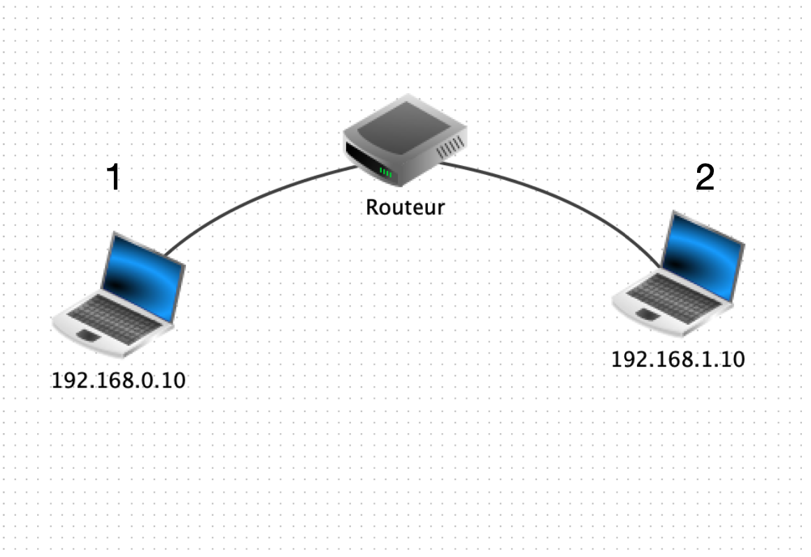

# Activité : Simulation d'un réseau

Pour mieux comprendre la construction de réseaux et d'envoi de paquets, on peut utiliser le logiciel **Filius**.
Ce logiciel permet de créer des réseaux, des sous-réseaux et de simuler le comportement dans ceux-ci.

## Approche du logiciel

Le logiciel Filius possède 3 modes:

✏️ : Annotation : Permet d'annoter le schéma
🔨 : Construction : Permet de rajouter des éléments sur le schéma

➡️ : Lecture : Permet d'utiliser la simulation pour étudier les échanges de données.

## Construction d'un réseau

1. Quels sont les éléments de ce réseau?
2. À quoi sert le routeur?
3. Dans quels réseaux sont les ordinateurs 1 et 2 ?

## Un réseau plus étoffé

Après avoir compris comment fonctionne **Filius**, on va étoffer le réseau précédent.

1. À quelle propriété du routeur faut-il veiller pour réaliser ce schéma ?
2. Réaliser le schéma ci-dessus.