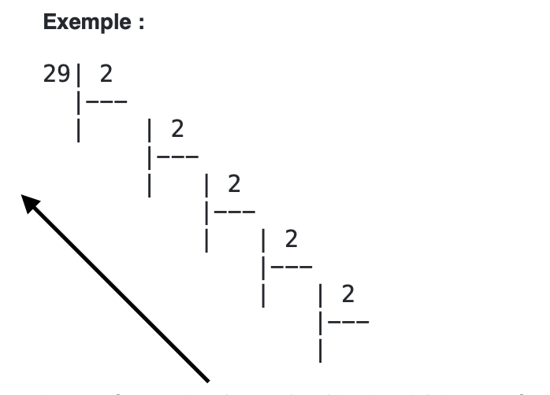

# Le binaire : Définition

Nous comptons généralement en base 10, cela veut dire que nous utilisons 10 symboles pour représenter les chiffres. Combiner ces chiffres permet de créer des nombres.
Pour représenter des chiffres en informatique, on n’utilise que 2 symboles : 0 et 1.
On nomme ces symboles des **bits**.
Un ensemble de 8 bits se nomme un **octet**.

## Rappel : Comment compter en base 10

Pour compter, on utilise la notation en colonne, dite positionnelle.
La colonne la plus à droite correspond à celle des unités, suivie à gauche par celle des dizaines, puis des centaines et ainsi de suite.

Par exemple, on peut décomposer le nombre $154=10^2\times1 + 10^1\times5 + 10^0\times4$.
On appelle cela la **décomposition par base avec ici la base valant 10**.

## Conversion binaire vers décimal

Un nombre écrit en base 2 est écrit en notation positionnelle.

Pour convertir un nombre binaire en base décimale, on opère comme la décomposition précédente avec la base valant 2 :

$11001$ est un nombre représenté en base 2. On peut le décomposer de cette manière :
$11001_2 = 1 \times 2^4 + 1 \times 2^3 + 0 \times 2^2 + 0 \times 2^1 + 1 \times 2^0 = 16 + 8 + 1 = 25_{10}$.

**Exercice:** Convertir les nombres binaires suivant en base 10 :  
a. $1101_2$  
b. $10101_2$  
c. $111000_2$  
d. $10010_2$  

## Conversion décimal vers binaire

Pour passer de la base 10 à la base 2, on peut utiliser la méthode que l'on appelle des **divisions successives**.

On divise successivement le nombre à convertir par 2.
Chaque **reste** correspond au nombre dans la représentation et chaque **quotient** est à diviser à la suite par 2.
On répète ces opération jusqu'à ce que le quotient soit 0 et le reste 1.

La représentation du nombre binaire s’obtient en écrivant les restes dans le sens de la flèche ci dessus.

## Conséquences sur les images en niveaux de gris

Chaque pixel d’une image en niveau de gris comportera donc un nombre entre 0 et 255 écrit en binaire.  Ces valeurs iront donc de **0000 0000** à **1111 1111**.

**Exercice:** Pour la palette donnée de niveau de gris, donner l’écriture binaire de chaque nombre décimaux.