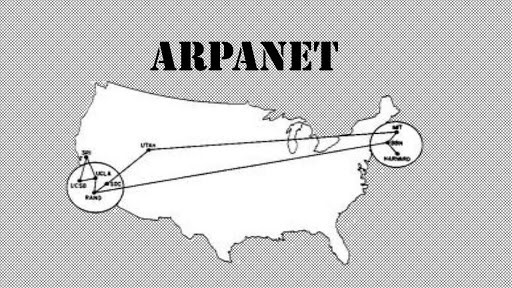

# Internet

## Point historique

La création d'Internet date du début des années 1960. L'idée était de relier divers machines pour envoyer des données, à l'origine des travaux issus de laboratoires ou des universités.

A l'époque, le projet initial s'appelait ARPANET et était un projet détenu par la Défense des États-Unis.
Le premier objectif était de relier les universités de Stanford, de Los Angeles et celle de l'Utah.

Ce n'est que le 20 septembre 1969 que la première communication voit le jour entre l'université de Californie et celle de Stanford.
Le premier message transmis de l'Histoire était *login*.

À la suite de cela, dans les années 70-80, des normalismes de communication ont vu le jour. On appelle cet ensemble de règles à respecter des **protocoles**.
La manière de communiquer pour les machines est découpées en diverses étapes.
Ces diverses étapes sont catégorisées dans un modèle : le modèle TCP-IP qui explique chaque étape de la communication.
Chaque étape (ou couche) du modèle TCP-IP correspond à divers protocoles.

Dans les années 1980, le fameux **protocole TCP/IPv4** a vu le jour. Il est installé dans en 1983 sur ARPANET, la même année où ont vu le jour les règles des systèmes de nom de domaine.

Les années 1990 ont permis de faire voir le jour à une des plus grandes technologies jamais créée par l'être humain : le WEB, créé au CERN (en Suisse) par Tim Berners-Lee et Robert Cailliau.

Depuis, Internet permet de relier plus de 3 à 4 milliards d'internautes pour s'envoyer des mails, des fichiers ou accéder à une quantité de données incommensurable.

En clair, **Internet est un réseau informatique sur lequel de nombreuses activités sont basées.**

## Notion de réseaux

### Définitions

Un **réseau informatique** est un ensemble de machines reliées, par différents moyens, qui communiquent entre elles pour échanger des données ou des informations.

On retrouve un certain nombre d'éléments sur un réseau informatique qui ont chacun leur propre rôle.

### Les éléments d'un réseau

Pour qu'un réseau fonctionne, il faut des éléments le constituant.
On retrouve :

| élément  | rôle                                                               | exemple                                      |
|----------|--------------------------------------------------------------------|----------------------------------------------|
| Machines | Élément qui cherche à communiquer, envoyer ou recevoir des données | ordinateur, tablettes, consoles, smartphones |
| Switch   | Élément qui relie de manière locale des machines                   | box internet, switch RJ45                    |
| Routeur  | Élément qui permet de relier un réseau local à Internet ou d'autres réseaux | Box internet, routeur spécifique    |
| Cables, Ondes | Élément qui permet de relier les diverses machines au Switch ou au routeur| Câble Ethernet, Fibre optique, WiFi|

On a défini dans les rôles divers types de réseaux.

On parle de réseau **local** lorsque dans un réseau, divers machines peuvent communiquer directement entre elles sans passer par d'autres réseaux. Exemple : un réseau domestique.

On dispose de machines, d'un réseau mais, comment se retrouvent-elles pour communiquer? Quelles techniques sont utilisées?

### Adressage de machines

Une machine dispose d'une ou plusieurs **cartes réseaux**. Ces cartes permettent de communiquer de manière locale ou de manière globale vers Internet.
Ces cartes disposent de plusieurs adresses qui permettent de l'identifier sur un réseau.

De manière locale, une carte réseau dispose d'une adresse **MAC (Media Access Control)**.
Cette adresse MAC peut aussi être appelée **adresse physique** car elle correspond à l'adresse utilisée par le port Ethernet et le protocole Ethernet.