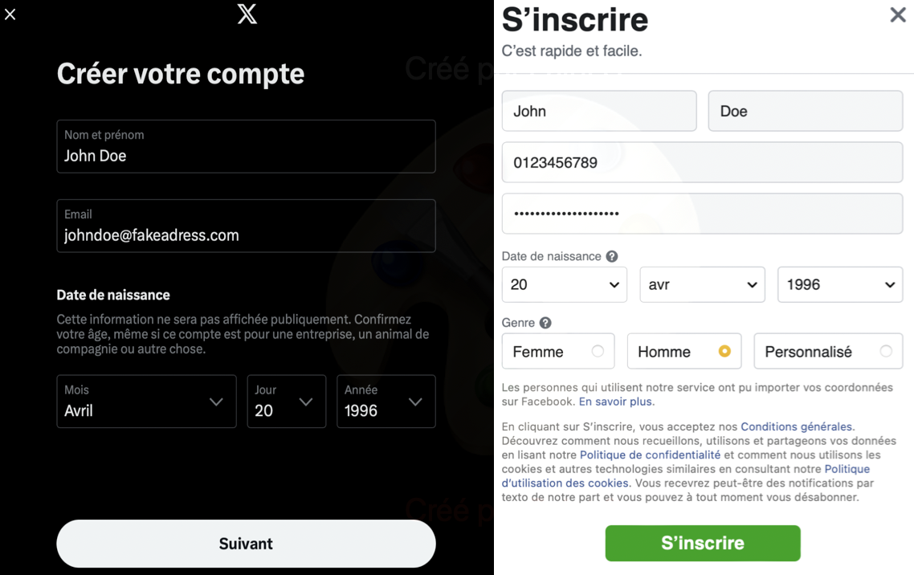
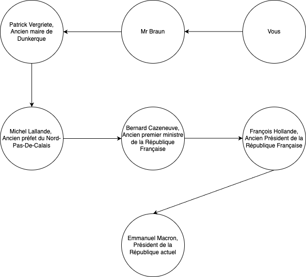

# Les réseaux sociaux I : Définitions et Principes 

## Définition

Un réseau social correspond à un groupe de personnes qui sont liées par des points communs qui peuvent être :  

* des amitiés
* des goûts partagés
* des passions partagées
* des intérêts communs.

De manière plus globale, on définit aussi un réseau social comme étant un site internet qui permet aux internautes de communiquer, de se créer des pages et de partager tous types d'informations.

Ces réseaux sociaux sont basés sur le WEB qui est une application d'Internet.

Il existe bons nombres de réseaux sociaux qui sont tous de formes ou d'utilisations différentes. Certains permettent de relier les gens et de les faire communiquer, d'autres servent à partager des actualités ou encore certains partager des vidéos, des photos etc...

**Activité :**
**Choisissez un réseau social que vous connaissez et définissez le.**
**Expliquez en quoi il est différent des autres? comment fonctionne-t-il? Qui l'a fondé? Quand? Pour quel but?**

## Histoire des réseaux sociaux

Les réseaux sociaux ont vu le jour au début des années 2000, en plein dans l'expansion du numérique dans les foyers.
Certains n'avaient pas forcément comme but d'être ceux qu'ils sont actuellement (comme Facebook qui initialement servait à relier les étudiants de Harvard).

## Financement d'un réseau social

Un réseau social est associé à un modèle économique. De grandes sociétés financent des réseaux sociaux à des fins lucratives (pour créer des bénéfices).
Il existe un bon nombre de coûts liés à l'utilisation pour les particuliers de réseaux sociaux.

**Lister quels coûts peuvent être associés au fonctionneemnt d'un réseau social**

_______________________________________________________________________________________
______________________________________________________________________________________________________________________________________________________________________________

Ces entreprises doivent donc rémunérer ou financer toutes les fonctionnalités de leurs réseaux sociaux et cela avec diverses méthodes.

**Lister des méthodes de financement des réseaux sociaux**

_______________________________________________________________________________________
______________________________________________________________________________________________________________________________________________________________________________

## Contenus disponibles sur un réseau social

Sur un réseau social, il existe bons nombre de contenus différents qui sont publiés pour des utilisateurs par des utilisateurs.

**Lister quels contenus peuvent être présents sur un réseau social**

______________________________________________________________________________________________________________________________________________________________________________

Les contenus sont soumis à un réglement spécifique au réseau social et même à la loi.
En effet,chaque utilisateur est pénalement responsable de ce qu'il poste sur un réseau social.
Les contenus publiés sur un réseau social sont considérés publics et à visée de tous.  
*Par exemple : il est strictement interdit de publier des contenus à caractères discriminatoires, diffamant et à visée de harcèlement envers autrui.*

Ces contenus peuvent être produits par des créateurs qui souhaitent partager leurs passions, des entreprises ou des magasins qui veulent étendre leur clientèle ou par des influenceurs payés par des marques pour réaliser des publicités.

### Réputation de l'utilisateur en ligne

Ces contenus (prises de parole, opinions, photos, vidéo, placements de produits) peuvent notamment affecter la réputation de l'utilisateur en ligne : on l'appelle **e-reputation**.
Elle renvoie directement à tous les utilisateurs l'image de celui qui publie du contenu en ligne.

Une bonne e-reputation permet de créer un sentiment de confiance à l'égard de l'utilisateur qui poste des contenus en ligne.

## Utilisation d'un réseau social

Après avoir défini ce qu'était un réseau social, comment ils fonctionnent ou comment les contenus sont régis, il faut savoir comment utiliser un réseau social.

### Pré-requis : enfants et réseaux sociaux

Avant toute chose : **Un réseau social est uniquement réservé à tout individu ayant plus de 15 ans. On parle de Majorité numérique**.

Avant cet âge, les réseaux sociaux sont autorisés à :  

* Refuser l'inscription des utilisateurs.
* Informer les enfants qui tentent une inscription et leurs parents des risques de leurs usages.
* Activer un dispositif de contrôle de temps.

Cela est décrit par l'article de loi du **7 juillet 2023** sur l'accès des réseaux sociaux par les enfants.

### Un profil pour utiliser un réseau social

Pour utiliser un réseau social, la majorité du temps il est nécessaire de se créer un **profil** et un **compte**. On parle d'**inscription**.

Pour créer un profil en ligne, l'utilisateur doit partager à l'entreprise qui gère le réseau social par exemple :

* Une adresse mail
* Un mot de passe
* Son identité : nom, prénom, âge, genre, voir même l'adresse
* Son numéro de téléphone
* Un pseudonyme qui permettra d'identifier l'utilisateur en ligne

Par exemple, voici les données nécessaires pour s'inscrire sur 𝕏 (anciennement Twitter) et Facebook.

Ces informations peuvent aussi être intéressantes pour les publicitaires pour cibler les annonces publicitaires aux utilisateurs.
Ces informations ne sont pas gratuites pour ces annonceurs, elles sont en général revendues par les entreprises qui gèrent les réseaux sociaux pour un certain montant d'argent.

### Sécurité de son profil en ligne

Les informations transmises à un réseau social sont confidentielles et permettent d'identifier un individu même dans le monde hors numérique.
Pour les sécuriser, il faut pouvoir rendre l'accès aux pirates informatiques impossible ou très complexes car elles peuvent fuiter lors de grands piratages des bases de données.

Pour se faire, on ne peut pas forcément sécuriser son adresse-mail, on va donc jouer sur le mot de passe.

On dit qu'un mot de passe est **robuste** s'il est compliqué à retrouver lors d'une recherche exhaustive. Une **recherche exhaustive** correspond à une recherche où l'on teste toutes les combinaisons possibles de caractères.

En général, il est conseillé pour rendre robuste un mot de passe qu'il réponde à ces critères :

* Au moins 10 caractères
* Contient des minuscules et des majuscules
* Contient des chiffres
* Contient des caractères spéciaux (! ? ; @ # & etc...)

Certains sites internet permettent d'observer la robustesse d'un mot de passe : [testeur de mots de passe](https://www.passwordmonster.com)

**Activité :**
**Tester les mots de passe suivant sur le site internet de test de mots de passe.**

* **JeSuisUnRenardQuiCourtDanslaForet**
* **Ren4rDFor3|**  

**Que peut-on en déduire?**

_______________________________________________________________________________________
______________________________________________________________________________________________________________________________________________________________________________

À l'issue de la création de compte, l'utilisateur doit se connecter.
Pour se faire, il doit renseigner à minima son adresse mail et son mot de passe dans des champs qui sont spécialement choisis.
On nomme cette étape **l'authentification**.

## Proximité des utilisateurs : Notion de Graphe et expérience de Milgram

Précédemment, on parlait d'un réseau social comme étant une manière de relier les personnes dans le monde.

### Les Graphes

Il existe un modèle mathématique pour représenter ce genre de situation, on appelle cela des **graphes**.

Un graphe correspond à un ensemble de noeuds que l'on relie pour simuler ou représenter graphiquement des liens entre des individus ou des machines par exemple.

Il existe plusieurs types de graphes qui correspondent à des situations particulières :

- Les graphes dits **non orientés** sont des graphes dans lesquels des noeuds appelés **sommets** sont reliés par des arêtes. Ce genre de graphe représente notamment les amitiés sur Facebook car celles-ci sont dites **réflexives** (si A est ami avec B, alors B est ami avec A).
- Les graphes dit **orientés** sont des graphes dans lesquels des **sommets** sont reliés par des **arcs** qui représentent une direction. Ce genre de graphe représente notamment les liens de *follow* sur Twitter.

**Indiquer sur le dessin ci-dessous, quel graphe est orienté et lequel est non orienté.**

**Activité : À l'aide de ce texte, dessiner le graphe correspondant:**

**Vous avez un groupe de 6 amis : Alice, Bob, Charlie, David, Emma et Frank. Vous devez modéliser leurs amitiés en utilisant un graphe. Un graphe est constitué de sommets (les personnes) et d’arêtes (les relations d’amitié). Voici les informations sur leurs amitiés :**

- Alice est amie avec Bob, Charlie et Emma.
- Bob est ami avec Alice, David et Frank.
- Charlie est ami avec Alice et Emma.
- David est ami avec Bob et Frank.
- Emma est amie avec Alice et Charlie.
- Frank est ami avec Bob et David.

#### Définitions sur les Graphes

On a vu précédement que ces graphes pouvaient modéliser des situations de la vie réelle.
Pour ce faire, on dispose de quelques propriétés sur les graphes.

**Le centre d'un graphe** est le sommet (ou le groupe de sommet) étant relié à tous les autres par une distance minimale.

**Le rayon d'un graphe** correspond à la plus petite distance entre un sommet qui est le centre et les sommets les plus excentrés.

**Le rayon d'un graphe** correspond à la plus petite distance reliant deux sommets excentrés (comme pour un cercle).

Dans notre situation des réseaux sociaux, le centre d'un graphe correspondant est la personne qui est amie avec le plus de personnes par exemple.

**Activité**

* À l'aide du graphe de l'exercice précédent, donner le centre du graphe (c'est à dire la personne qui a le plus d'amis).

* Donner un rayon de ce graphe, donner sa longueur.

* En déduire un diamètre de ce graphe, donner sa longueur.

### Petit monde de Milgram

Quel est le lien entre les graphes et les réseaux sociaux hormis la représentation mathématiques?
On a vu précédement qu'il existe des chemins entre les utilisateurs qui représentent le nombre de personnes dont un utilisateur A a besoin pour contacter un utilisateur B.

Cela a été étudié en 1963 par Stanley Milgram. En effet, il a déterminé qu'il fallait au maximum 6 poignées de mains pour connaître n'importe qui dans le monde.

Par exemple, comment pourriez-vous contacter de manière directe notre président de la République ?

Vous aurez besoin de plusieurs intermédiaires :

**Activité : Trouvez un chemin entre vous et Bill Gates, le directeur de Microsoft.**

## Les fils d'actualité et les messages privés

Dans tous les réseaux sociaux, tous les utilisateurs peuvent discuter par divers moyens : fils d'actualités, messages privés, groupes privés ou publics.
Comme énoncé au début de ce cours, tous les utilisateurs sont responsables de leurs mots et de leurs contenus sur les divers réseaux sociaux.

Le fait de harceler sur internet nommé **cyber-harcèlement** est répréhensible par la loi. On parle de l'article 222-33-2-2 du code pénal.

!!! Danger
    Le fait de harceler une personne par des propos ou comportements répétés ayant pour objet ou pour effet une dégradation de ses conditions de vie se traduisant par une altération de sa santé physique ou mentale est puni d'un an d'emprisonnement et de 15 000 € d'amende lorsque ces faits ont causé une incapacité totale de travail inférieure ou égale à huit jours ou n'ont entraîné aucune incapacité de travail.
    **...**
    4° Lorsqu'ils ont été commis par l'utilisation d'un service de communication au public en ligne ou par le biais d'un support numérique ou électronique ;

Il existe différentes formes de **cyberviolence**.

**Définir ces différentes formes de cyberviolences :**

* Harcèlement en ligne
* Discrimination en ligne
* Usurpation d'identité
* Diffamation
* Cyberintimidation

Il existe diverses ressources disponibles pour lutter contre les cyber-violences comme la plateforme **Pharos**. Elle permet de réaliser des signalements pour des contenus illicites ou illégaux publiés sur les réseaux sociaux.
Si vous êtes vous même victime de cyber-harcèlement, vous pouvez contacter le **3018** qui est le numéro national contre le harcèlement en ligne.

La cyberviolence est un des plus grands enjeux de notre société car celle-ci est omniprésente. Il est important de savoir l'identifier et de savoir comment lutter contre celle-ci.

**Activité : activité Pix sur les réseaux sociaux**