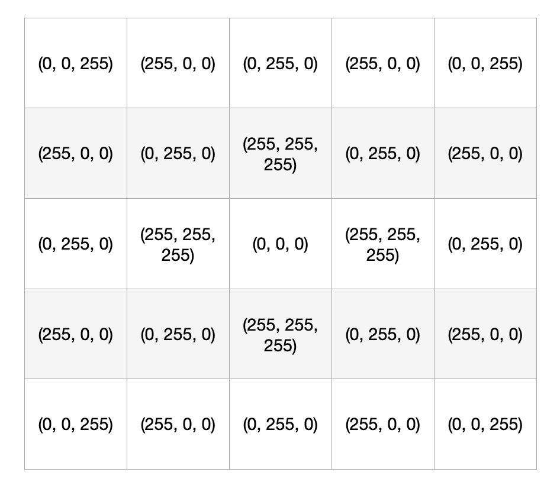

# Photographie Numérique 2 : Les images couleurs

## La vision humaine et les capteurs d'appareils photo

### Le fonctionnement de l'oeil

Avant de comprendre comment une image est formée, il faut comprendre comment l’oeil voit ce qui l’entoure.

La cornée sert à faire converger les rayons de la lumière.
L’iris permet d’ajuster la quantité de lumière qui rentre dans la pupille.
Le cristallin permet de faire la mise au point pour voir de manière nette en projettant les rayons lumineux sur la rétine.
La rétine contient de nombreuses cellules qui réagissent à la lumières. Ce sont les cônes.
Il existe trois types de cônes : les verts, les bleus et les rouge.
**Remarque** : Il y a plus de cônes verts que de bleus et rouges.

Les cônes transforment l’énergie lumineuse en impulsion électriques qui sont transmises au cerveau grâce au nerf optique. Le cerveau à l’aide des impulsions électriques qui sont dépendantes les proportions de vert, bleu et rouge, les additionne et permet de reconstituer toutes les couleurs.

**Grâce au paragraphe précédent, remplir le schéma suivant :**

## Le capteur photo

Le fonctionnement du capteur d’un appareil photo est très similaire au fonctionnement de l’oeil.

La lumière suit un chemin particulier. Elle traverse dans un premier temps **l’objectif** (une série de lentilles qui permet d’adapter la netteté et faire converger la lumière vers le capteur.

Elle continue son chemin à travers **le diaphragme** qui permet d’adapter la **quantité de lumière** qui se dirige vers le capteur numérique.

Elle traverse ce que l’on appelle la **matrice de Bayer** qui est un filtre qui permet de scinder les différentes couleurs de la lumière. Ce filtre est superposé au **capteur numérique**.

Ce capteur est composé de beaucoup de cellules qui réagissent à la lumière : on les appelle **photosites**.  
Les photosites transforment l’énergie lumineuse (Rouge, Bleu et Vert) en signal électrique (à la manière des cônes rétiniens).

**Grâce au paragraphe précédent, remplir le schéma suivant :**

## L'image en couleur

Pour l’image en couleur, le pixel comprend trois composantes qui permettent de recréer une couleur : **le rouge, le vert et le bleu**. On parle de composantes **R V B**.

Chaque pixel est composé d’un ensemble de **trois valeurs** représentant la quantité de rouge, de vert et de bleu qui le compose entre 0 et 255.
On peut définir le pixel Rouge par les valeurs (255, 0, 0), le vert (0,255,0) et le bleu (0,0,255)

Les couleurs sont donc des combinaisons de ces composantes en faisant varier leur intensité.

On peut définir d’autres couleurs comme le :

- **Cyan (0 , 255, 255)**
- **Magenta (255, 255, 0)**
- **Jaune ( 255, 255, 0)**
- **Blanc (255, 255, 255)**
- **Noir (0, 0, 0)**
- **Orange Renard (195, 88, 23)**

**Colorier les cases en fonction de la valeur du pixel:**

## Les images et Python

La bibliothèque **PIL** permet de réaliser des traitements sur des images grâce à des fonctions.
*Image.open*(**chemin de l’image**) permet d’associer à une variable une image grâce à son chemin.
*Image.format* permet de donner le format de l’image.
*Image.size* permet de donner les dimensions de l’image.
*Image.mode* permet de donner le mode de l’image (RVB, Nuances de Gris).
*Image.crop*( **(gauche, haut, droite, bas)** ) permet de découper une image grâce aux coordonnées.
*Image.split*(  ) permet d'obtenir chacune des composantes d'un pixel dans 3 variables à définir.
*Image.rotate*( **angle** ) permet de tourner l’image dans le sens horaire d’un certain angle.

*Grâce à la notice précédente, légender le programme suivant et expliquer ce qu’il fait.*

_______________________________________________________________________________________
______________________________________________________________________________________________________________________________________________________________________________
_______________________________________________________________________________________
_______________________________________________________________________________________
_______________________________________________________________________________________

*Ecrire un programme qui permet d’ouvrir l’image fournie, la tourne de 45 degrés et l’affiche.*

*Écrire un programme qui permet d’ouvrir l’image fournie et d’afficher les trois composantes rouge, bleu et vert.*

*Écrire un programme qui permet de convertir l’image fournie en nuances de gris. Vous utiliserez Image.convert( ).*