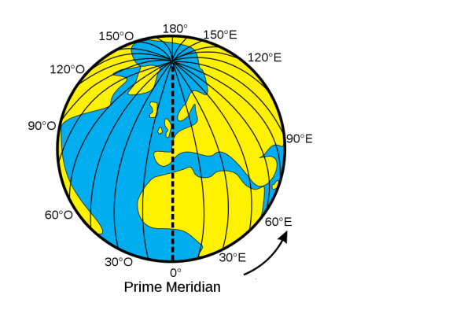

# 🌍 Géolocalisation

## Point Historique et Définitions

> **📚 Historique**

La géolocalisation trouve ses origines dans les besoins militaires des années **1960**. L'armée américaine développe alors le **GPS (Global Positioning System)** pour améliorer la précision de ses opérations.

Le premier satellite GPS est envoyé dans l'espace dans les **années 1980**, marquant le début d'une révolution technologique qui transformera notre rapport à l'espace et à la navigation.

Dans les **années 1990**, le GPS devient accessible au grand public, ouvrant la voie aux applications civiles que nous connaissons aujourd'hui.

D'autres puissances développent leurs propres systèmes : l'Europe lance **Galileo** (plus précis que le GPS américain), la Russie dispose de **GLONASS**, et la Chine développe **BeiDou**.

**Aujourd'hui, la géolocalisation est omniprésente dans notre quotidien : smartphones, voitures, montres connectées, applications de livraison...**

> **📖 Définition**

**La géolocalisation** est une technique permettant de situer de manière précise un lieu, une personne ou un objet sur la planète grâce à des coordonnées géographiques.

Pour localiser un point sur Terre, on utilise un système de coordonnées basé sur trois dimensions :

| Coordonnée | Définition | Unité | Exemple (Paris) |
|------------|------------|-------|------------------|
| **Latitude** | Angle par rapport à l'équateur | Degrés | 48.8588897° N |
| **Longitude** | Angle par rapport au méridien de Greenwich | Degrés | 2.320041° E |
| **Altitude** | Hauteur par rapport au niveau de la mer | Mètres | 35 m |




## Fonctionnement de la géolocalisation par satellite

> **📖 Définition**

**La trilatération** est la technique mathématique utilisée pour déterminer une position en mesurant les distances depuis au moins trois points de référence connus (les satellites).

Le principe est simple : chaque satellite émet un signal contenant l'heure précise d'émission et sa position. Le récepteur GPS calcule le temps de trajet du signal pour déterminer sa distance à chaque satellite.


### Le processus de localisation

**Étape 1 :** Le récepteur GPS capte les signaux d'au moins **4 satellites**
- 3 satellites pour déterminer la position (x, y, z)
- 1 satellite supplémentaire pour la synchronisation temporelle

**Étape 2 :** Calcul des distances grâce au temps de trajet des signaux
- Vitesse du signal = vitesse de la lumière (300 000 km/s)
- Distance = Vitesse × Temps de trajet

**Étape 3 :** Résolution mathématique pour trouver le point d'intersection

!!! warning
    La précision dépend de nombreux facteurs : nombre de satellites visibles, conditions météorologiques, obstacles (bâtiments, relief), qualité du récepteur.

**Activité :**
**Explorez le principe de la trilatération avec cette simulation interactive :**
[Activité : Trilatération](https://parcours.algorea.org/fr/a/88752303685492924;p=4702,1067253748629066205,183305583351435935,1207970506541061357,237778358454750514;a=0)

### Applications : Le calcul d'itinéraires

Une fois la position déterminée, les systèmes de navigation utilisent des **algorithmes de routage** pour calculer le meilleur chemin entre deux points.

**Les paramètres pris en compte :**

| Critère | Description | Exemple |
|---------|-------------|----------|
| **Distance** | Chemin le plus court | 15 km vs 18 km |
| **Temps** | Trajet le plus rapide | 20 min vs 25 min |
| **Trafic** | Conditions en temps réel | Embouteillages, accidents |
| **Type de route** | Préférences utilisateur | Éviter autoroutes/péages |
| **Mode de transport** | Adaptation au véhicule | Voiture, vélo, piéton |

**Exemple concret : Trajet Paris → Lyon**
- **Itinéraire rapide :** A6 (autoroute) - 4h30 - 465 km
- **Itinéraire économique :** Routes nationales - 6h15 - 445 km  
- **Itinéraire touristique :** Routes départementales - 7h00 - 520 km

Les applications comme **Google Maps**, **Waze** ou **Plans** combinent :
- Données cartographiques statiques
- Informations trafic en temps réel
- Signalements utilisateurs (accidents, travaux)
- Intelligence artificielle pour prédire les conditions

## Le protocole NMEA-0183 : Communication des données GPS

> **📖 Définition**

**Le protocole NMEA-0183** est un standard de communication développé par la **National Marine Electronics Association (NMEA)** pour transmettre les données de géolocalisation sous forme de trames textuelles facilement décodables.

Ce protocole permet aux récepteurs GPS de communiquer leurs informations de position à d'autres appareils (ordinateurs, smartphones, systèmes de navigation).

### Formats de coordonnées

Il existe plusieurs façons d'exprimer les coordonnées géographiques :

| Format | Description | Exemple (Paris) |
|--------|-------------|------------------|
| **Décimal** | Degrés avec décimales | 48.8588897° N |
| **DMS** | Degrés, Minutes, Secondes | 48°51'32'' N |
| **NMEA** | Degrés et minutes décimales | 4851.533' N |

!!! warning
    **Conversion :** 1 degré = 60 minutes, 1 minute = 60 secondes

### Structure d'une trame NMEA

**Exemple de trame GPGGA (position GPS) :**

```
$GPGGA,064036.289,4836.5375,N,00740.9373,E,1,04,3.2,200.2,M,,,,0000*0E
```

**Décodage de la trame :**

| Champ | Valeur | Signification |
|-------|--------|---------------|
| **$GPGGA** | Type de trame | Global Positioning System Fix Data |
| **064036.289** | Heure UTC | 06h 40min 36,289s |
| **4836.5375,N** | Latitude | 48°36,5375' Nord |
| **00740.9373,E** | Longitude | 7°40,9373' Est |
| **1** | Qualité du signal | 1 = GPS fixe |
| **04** | Nombre de satellites | 4 satellites utilisés |
| **3.2** | Précision horizontale | 3,2 mètres |
| **200.2,M** | Altitude | 200,2 mètres |

**Cette trame correspond à la position de Paris.**

## Applications pratiques

### Exercices sur les coordonnées GPS

**Activité 1 : Localisation du lycée**
**Sur votre téléphone ou Google Maps, retrouvez les coordonnées GPS du lycée.**

_______________________________________________________________________________________
______________________________________________________________________________________________________________________________________________________________________________

**Activité 2 : Exploration urbaine**
**Recherchez les coordonnées GPS de la Tour Eiffel à Paris et de la Statue de la Liberté à New York.**
**Calculez la distance entre ces deux lieux en utilisant l'outil [Lexilogos](https://www.lexilogos.com/calcul_distances.htm).**

_______________________________________________________________________________________
______________________________________________________________________________________________________________________________________________________________________________

**Activité 3 : Métadonnées de photos**
**Retrouvez les coordonnées GPS des lieux où ont été prises les photos fournies en annexe grâce à leurs métadonnées EXIF.**

_______________________________________________________________________________________
______________________________________________________________________________________________________________________________________________________________________________

### Exercices de décodage NMEA

**Activité 4 : Décodage de trames**
**À l'aide du site [NMEA Decoder](https://rl.se/gprmc), identifiez les villes correspondant aux trames NMEA suivantes :**

```
$GPGGA,175737.303,4449.833,N,00034.772,W,1,04,1.0,0.0,M,0.0,M,,*7C
$GPGGA,175736.303,5038.047,N,00303.695,E,1,03,1.0,0.0,M,0.0,M,,*68
$GPGGA,175738.303,4545.175,N,00450.039,E,1,12,1.0,0.0,M,0.0,M,,*69
```

_______________________________________________________________________________________
______________________________________________________________________________________________________________________________________________________________________________

**Activité 5 : Analyse détaillée**
**Analysez la trame suivante :**

```
$GPGGA,175736.303,4533.786,N,00554.803,E,1,05,1.0,154.3,M,0.0,M,,*68
```

**Combien de satellites ont été utilisés ?**
_______________________________________________________________________________________

**À quelle hauteur est situé l'objet ?**
_______________________________________________________________________________________

**À quelle ville correspondent ces coordonnées : 41.921; 8.735 ?**
_______________________________________________________________________________________

## Enjeux et perspectives

**La géolocalisation soulève des questions importantes :**
- **Vie privée :** Traçabilité des déplacements, données personnelles
- **Sécurité :** Dépendance aux satellites, vulnérabilité aux interférences
- **Précision :** Amélioration continue (Galileo, GPS III)
- **Applications futures :** Véhicules autonomes, IoT, réalité augmentée

!!! danger
    **Attention :** La géolocalisation peut être utilisée à des fins de surveillance. Il est important de maîtriser les paramètres de confidentialité de vos appareils.