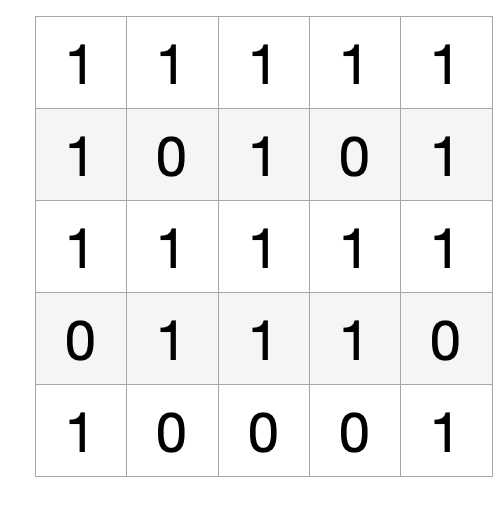
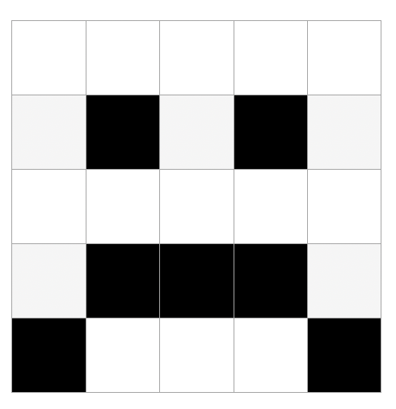
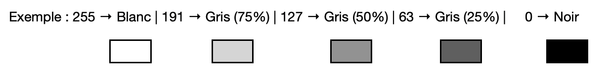
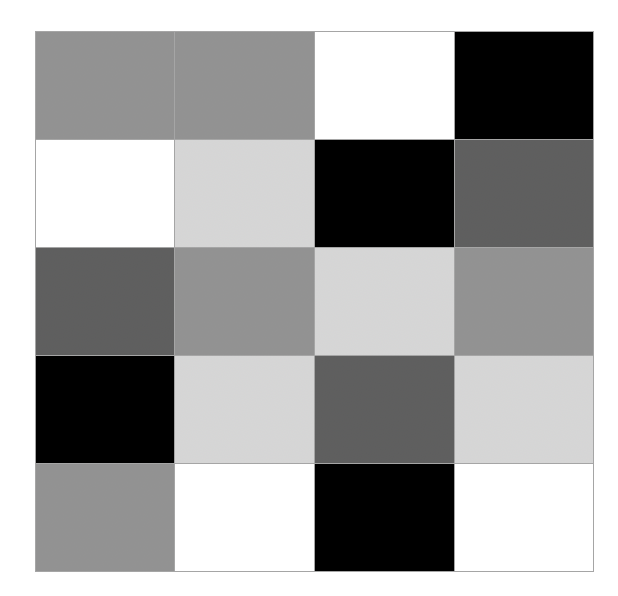

# 📸 Photographie Numérique 1 : Images en Noir et Blanc

## 📚 Histoire de la photographie numérique

La photographie numérique trouve ses origines dans les années **1970** avec les premiers capteurs CCD (Charge-Coupled Device) développés par **Willard Boyle** et **George Smith** aux laboratoires Bell. Ces travaux leur vaudront le prix Nobel de physique en **2009**.

Le premier appareil photo numérique grand public, le **Kodak DCS-100**, est commercialisé en **1991** pour la somme de 13 000 dollars. Il fallait attendre les années **2000** pour voir la démocratisation de cette technologie avec l'arrivée des premiers appareils accessibles au grand public.

Aujourd'hui, chaque smartphone contient un capteur numérique capable de produire des images de plusieurs millions de pixels, révolutionnant notre rapport à la photographie.

## 📖 Qu'est-ce qu'une image numérique ?

> **📖 Définition**

Une **image numérique** est un tableau à deux dimensions composé de cases élémentaires appelées **pixels** (contraction de *Picture Element*). Chaque pixel contient une information de couleur ou de luminosité.

### 🔍 Caractéristiques fondamentales d'une image

| Caractéristique | Définition | Exemple |
|-----------------|------------|----------|
| **Coordonnées** | Position d'un pixel dans l'image (i, j) | Pixel en position (150, 200) |
| **Définition** | Nombre total de pixels (hauteur × largeur) | 800 × 600 = 480 000 pixels |
| **Résolution** | Nombre de pixels par unité de longueur (ppp) | 300 ppp pour l'impression |
| **Mode** | Type d'information stockée par pixel | Noir/blanc, niveaux de gris, couleur |

**Activité : Calculs sur les images**

**1. Calculez la définition d'un écran 4K (4096 × 2160 pixels)**

_______________________________________________________________________________________

**2. Une image Full HD (1920 × 1080) est imprimée sur 20cm × 30cm. Calculez sa résolution.**

_______________________________________________________________________________________

## 📖 Les images en noir et blanc

> **📖 Définition**

Une **image en noir et blanc** (ou binaire) est un tableau à deux dimensions où chaque pixel ne peut prendre que deux valeurs : **noir** ou **blanc**.

### 💾 Représentation en mémoire

Pour stocker ces images, l'ordinateur utilise le système binaire :

| Couleur | Valeur numérique | Représentation binaire |
|---------|------------------|------------------------|
| **Noir** | 0 | 0 |
| **Blanc** | 1 | 1 |

Chaque pixel occupe donc exactement **1 bit** en mémoire, ce qui rend ces images très légères.

**Activité : Décodage d'images binaires**

**1. Dessinez l'image correspondant à ce tableau binaire :**

**2. Créez le tableau binaire pour cette image :**

!!! warning
    Les images en noir et blanc pur sont limitées pour représenter la réalité. C'est pourquoi on utilise souvent les **niveaux de gris** pour plus de nuances.

## 📖 Les images en niveaux de gris

> **📖 Définition**

Une **image en niveaux de gris** est un tableau à deux dimensions où chaque pixel contient une valeur d'intensité lumineuse comprise entre **0** (noir) et **255** (blanc), soit **256 nuances** possibles.

### 🎨 Échelle des gris

| Valeur | Couleur | Pourcentage de luminosité |
|--------|---------|---------------------------|
| 0 | Noir pur | 0% |
| 127 | Gris moyen | 50% |
| 255 | Blanc pur | 100% |

!!! info
    Plus la valeur est **élevée**, plus le pixel tend vers le **blanc**. Plus elle est **faible**, plus il tend vers le **noir**.

### 💾 Stockage en mémoire

Chaque pixel nécessite **8 bits** (1 octet) pour stocker sa valeur :
- Valeur minimale : 0 = **0000 0000** en binaire
- Valeur maximale : 255 = **1111 1111** en binaire

**Activité : Conversion décimal-binaire**

**Convertissez ces valeurs de gris en binaire :**

| Valeur décimale | Nuance de gris | Valeur binaire |
|-----------------|----------------|----------------|
| 0 | Noir | |
| 64 | Gris foncé | |
| 128 | Gris moyen | |
| 192 | Gris clair | |
| 255 | Blanc | |
