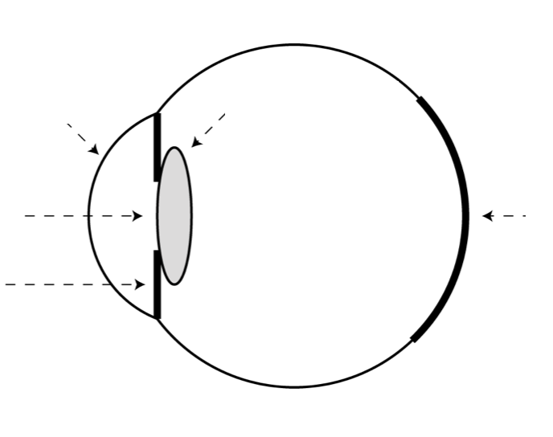
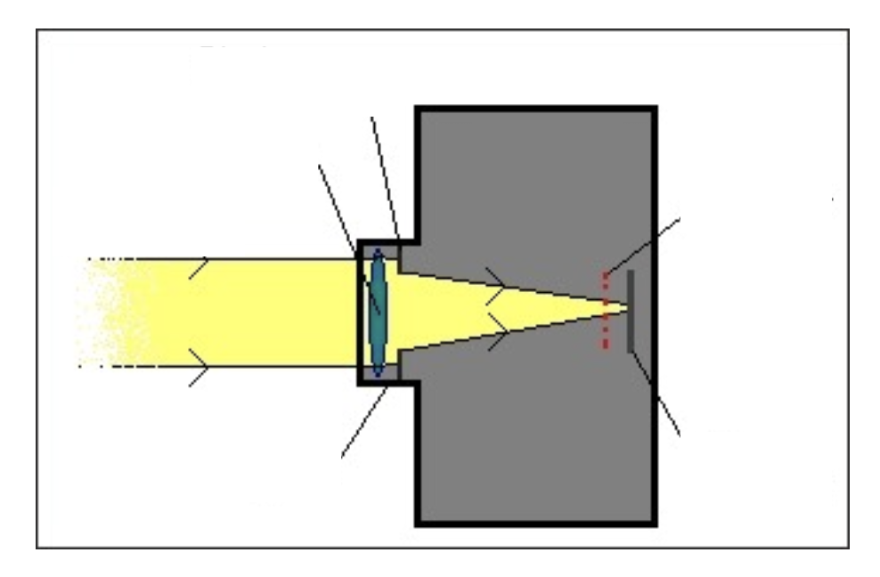
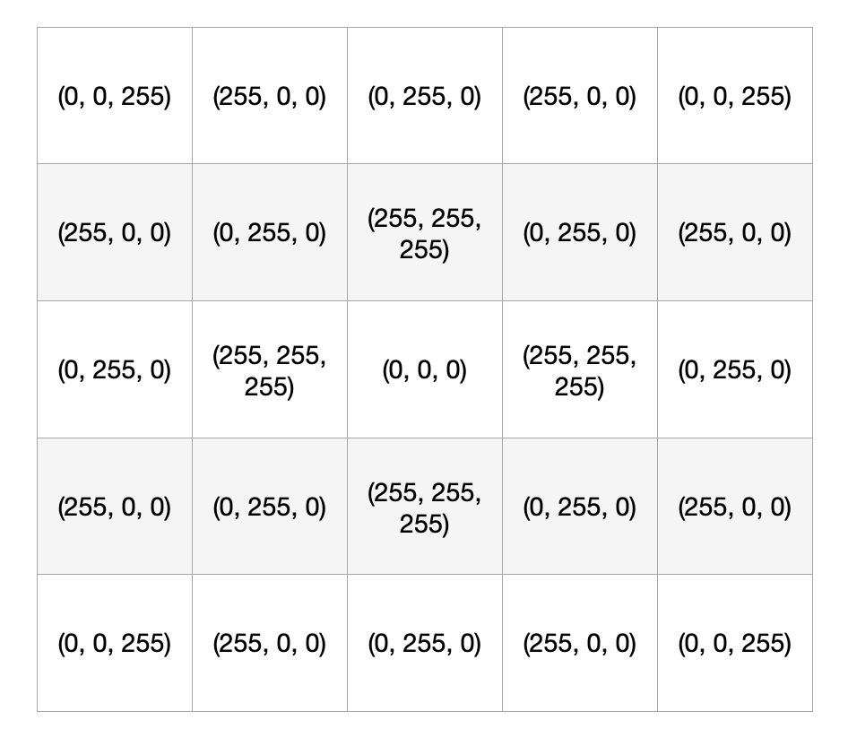
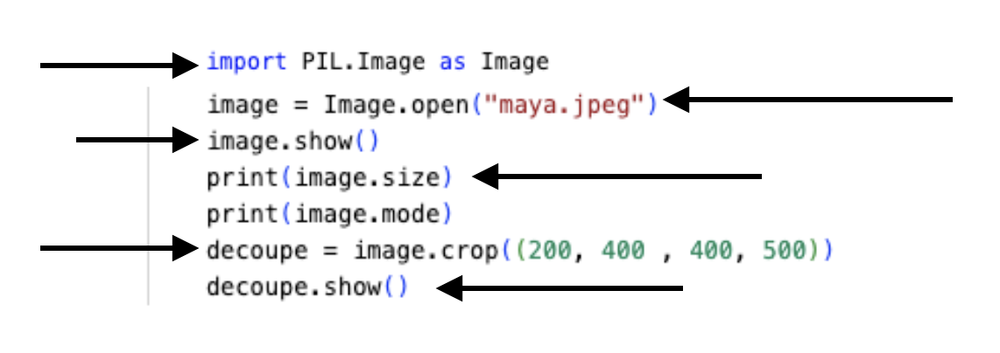

# 📸 Photographie Numérique 2 : Les Images en Couleur

## 📚 Histoire de la photographie couleur

La photographie couleur naît en **1861** grâce aux travaux du physicien écossais **James Clerk Maxwell**, qui réalise la première photographie couleur en superposant trois images prises à travers des filtres rouge, vert et bleu.

Le procédé **Autochrome** des frères **Lumière** (1907) démocratise la couleur, suivi par le **Kodachrome** (1935) et le **Polaroid** couleur (1963). L'ère numérique révolutionne cette approche avec les capteurs **CCD** puis **CMOS**, permettant la capture directe des trois composantes colorimétriques.

Aujourd'hui, chaque smartphone capture des images couleur de qualité professionnelle grâce à des capteurs de plusieurs millions de pixels.

## 📖 Vision humaine et capteurs numériques

### 👁️ Le fonctionnement de l'œil humain

> **📖 Définition**

L'**œil humain** fonctionne comme un appareil photo biologique, capable de percevoir les couleurs grâce à des cellules spécialisées appelées **cônes**.

| Composant | Fonction | Équivalent photo |
|-----------|----------|------------------|
| **Cornée** | Convergence des rayons lumineux | Lentille frontale |
| **Iris** | Contrôle de la quantité de lumière | Diaphragme |
| **Cristallin** | Mise au point | Objectif |
| **Rétine** | Capture de l'image | Capteur |
| **Cônes** | Détection des couleurs (R, V, B) | Photosites |

!!! info
    L'œil contient environ **6 millions de cônes**, avec une prédominance des cônes verts (64%), suivis des rouges (32%) et des bleus (4%).

**Activité : Anatomie de l'œil**

**Légendez le schéma de l'œil avec les termes appropriés :**

### 📷 Le capteur photographique numérique

> **📖 Définition**

Un **capteur photographique** est un composant électronique qui convertit la lumière en signal électrique, reproduisant le fonctionnement de la rétine humaine.

#### 🔄 Trajet de la lumière dans l'appareil photo

| Étape | Composant | Fonction |
|-------|-----------|----------|
| 1 | **Objectif** | Convergence et mise au point |
| 2 | **Diaphragme** | Contrôle de la quantité de lumière |
| 3 | **Matrice de Bayer** | Filtrage des couleurs R, V, B |
| 4 | **Photosites** | Conversion lumière → signal électrique |

#### 🌈 La matrice de Bayer

Inventée par **Bryce Bayer** chez Kodak en **1976**, cette matrice filtre la lumière selon un motif spécifique :
- **50% de filtres verts** (sensibilité de l'œil)
- **25% de filtres rouges**
- **25% de filtres bleus**

**Activité : Schéma du capteur**

**Complétez le schéma de l'appareil photo numérique :**

## 📖 Représentation des images en couleur

> **📖 Définition**

Une **image couleur** utilise le modèle **RVB** (Rouge, Vert, Bleu) où chaque pixel est défini par trois valeurs comprises entre **0** et **255**, représentant l'intensité de chaque composante colorimétrique.

### 🎨 Le modèle RVB (RGB)

Chaque pixel nécessite **24 bits** (3 octets) de stockage :
- **8 bits** pour le rouge (0-255)
- **8 bits** pour le vert (0-255)  
- **8 bits** pour le bleu (0-255)

| Couleur | Rouge | Vert | Bleu | Code RVB |
|---------|-------|------|------|----------|
| **Rouge pur** | 255 | 0 | 0 | (255, 0, 0) |
| **Vert pur** | 0 | 255 | 0 | (0, 255, 0) |
| **Bleu pur** | 0 | 0 | 255 | (0, 0, 255) |
| **Cyan** | 0 | 255 | 255 | (0, 255, 255) |
| **Magenta** | 255 | 0 | 255 | (255, 0, 255) |
| **Jaune** | 255 | 255 | 0 | (255, 255, 0) |
| **Blanc** | 255 | 255 | 255 | (255, 255, 255) |
| **Noir** | 0 | 0 | 0 | (0, 0, 0) |
| **Orange Renard** | 195 | 88 | 23 | (195, 88, 23) |

**Activité : Décodage couleur**

**Coloriez les cases selon les valeurs RVB indiquées :**

## 📖 Traitement d'images avec Python

### 🐍 La bibliothèque PIL (Python Imaging Library)

> **📖 Définition**

La bibliothèque **PIL** (ou **Pillow**) est un module Python permettant de manipuler et traiter des images numériques de manière programmatique.

#### 🔧 Fonctions principales de PIL

| Fonction | Syntaxe | Description |
|----------|---------|-------------|
| **Ouverture** | `Image.open("chemin")` | Charge une image depuis un fichier |
| **Format** | `image.format` | Retourne le format de l'image (JPEG, PNG...) |
| **Dimensions** | `image.size` | Retourne (largeur, hauteur) en pixels |
| **Mode** | `image.mode` | Retourne le mode (RGB, L, RGBA...) |
| **Découpage** | `image.crop((x1,y1,x2,y2))` | Découpe une zone rectangulaire |
| **Séparation** | `image.split()` | Sépare les composantes R, V, B |
| **Rotation** | `image.rotate(angle)` | Fait tourner l'image |
| **Conversion** | `image.convert("L")` | Convertit en niveaux de gris |

**Activité : Analyse de code**

**1. Analysez ce programme et expliquez son fonctionnement :**

_______________________________________________________________________________________
_______________________________________________________________________________________
_______________________________________________________________________________________

**2. Programmation pratique**

**Écrivez un programme qui :**
- Ouvre l'image fournie
- La fait tourner de 45 degrés
- L'affiche

**3. Écrivez un programme qui sépare et affiche les trois composantes RVB d'une image.**

**4. Écrivez un programme qui convertit une image couleur en niveaux de gris.**