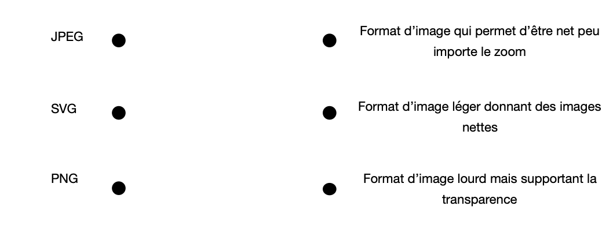
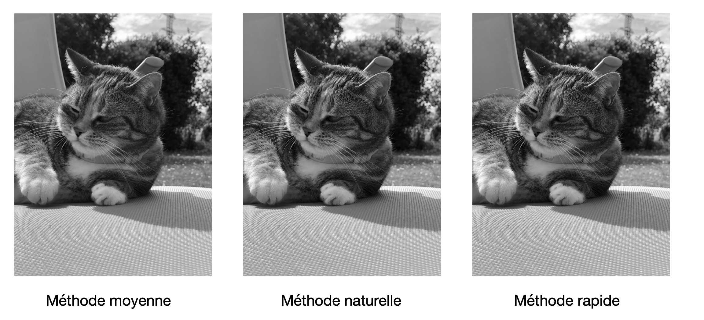
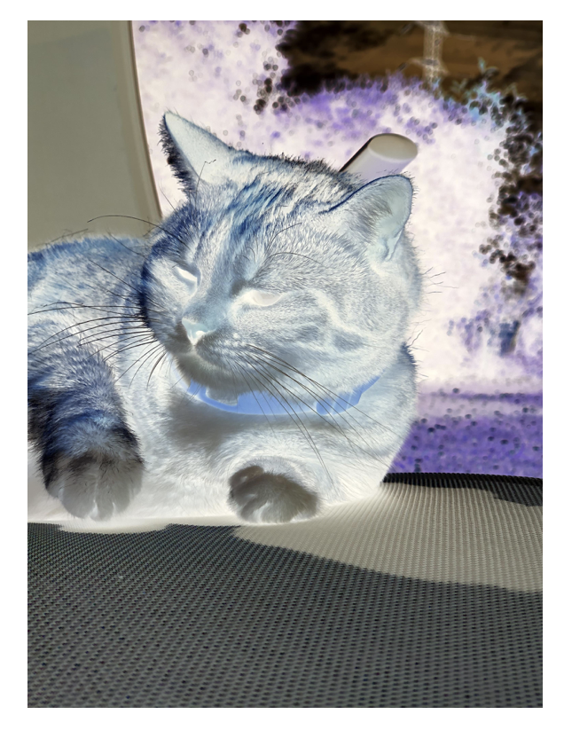
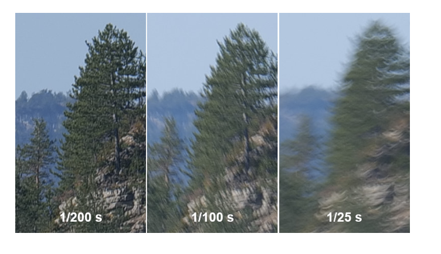
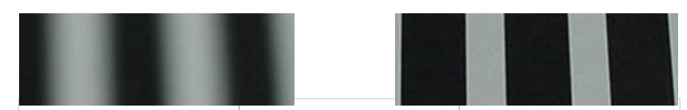
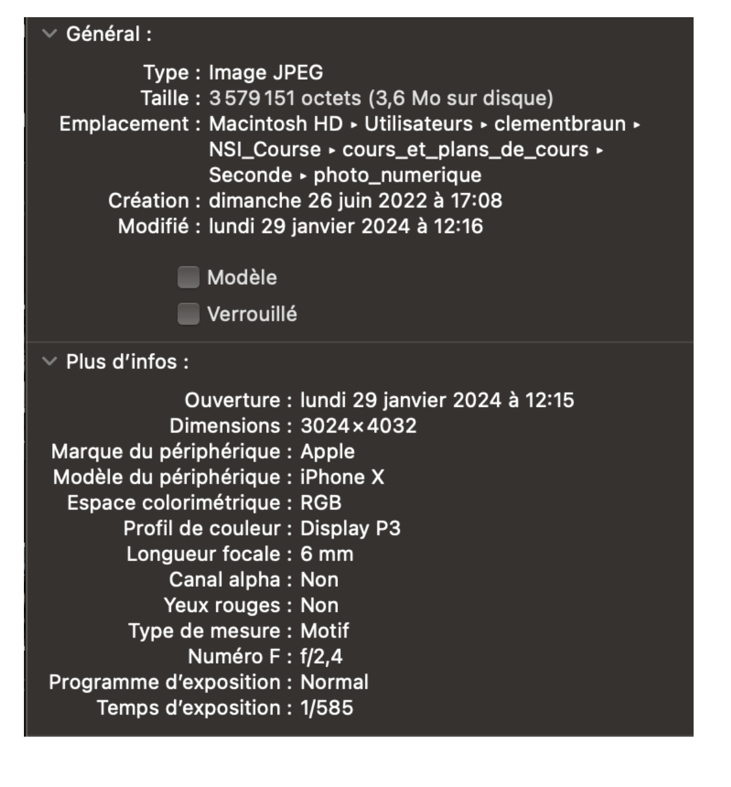

# 📸 Photographie Numérique 3 : Formats, Traitements et Métadonnées

## 📚 Histoire des formats d'image numériques

Les formats d'image numériques évoluent avec les besoins technologiques. Le **GIF** (1987) de **CompuServe** permet les premières animations. Le **JPEG** (1992) du **Joint Photographic Experts Group** révolutionne la compression d'images. Le **PNG** (1996) apporte la transparence sans perte.

Aujourd'hui, de nouveaux formats comme **WebP** (Google, 2010) et **AVIF** (2019) optimisent encore davantage la compression tout en préservant la qualité.

## 📖 Extensions et formats d'images

> **📖 Définitions**

Une **extension** est une suite de caractères précédée d'un point qui identifie le type de fichier. Le **format** correspond à la méthode d'encodage des données pour leur stockage et leur lecture.

### 🗂️ Principaux formats d'image

| Format | Extension | Compression | Transparence | Usage principal |
|--------|-----------|-------------|--------------|------------------|
| **JPEG** | .jpg, .jpeg | Avec perte | Non | Photos, web, réseaux sociaux |
| **PNG** | .png | Sans perte | Oui | Logos, illustrations, graphiques |
| **GIF** | .gif | Sans perte | Oui | Animations, images simples |
| **BMP** | .bmp | Aucune | Non | Images brutes, édition |
| **WebP** | .webp | Avec/sans perte | Oui | Web moderne, optimisation |

**Activité : Formats et usages**

**Reliez chaque format à son usage optimal :**

**Complétez les usages principaux :**
- **JPEG** : _______________________
- **PNG** : _______________________  
- **GIF** : _______________________

## 📖 Algorithmes de traitement d'images

### 🎨 Conversion en niveaux de gris

> **📖 Définition**

La **conversion en niveaux de gris** transforme une image couleur en image monochrome, utile pour l'analyse d'image, la calibration d'appareils ou l'optimisation de stockage.

#### 🔢 Méthodes de conversion

| Méthode | Formule | Avantages | Inconvénients |
|---------|---------|-----------|---------------|
| **Moyenne** | `(R + V + B) / 3` | Simple, rapide | Peu réaliste |
| **Luminance** | `0,2126×R + 0,7152×V + 0,0722×B` | Respecte la vision humaine | Plus complexe |
| **Composante verte** | `Valeur du vert` | Très rapide | Approximation grossière |

!!! info
    La méthode de **luminance** utilise les coefficients de sensibilité de l'œil humain définis par la norme **ITU-R BT.709**.

**Exemple avec l'image de Maya :**

### 🔄 Inversion d'image (négatif)

> **📖 Définition**

L'**inversion d'image** crée un négatif en soustrayant chaque composante de couleur à la valeur maximale (255).

**Formule :** `Nouvelle_valeur = 255 - Ancienne_valeur`

!!! note
    Cette technique était fondamentale en photographie argentique, où les négatifs étaient inversés chimiquement pour obtenir l'image finale.

### 📷 Algorithmes de prise de vue

#### 🎯 Stabilisation d'image

> **📖 Définition**

La **stabilisation d'image** utilise des algorithmes pour compenser les mouvements involontaires du photographe et réduire le **flou de bougé**.

| Type de stabilisation | Principe | Efficacité |
|----------------------|----------|------------|
| **Optique** | Déplacement de lentilles | Très élevée |
| **Numérique** | Traitement logiciel | Modérée |
| **Capteur** | Déplacement du capteur | Élevée |

#### 🔍 Mise au point automatique

> **📖 Définition**

L'**autofocus** ajuste automatiquement la distance focale pour obtenir une image nette du sujet visé.

**Méthodes principales :**
- **Détection de contraste** : Analyse du contraste pour trouver la netteté maximale
- **Détection de phase** : Utilise des capteurs dédiés pour mesurer la distance

## 📖 Métadonnées EXIF

> **📖 Définition**

Les **métadonnées** sont des données qui décrivent d'autres données. Pour les images, le standard **EXIF** (Exchangeable Image File Format) stocke automatiquement des informations lors de la prise de vue.

### 📊 Types de métadonnées EXIF

| Catégorie | Informations stockées | Exemples |
|-----------|----------------------|----------|
| **Géolocalisation** | Coordonnées GPS, lieu, date/heure | Latitude: 48.8566°N, Longitude: 2.3522°E |
| **Techniques** | Poids, résolution, dimensions | 4032×3024 pixels, 2.1 Mo |
| **Appareil** | Marque, modèle, objectif | Canon EOS R5, 24-70mm f/2.8 |
| **Prise de vue** | Ouverture, vitesse, ISO | f/2.8, 1/125s, ISO 400 |
| **Auteur** | Nom, copyright, titre | © 2024 Photographe, "Coucher de soleil" |

### 🔍 Consultation des métadonnées

**Exemple avec l'image de Maya :**

!!! warning
    Les métadonnées peuvent révéler des informations personnelles (localisation, matériel utilisé). Il est important de les supprimer avant publication sur les réseaux sociaux.

**Activité : Analyse de métadonnées**

**1. Analysez les métadonnées d'une photo prise avec votre smartphone**
**2. Identifiez quelles informations pourraient poser des problèmes de confidentialité**
**3. Recherchez comment supprimer les métadonnées avant partage**

## 🔮 Enjeux et perspectives

### 🛡️ Vie privée et sécurité

Les métadonnées soulèvent des questions importantes :
- **Géolocalisation** : révélation involontaire de lieux privés
- **Traçabilité** : identification du matériel et des habitudes
- **Authentification** : vérification de l'origine des images

### 🚀 Évolutions technologiques

Les nouvelles technologies enrichissent les métadonnées :
- **Intelligence artificielle** : reconnaissance automatique d'objets et de personnes
- **Blockchain** : certification et traçabilité des images
- **Réalité augmentée** : ajout d'informations contextuelles