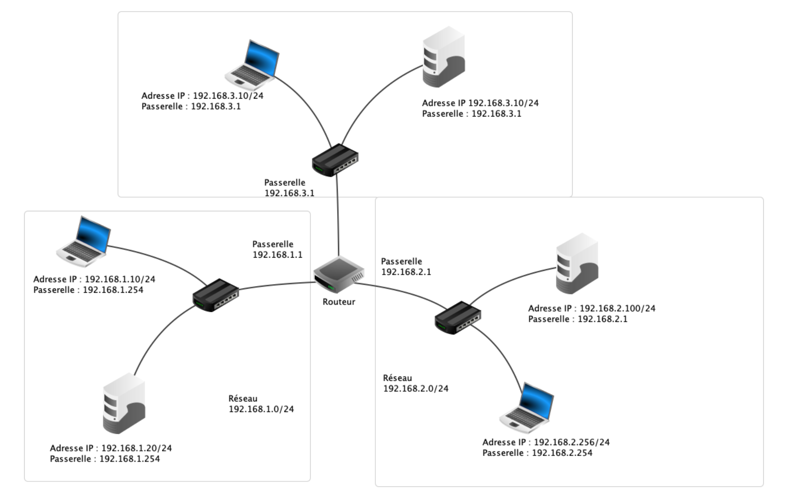

# Interrogation : Internet et Réseaux

**L'évaluation porte sur 4 exercices indépendants.**
**Les exercices sont notés sur 24 et la rigueur, rédaction et justifications sont notés sur 2 points.**

## Exercice 1 : Fondamentaux des réseaux (6 points)

1. **Expliquer la différence entre une adresse MAC et une adresse IP.**
 

2. **Décrire le rôle principal d'un routeur dans un réseau.**
 

1. **Citer et expliquer brièvement deux protocoles du modèle TCP/IP.**
 

1. **Expliquer la différence entre un réseau local (LAN) et un réseau global.**

## Exercice 2 : Adressage IP et Sous-réseaux (6 points)

1. *On considère l'adresse IP suivante : 192.168.1.45/24*
 

   a) **Quelle est l'adresse du réseau ?**
    

   b) **Quel est le masque de sous-réseau en notation décimale ?**
    

   c) **Combien d'hôtes peuvent être adressés dans ce réseau ?**
 
2. Dans un réseau d'entreprise, on a les configurations suivantes :
 

- *Serveur Web : 192.168.5.10/23*
    

- *Base de données : 192.168.4.20/23*
    

- *Poste Client : 192.168.6.30/23*
  
**Ces machines peuvent-elles communiquer directement entre elles?**  **Justifier votre réponse en déterminant les plages d'adresses de chaque sous-réseau.**

## Exercice 3 : Modèle TCP/IP et Encapsulation (6 points)

1. **Décrire le processus d'encapsulation des données dans le modèle TCP/IP en citant les quatre couches principales. (3 points)**  
 
2. *Pour le protocole TCP :*
   a) **Expliquer le mécanisme de la "triple poignée de main" (three-way handshake) lors de l'établissement d'une connexion.**  
   b) **Comment le protocole TCP garantit la livraison des données?**
   c) **Comparer avec le protocole UDP en citant une différence majeure et donner un cas d'utilisation approprié pour chaque protocole.**

## Exercice 4 : Réparation d'un réseau disfonctionnel (6 points)

*Voici une maille composée de 3 réseaux distincts.*

**Identifier les problèmes de configuration qui empêchent la communication entre les différents réseaux.**
**Corriger les problèmes pour permettre à toutes les machines de communiquer.**

