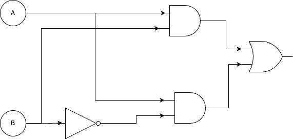
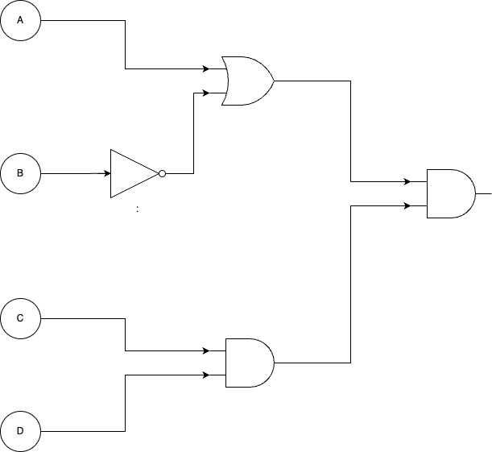

# Interrogation : Architechture d'une machine et circuits logiques

**L'évaluation porte sur 3 exercices indépendants.**
**Les exercices sont notés sur 18 et la rigueur, rédaction et justifications sont notés sur 2 points.**

## Partie 1 : Théorie (9 points)

1. Donner la table de vérité de la porte AND et de la porte OR. (1 points)

2. Expliquer la structure (les parties) et le rôle du processeur dans un ordinateur. (3 points)

3. Décriver le cycle de fonctionnement du processeur (Fetch, Decode, Execute, Store). (2 points)

4. Expliquer les différents types de mémoire dans une machine (RAM, ROM, cache, mémoire à long terme) et leur rôle spécifique. (3 points)

## Partie 2 : Circuits logiques (9 points)

### Exercice 1 : Donner le schéma correspondant à l'équation booléenne proposée (3 points)  

- S1 = (A **and** B) **or** (  (**not** B)  **and** C)
- S2 = (A **and** B) **or** (C **and** A **or** B)

### Exercice 2 : Schéma logique sous contrainte (2 points)  

**Construire un schéma d'un circuit logique à deux variables A et B qui est vrai uniquement si A est vrai ET si B est faux.**  

 
 
 
 
 
 
 

### Exercice 3 : Donner l'équation booléenne associée au schéma proposé (4 points)  

