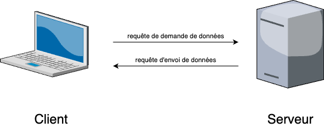

# 📚 Web

    

        
📚 Historique

        <h3 class="course-title">Point Historique et Définitions</h3>
        

            Le WEB a été créé en 1989 au CERN (institut de recherche Suisse) par une équipe chapeautée par <strong>Tim Berners-Lee</strong> et <strong>Robert Cailliau</strong>.  Le but du projet initialement était la création d'une application qui permettrait l'échange de données sur Internet.  La technologie du WEB repose sur l'utilisation d'<strong>hyperliens</strong>.  Les hyperliens sont des liens cliquables souvent bleus ressemblant à cela :  [Lien menant à l'accueil du site](../../index.md)  Ces divers <strong>hyperliens</strong> permettent d'accéder à des données qui sont stockées sur des <strong>serveurs</strong>, comme des pages WEB, des images ou tout type de contenu.  Pour accéder aux différents serveurs, ces liens *"pointent"* vers les adresses IP correspondant aux différents serveurs qui détiennent ces ressources.  Pour accéder à toutes ces données, on utilise un <strong>navigateur WEB</strong>, un logiciel qui permet de traiter des demandes de données (appelées <strong>requêtes</strong>), les afficher ou réaliser certains traitement sur celles-ci.  <strong>Anecdote : voici la toute première page WEB, celle créée par les chercheurs du CERN :</strong> [première page web](http://info.cern.ch/hypertext/WWW/TheProject.html)
        

    

    
    

        
📖 Définition

        <h3 class="course-title">Modèle Client - Serveur</h3>
        

            On a vu précédemment dans les échanges TCP, que deux machines communiquaient : <strong>emettrice et réceptrice.</strong>  On appelle <strong>client</strong> une machine qui souhaite recevoir des informations ou des données. Cette machine correspond à la machine que l'on nommait *réceptrice*.  On appelle <strong>serveur</strong> une machine qui dispose d'informations ou de données et qui a pour rôle de les envoyer. Cette machine correspond à ce que l'on nommait *émettrice*.  Lors d'un échange entre un client et un serveur, ceux-ci émettent des échanges formalisés que l'on appelle <strong>requête</strong>.  On peut schématiser cela de cette manière :   
        

    

    
    

        
📖 Définition

        <h3 class="course-title">Adresse IP et URL</h3>
        

            Il peut être fastidieux de retenir toutes les adresses IP de tous les sites que nous connaissons.  Personne n'écrit dans sa barre de recherche dans son navigateur <strong>216.58.214.163</strong> pour accéder à la page WEB associée : celle de *google.fr*  On appelle <strong>URL</strong> (<strong>U</strong>niform <strong>R</strong>essources <strong>L</strong>ocator) l'adresse d'un site WEB, adresse correspondante à l'adresse IP du serveur ou se retrouve la page mais dans des caractères intelligibles par l'être humain.  Une <strong>URL</strong> est consituée de plusieurs parties séparées par des points:  $\overbrace{\texttt{http(s)://}}^{\texttt{protocole utilisé}}\underbrace{\texttt{www}}_{\texttt{sous-domaine}}\overbrace{\texttt{google}}^{\texttt{nom de domaine}}\underbrace{\texttt{com}}_{\texttt{extension du domaine}}$  Le serveur <strong>DNS</strong> (<strong>D</strong>omain <strong>N</strong>ame <strong>S</strong>erver) possède une table de correspondance entre l'adresse IP du serveur disposant des informations et d'une adresse dite <strong>symbolique</strong> que nous pouvons retenir plus facilement.  Par exemple, nos navigateurs web possèdent des tables de ce style pour éviter de faire les mêmes requêtes tous les jours.  |Site|Adresse symbolique|Adresse IP| |-|-|-| |Google|www.google.fr|172.217.20.163| |Youtube|www.youtube.fr|142.250.178.142| |Leboncoin|www.leboncoin.fr|18.164.52.43| |Amazon|www.amazon.fr|52.95.116.113|
        

    

    
    

        
📖 Définition

        <h3 class="course-title">Fonctionnement du serveur DNS</h3>
        

            Le serveur DNS permet d'associer une adresse symbolique avec une adresse IP. Pour obtenir l'adresse IP d'un serveur disposant d'une ressource que l'on cherche via une adresse symbolique, on peut distinguer plusieurs cas :  ### Adresse symbolique connue dans le navigateur  Si l'adresse symbolique est déjà stockée dans le cache du navigateur (ou du système d'exploitation), celui-ci remplace envoie la requête de recherche de la ressource avec l'adresse IP qu'il connait déjà dans sa table.  Par exemple, si l'on cherche à aller sur le site www.google.fr, en dactylographiant notre adresse dans la barre de recherche, le navigateur va envoyer directement la requête de la page du site à l'adresse IP <strong>172.217.20.163</strong>.  ### Adresse symbolique non connue dans le navigateur  Si l'adresse symbolique n'est pas connue par le navigateur (ou le système d'exploitation), divers requêtes sont réalisées à la suite pour trouver le bon serveur DNS qui dispose de l'adresse à chercher.  Cela va s'exécuter de manière <strong>récursive</strong>.  Admettons que nous cherchons le site <strong>windows.microsoft.com</strong>  
        

    

    
    

        
📖 Définition

        <h3 class="course-title">Le langage des pages WEB : HTML</h3>
        

            Le <strong>HTML</strong> (HyperText Markup Language) a été créé en <strong>1991</strong> par <strong>Tim Berners-Lee</strong>, alors qu'il travaillait au <strong>CERN</strong>. C'est un langage dit "<strong>à balises</strong>".  Un <strong>langage à balises</strong> est un type de langage informatique utilisé pour structurer et organiser des données en les entourant avec des <strong>balises</strong> ou <strong>tags</strong>.    Les balises sont des éléments de texte spécifiques, généralement entourés de crochets angulaires (<code>< ></code>), qui indiquent comment le contenu doit être interprété ou affiché.  Dans un langage à balises, chaque élément est délimité par une balise d’ouverture et une balise de fermeture.   Par exemple, dans <strong>HTML</strong>, la balise <code>
</code> marque le début d’un paragraphe, et la balise <code>
</code> marque sa fin :  ``<code>html 
Ceci est un paragraphe.
 </code>``  Les balises ne sont pas visibles par l’utilisateur final, elles servent à structurer le document ou à fournir des <strong>informations</strong> sur la manière dont le contenu doit être rendu.    Les langages à balises sont souvent utilisés dans la <strong>création de documents web</strong> (comme HTML ou XML), car ils permettent d’ajouter une signification <strong>sémantique</strong> aux données et de contrôler la mise en forme ou le comportement du contenu.
        

    

    
    

        
📖 Définition

        <h3 class="course-title">HTTP : protocole des requêtes sur le WEB</h3>
        

            <strong>HTTP</strong> (HyperText Transfer Protocol) est un <strong>protocole de communication</strong> qui permet l'échange de données ou de pages sur le <strong>WEB</strong>.   Il fonctionne selon un modèle <strong>client-serveur</strong>, où un <strong>client</strong> (par exemple, un navigateur web) envoie une <strong>requête</strong> à un <strong>serveur</strong> pour accéder à une ressource, comme une page web.    Cette requête inclut une méthode, comme <strong>GET</strong> (pour récupérer des données) ou <strong>POST</strong> (pour envoyer des données).   Le <strong>serveur</strong> répond avec un <strong>code de statut</strong> (comme <strong>200 OK</strong> si tout se passe bien) et la ressource demandée, qui peut être un fichier <strong>HTML</strong>, une image, ou un autre type de contenu.    ### Les Méthodes HTTP Lors d'une communication, le client utilise différentes méthodes pour interagir avec le serveur.  La <strong>méthode GET</strong> est utilisée pour récupérer des informations. Elle ne modifie aucune donnée sur le serveur et permet seulement d'obtenir des données comme des pages web, les fichiers necessaires à son affichage ou son fonctionnement etc...  ``<code> GET /utilisateurs/profil?id=123 HTTP/1.1 Host: www.reseausocial.com User-Agent: Mozilla/5.0 Accept-Language: fr-FR </code>`<code>  La <strong>méthode POST</strong> est utilisée pour envoyer des données au serveur pour en modifier certaines ressources (informations d'un compte par exemple, envoi de fichiers etc...).  </code>`<code> POST /utilisateurs/inscription HTTP/1.1 Host: www.reseausocial.com Content-Type: application/x-www-form-urlencoded Content-Length: 54  nom=Dupont&prenom=Jean&email=jean.dupont@email.com </code>``  Ces méthodes sont souvent utilisées lors de l'envoi de formulaires ou d'initialisation de la page par le navigateur.  Après chaque requête, le serveur renvoie un code de statut qui indique le résultat du traitement :  200 OK : La requête a réussi 404 Not Found : La ressource demandée n'existe pas 500 Internal Server Error : Problème côté serveur
        

    

    
    

        
📖 Définition

        <h3 class="course-title">Page Rank</h3>
        

            Le Page Rank est un algorithme révolutionnaire développé par <strong>Larry Page</strong> et <strong>Sergey Brin</strong>, les fondateurs de Google, lors de leurs études à l'Université Stanford en 1996. L'idée était simple mais géniale : classer les pages web non pas uniquement sur leur contenu, mais sur leur importance dans le réseau Internet.  Le fonctionnement du Page Rank est simple. Il fonctionne sur la logique de "votes". On considère qu'une page vote pour une autre page lorsqu'elle possède un lien vers celle-ci.  <strong>Cela veut dire que plus une page possède de lien plus elle semble "pertinente".</strong>  Cette logique peut paraître efficace mais si énormément de petits articles sans réelle valeur pointent vers une page moins qualitative, elle peut se retrouver plus haute qu'une page de meilleure qualité.  Pour éviter ce biais, certaines pages ont des votes plus importants que d'autres (comme le maire pour le Loup-Garou de Thiercelieux).  En calculant le nombre de votes, on peut déterminer la qualité d'une page et si elle est pertinente avec la recherche demandée. Cette logique est utilisée par la plupart des moteurs de recherches.
        

    

    

