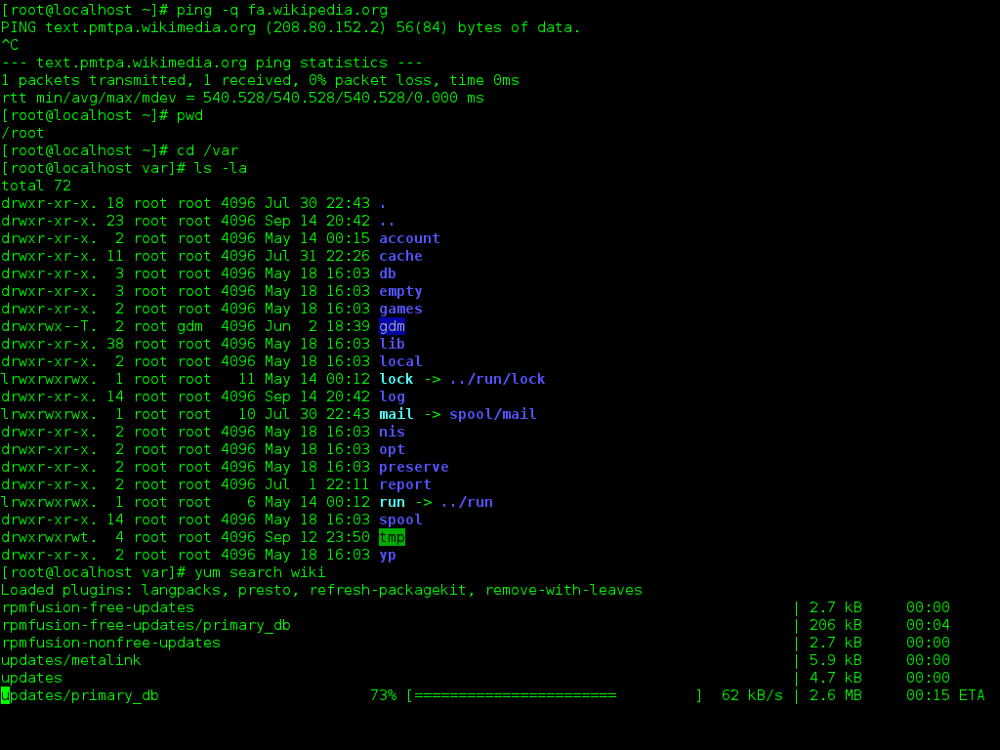
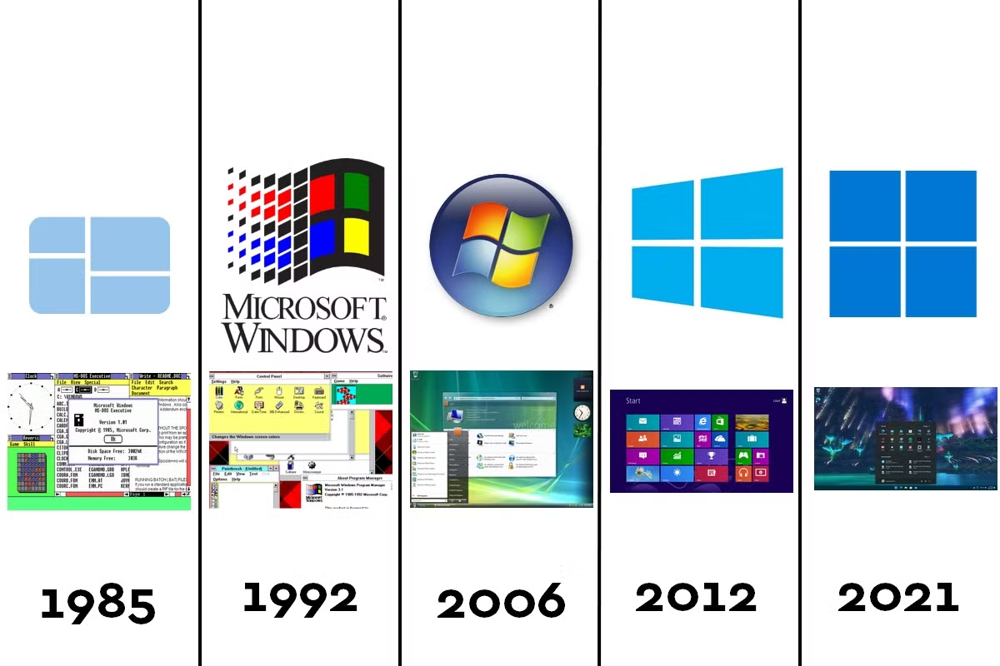

# 💻 Introduction aux systèmes d'exploitation

## 🔍 Définition

Un Système d'Exploitation (ou Operating System) est un ensemble de programmes qui permettent le fonctionnement et l'orchestration des opérations entre les divers composants d'un ordinateur.

Il permet de rendre un ensemble de composants electroniques utilisables pour créer un outil fonctionnel et facile d'usage pour un utilisateur.

## 📚 Contexte de l'invention des Systèmes d'Exploitation

Les systèmes d'exploitation (OS) sont apparus pour simplifier l'utilisation des ordinateurs. Au départ, les utilisateurs devaient écrire des commandes complexes pour interagir avec la machine. Les OS ont été conçus pour gérer les tâches courantes (lancer des programmes, gérer les fichiers, etc.) et permettre une utilisation plus intuitive des ordinateurs.

## 🔓 Système Libre // Système Propriétaire

- **Système Libre**: Logiciel dont le code source est accessible à tous. Il peut être modifié et partagé (ex. : Linux). 🐧

- **Système Propriétaire** : Logiciel dont le code source est fermé. Il ne peut être utilisé ou modifié qu'avec l'autorisation de l'entreprise qui le vend (ex. : Windows, macOS). 🔒

## 🔧 Composants d'un SE

Un système d'exploitation est composé de plusieurs éléments.

### ⚙️ Le noyau

Le **Noyau (ou kernel)** est le coeur du système d'exploitation. 

Il est le responsable de plusieurs tâches bien précises :

- 🧠 La gestion de la mémoire
- 🔌 La communication avec le materiel
- ⏱️ L'ordonnancement des tâches

!!! info "Mission notable : La traduction 🔄"
    Le Système d'Exploitation permet de traduire le langage binaire compréhensible par les différents composants de l'ordinateur en **mnémoniques** ou **instructions** intelligibles par l'utilisateur grâce au langage *Assembleur*.

    *Définition :*  
    *On appelle mnémonique un ensemble de caractère associé à une opération réalisable par un des composants de l'ordinateur*

!!! Tip "Anecdote 💡"
    Le mot **kernel** vient de l'anglais qui est la traduction de cerneau, la partie comestible de la noix.

### 📂 Le système de fichiers

Le **système de fichier** est une méthode de gestion et d'organisation des différents fichiers. Il permet de classer les fichiers pour que leur utilisation et leur accès soient plus faciles pour l'utilisateur **ET** pour le matériel.

La structure des systèmes de fichiers est généralement **arborescente**, ce qui est naturellement adopté lors de la structuration de dossiers.

On définit **racine** correspond (curieusement) au sommet de l'arborescence. Elle contient tous les fichiers et repertoires du système. Elle comprend aussi l'ensemble des répertoires necessaires au fonctionnement des périphériques et des composants.

On définit un système de hiérarchie des fichiers et des répertoires pour permettre s'y repérer plus facilement.

Cependant on retrouve une différence entre les kernels.

!!! info "Système UNIX 🐧"
    ```
    **Arborescence d'un système windows**
    /                   (Racine)
    ├── home            (Dossier utilisateurs)
    │   ├── utilisateur1
    │   │   ├── Documents
    │   │   ├── Images
    │   │   └── Musique
    │   └── utilisateur2
    ├── etc             (Configurations système)
    └── var             (Données variables)
    ```

!!! info "Système MS-DOS (Windows) 🪟"
    **Arborescence d'un système windows**
    ```
    C:\                   (Racine du lecteur principal)
    ├── Users             (Dossier des utilisateurs)
    │   ├── Administrateur
    │   │   ├── Bureau        (Fichiers sur le bureau)
    │   │   ├── Documents     (Fichiers personnels)
    │   │   ├── Téléchargements
    │   │   ├── Images
    │   │   └── Musique
    │   └── Utilisateur1
    │       ├── Bureau
    │       ├── Documents
    │       ├── Téléchargements
    │       ├── Images
    │       └── Musique
    ├── Windows           (Fichiers système)
    │   ├── System32
    │   ├── Temp
    │   └── Drivers
    ├── Program Files     (Programmes installés)
    │   ├── Microsoft Office
    │   ├── Google
    │   └── Adobe
    └── Program Files (x86)  (Programmes 32 bits)
        ├── Jeux
        └── Logiciels obsolètes
    ```

### 🔑 Permissions

Le Système d'Exploitation est organisé par utilisateurs.
Chaque utilisateur n'a pas les mêmes droits sur tous les fichiers de l'ordinateur.
On appelle tous ces droits des **permissions**. Elles sont accordées suivant le niveau de l'utilsateur.

Il existe dans ces deux modèles un super-utilisateur qui possède tous les droits (**sudo** pour les systèmes UNIX et **Administrateur** pour les systèmes MS-DOS).

Ces permissions doivent être accordées à chacun des fichiers et peuvent être modifiées plus ou moins facilement suivant le système utilisé (UNIX étant beaucoup plus permissif).

On parle de modèle **UGO** pour le modèle UNIX pour *User / Group / Other*.
Ces permissions peuvent être attribuées à l'aide de commandes écrites dans le terminal (invite de commande).

Il existe 3 types de permissions : 

- Lecture (Reading)
- Ecriture (Writing)
- Éxécution (eXecute)

On parle de permissions *RWX*, on verra comment les modifier dans le cours suivant.

### L'interface

L'**interface (ou *shell*)** permet à l'utilisateur d'intéragir avec l'ordinateur et pouvoir l'utiliser facilement.  

!!! tip "Anecdote"
    On parle de *shell* qui signifie coquille ou coque en anglais, reprenant le modèle de noix.
    L'interface correspond donc à la partie la plus externe du Système.

Il existe différentes interfaces utilisables par l'utilisateur qui ont chacunes leurs avantages.

### Interface en ligne de commande (CLI)

L'**Interface en ligne de commande** était le premier choix pour permettre à l'utilisateur d'intéragir avec l'ordinateur.

Cette interface peut paraître archaïque (ou moins intuitive) mais elle est de loin la plus efficace et la moins energivore pour la machine.

L'avantage le plus important est la rapidité du système qui ne doit gérer l'affichage que de simples caractères de couleur sur un fond uni plutôt que de gérer des fenêtres d'exécution ou de contexte.



L'utilisation de ce genre d'interface n'est plus que réservé à l'accès à distance à des serveurs ou de machines dédiées à de simples usages bien que cela peut être déprécié.

### Interface Graphique (GUI)

Interface visuelle utilisable facilement grâce à des visuels pratiques.
Microsoft a introduit le système de fenêtre qui a été popularisé dans la fin des années 80's - début des années 90's.

L'avantage notable de l'Interface Graphique (ou *GUI pour Graphic User Interface*) est qu'elle est beaucoup plus pratique pour les utilisateurs lambdas.
Le problème des interfaces graphique est la gestion des différents styles à adopter qui peuvent être gourmandes en ressources.

Ces interfaces ont évolué avec les avancées technologiques et l'évolution des design au cours du temps.



!!! Tip "Anecdotes"
    Microsoft a nommé Windows la version évoluée de son Système MS-DOS car il introduisait la notion de fenêtre (*window* en anglais).

    Windows Vista était un Système d'Exploitation controversé. Son design était révolutionnaire avec la technologie *Aero* mais elle était tellement énergivore qu'elle ralentissait considérablement la machine.
